# Import Clara Core — Usage & Reporting (Package 1 of 6)

## Objective

Import the **Clara Core — Usage & Reporting** solution package into Microsoft Copilot Studio and verify all components are created successfully.

This is the foundation package of CLARA v3. It is the **only required package** — every optional package (waitlist, provisioning, communication) depends on the tables, connector, and flows installed here.

---

## Before You Start

CLARA v3 replaces the single monolithic solution used in v2 with a **modular, component-based architecture**. Instead of importing one large zip, you import Core first, then layer on only the optional packages your tenant needs.

| | |
|---|---|
| **Package file** | `01 - Clara Core Usage & Reporting 3_0_0_3.zip` |
| **Solution unique name** | `Clara` |
| **Solution version** | 3.0.0.3 |
| **Publisher** | Luis Demetrio (prefix: `csa`) |


---

## What You'll Do

- Navigate to Copilot Studio
- Import the Clara Core solution package
- Map the required connections
- Set the optional environment variable
- Verify the agent, tables, connector, flows, tools, and topics were created
- Prepare for the next exercise (Azure App Registration for the custom connector)

---

## Tasks

### 🧱 Step 1: Download the Core package

1. Navigate to Clara's GitHub repository:

   <https://github.com/luishdemetrio/clara-copilot-agent/tree/main/agent/3.0>

2. Locate and click on **`01 - Clara Core Usage & Reporting 3_0_0_3.zip`**

   > ℹ️ The version number can be different.

3. Click **Download** (download icon on the right)

> ⚠️ This is package **1 of 6**. Don't download the other packages yet — they all depend on Core being imported and configured first.

---

### 🧱 Step 2: Access Copilot Studio

1. Open **Microsoft Edge**
2. Navigate to: <https://copilotstudio.microsoft.com>
3. Sign in
4. Confirm you're in the correct environment (top-right environment picker)

✅ **Validation:** Copilot Studio home page loads with the Agents tab visible.

---

### 🧱 Step 3: Import the solution

1. **Access Solutions**

   - On the left-hand side menu, click the Agents, then click on **Import agent**.
   
   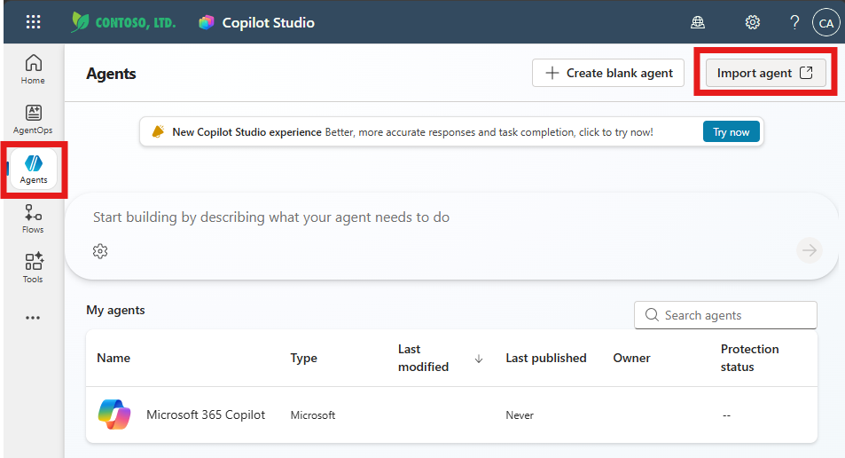

2. In the top menu, click **Import solution**.

   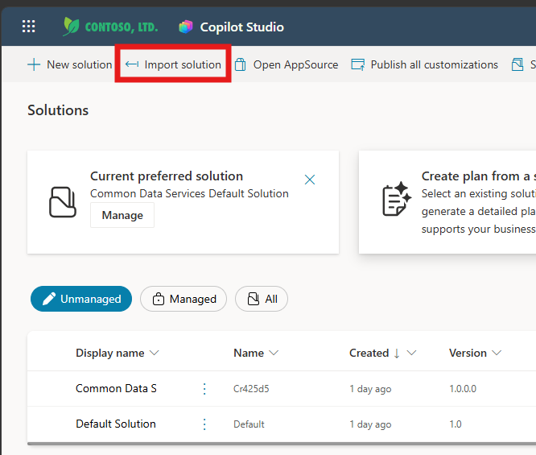
   
3. When prompted:

   - Click **Browse** or **Choose file**
   - Select `01 - Clara Core Usage & Reporting 3_0_0_3.zip`
   - Click **Open**, then **Next**

   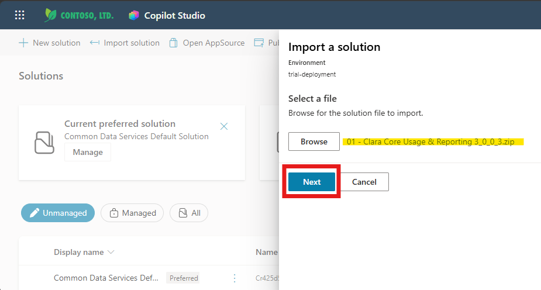

4. Review the solution details, then click **Next**.

   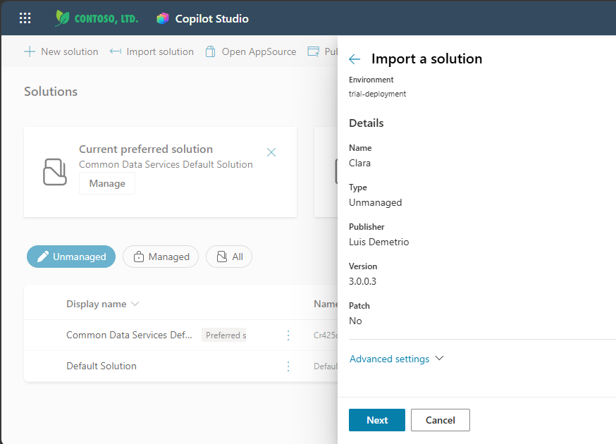

5. **Connections page** — the wizard shows a **Sign in** screen listing the connection references it could automatically match to a connection that already exists in your environment under your credentials:

   | Service | Connection reference | What it's for |
   |---|---|---|
   | Microsoft Copilot Studio Crfefed-064a2 | `cr41e_sharedmicrosoftcopilotstudio_064a2` | A system-level connection that ships with every exported Copilot Studio agent solution, letting automated components (like the external-trigger flows) call back into the Copilot Studio platform. Not specific to CLARA's license logic — nothing to configure here. |
   | clara_CLARA.shared_commondataserviceforapps... | `clara_CLARA.shared_commondataserviceforapps.shared-commondataser-...` | The **Microsoft Dataverse** connection. Used by the two Core flows (`Clara - M365 Copilot Dashboard Sync` and `CLARA – M365 Copilot Licensed User Profiles Sync`) and the `Microsoft Dataverse - List rows from selected environment` tool to read/write the `Clara M365 Copilot Dashboard` and `CLARA User Profile` tables. |
   
   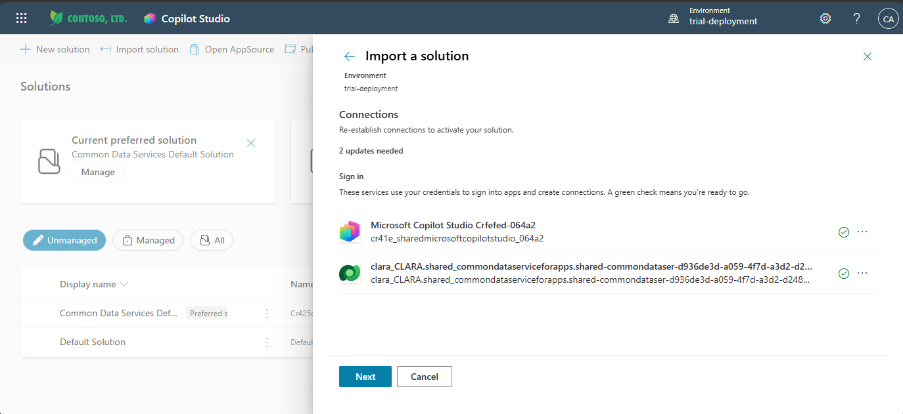

   Both typically show a green check (✅) already, meaning the wizard matched them to an existing connection under your account — no action needed beyond reviewing them. Click **Next**.

   > ℹ️ You won't see the **Clara Graph APIs** custom connector on this screen. Since it's a brand-new connector shipped *inside* this solution, there's no pre-existing connection of that type in your environment for the wizard to match it to. Its connection gets created separately — either on a later step of this same wizard or, if it isn't prompted here, right after import via **Solutions > Clara > Connection references**. Either way, that connection requires an OAuth sign-in against Microsoft Graph, which depends on the Azure AD app registration covered in the next exercise — if that registration isn't done yet, the sign-in will fail, which is expected at this point.

6. **Environment Variables page** — fill in the following (optional) field:

   - **Dataverse Environment** (`csa_DataverseEnvironemnt`): the full URL of your Dataverse environment.

     Example: `https://org0509a3b6.crm.dynamics.com`

    This field is technically optional — the import will still complete if you leave it blank. In practice, you should fill it in: it's what the Core flows and reporting queries use to group the M365 Copilot Dashboard by country (usage location), department, and office location. Without it, the import succeeds but the dashboard's grouped breakdowns won't have anything to group against.


    >💡 Recommendation: Set this value now rather than leaving it for later. If you skip it, go to Solutions > Clara > Environment Variables afterward to add it, then re-run the dashboard sync flow so the grouped data populates.

   > ℹ Yes, the field's internal name is spelled "Environemnt" — that's how it ships in the solution itself, not a typo in this guide. 😅
   
   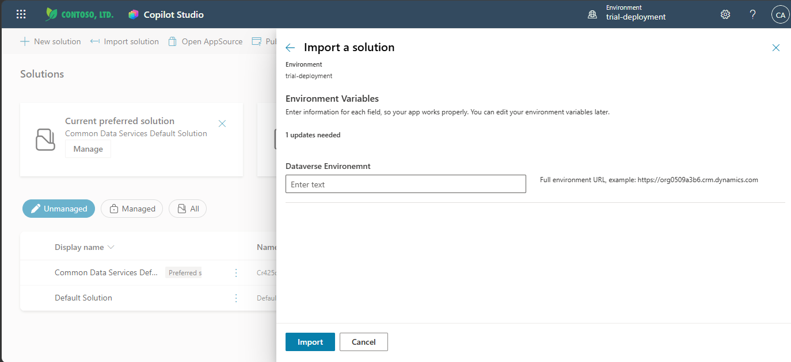

7. Click **Import** to begin.

8. Wait for the import to complete.

   ⏱️ **Expected time:** 2–4 minutes

   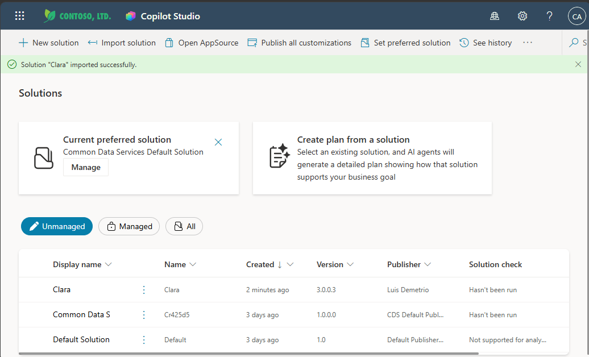
   
✅ **Validation:**

- You may see a warning after importing the solution (commonly about the Clara Graph APIs connection not being authorized yet). You can ignore it for now and resolve it in the next exercise.
- The **Clara** solution appears in your solutions list, version 3.0.0.3.

---

### 🧱 Step 4: Configure Azure App Registration

#### Why You Need to Create This Yourself

In CLARA v2, Copilot Studio automatically created an Azure App Registration behind the scenes during import. **That auto-provisioning doesn't happen in CLARA v3.** The Clara Graph APIs custom connector now ships as a standalone, reusable component with no app registration of its own — you need to create one in your tenant before the connector can authenticate against Microsoft Graph.

Think of this App Registration as Clara's identity badge in your Microsoft 365 tenant: the Client ID, Tenant ID, and a client secret are what let her prove who she is when calling Microsoft Graph, on behalf of the signed-in admin using her.

1. Open a **new browser tab** and navigate to: <https://portal.azure.com>

2. Sign in, then search for and click **App registrations**

3. Click **+ New registration**

   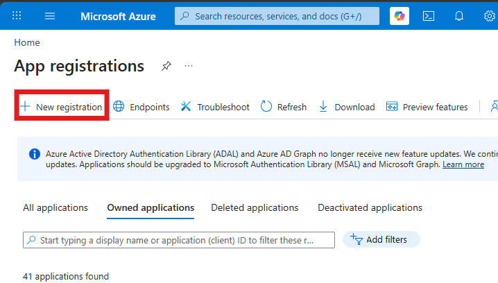

4. Fill in the registration form:

   - **Name:** `CLARA` (any name works — what matters going forward is the IDs, not the display name)
   - **Supported account types:** **Single tenant only**
   - **Redirect URI:** leave blank — you'll add the correct one in the Custom Connector exercise that follows this one

5. Click **Register**

   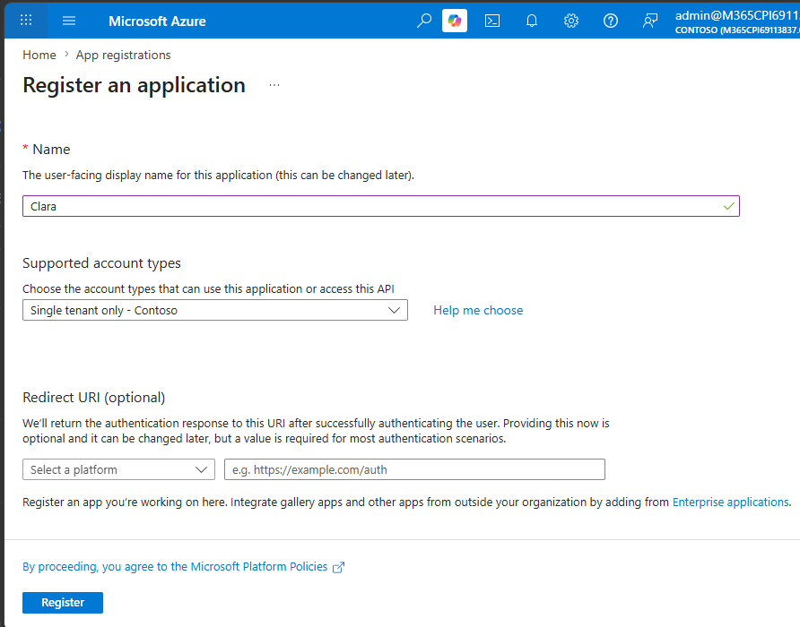

6. On the **Overview** page, immediately copy and save:

   - **Application (client) ID**
   - **Directory (tenant) ID**

   into a tracker:

   ```
   Azure App Registration
   ======================
   Application (client) ID: ____________________
   Directory (tenant) ID: ______________________
   Client Secret Value: ________________________
   ```

   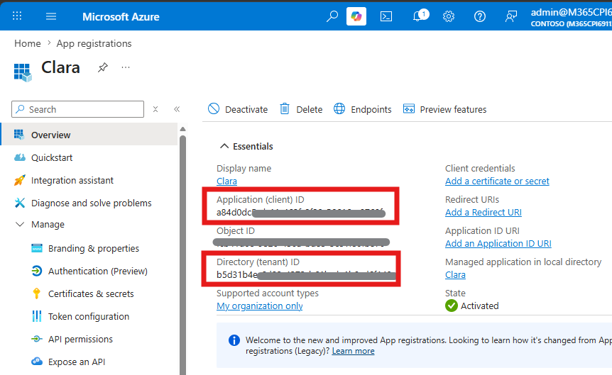
   
7. Click **API permissions** (left menu) → **+ Add a permission** → **Microsoft Graph** → **Delegated permissions**

   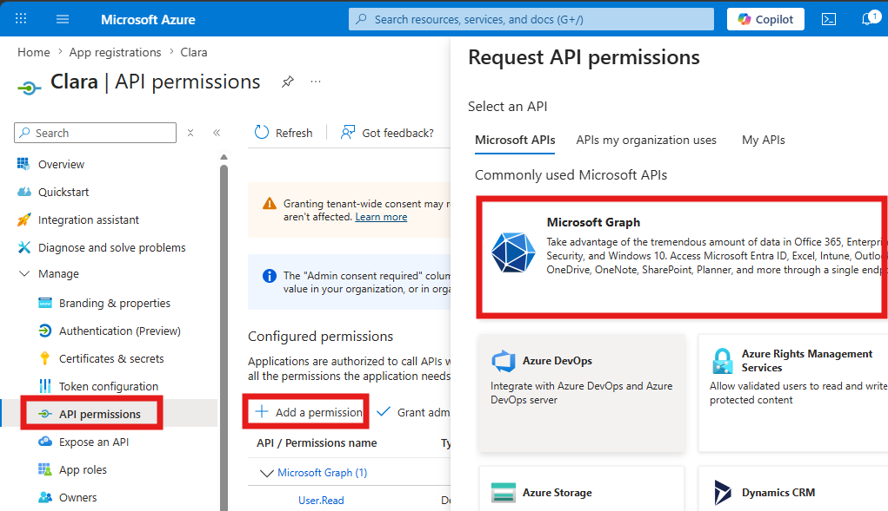

   > ⚠️ Choose **Delegated permissions**, not Application permissions. Clara acts on behalf of signed-in admins — she should only be able to do what they could already do manually.
   
   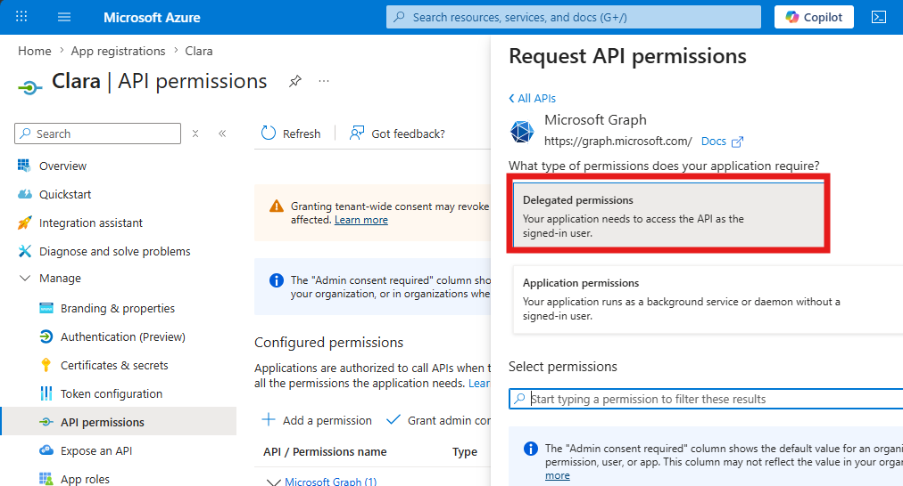

8. Search for and check each of these **3 permissions**:

   - **Directory.Read.All** — read user and group information
     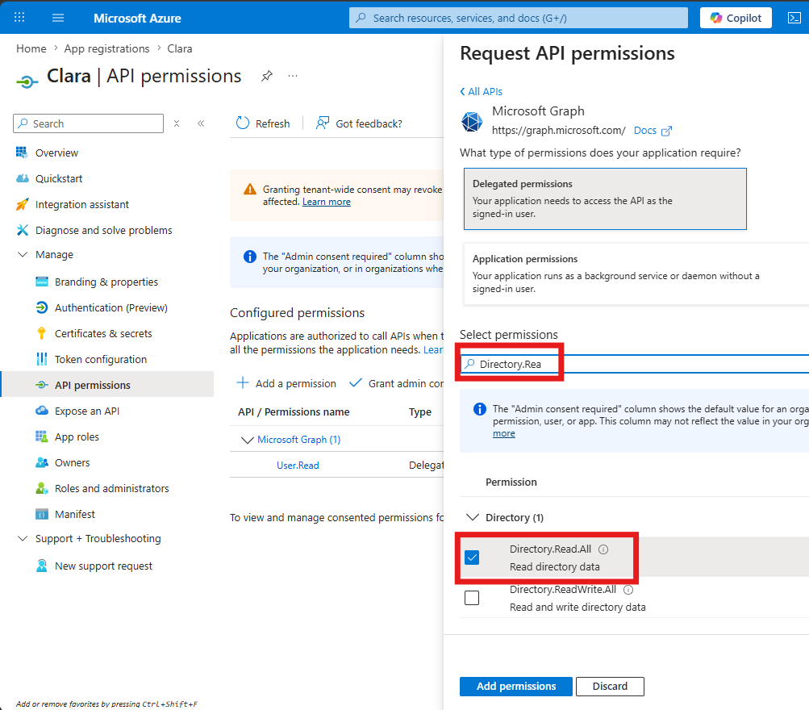
     
   - **GroupMember.ReadWrite.All** — add/remove users from a license group (used by the optional Entra ID Group License Provisioning package)
     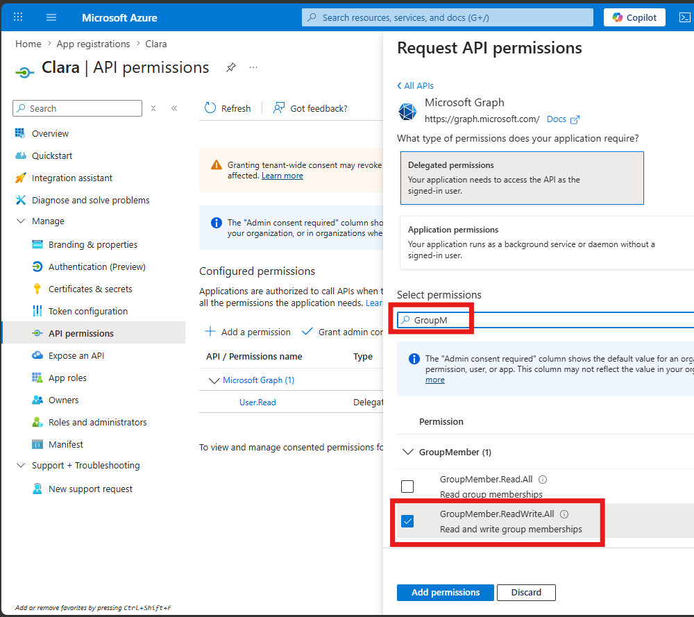
     
   - **Reports.Read.All** — access M365 Copilot usage reports
   
     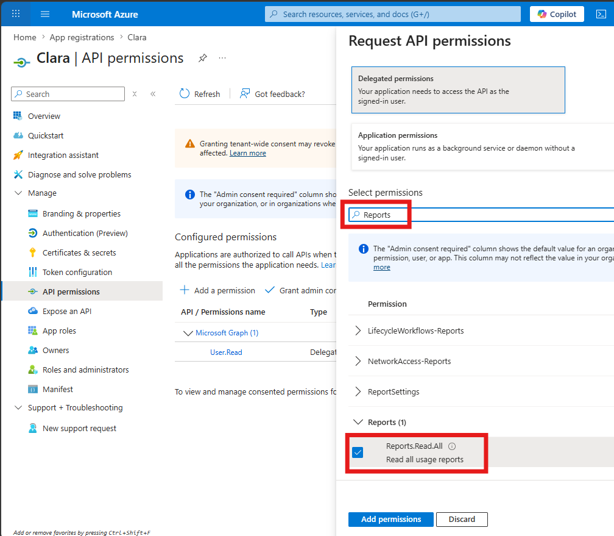
     
9. Click **Add permissions**:

   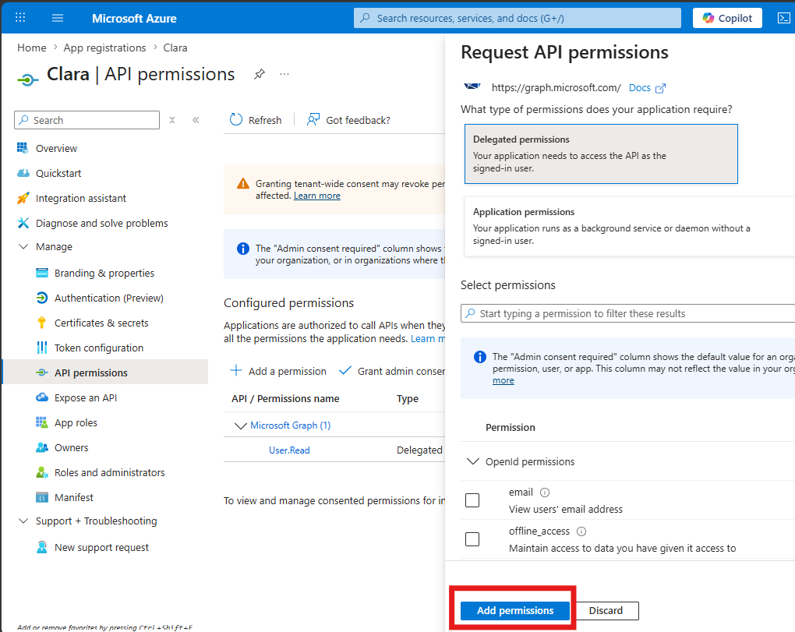


   > 💡 Even if you're only deploying Core today, grant all three now. The Clara Graph APIs connector and this App Registration are shared by every CLARA package — getting the permissions right here saves you a return trip when you add provisioning or waitlist packages later.

10. Click **Grant admin consent for [Your Organization]** → **Yes**

    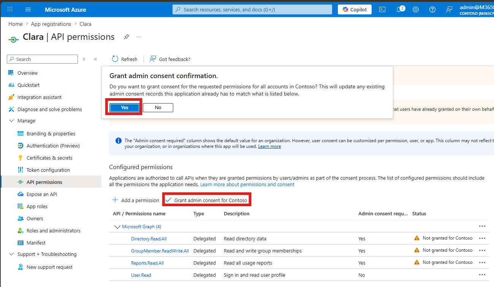
    
11. Confirm all 3 permissions show **Granted** with green checkmarks.

    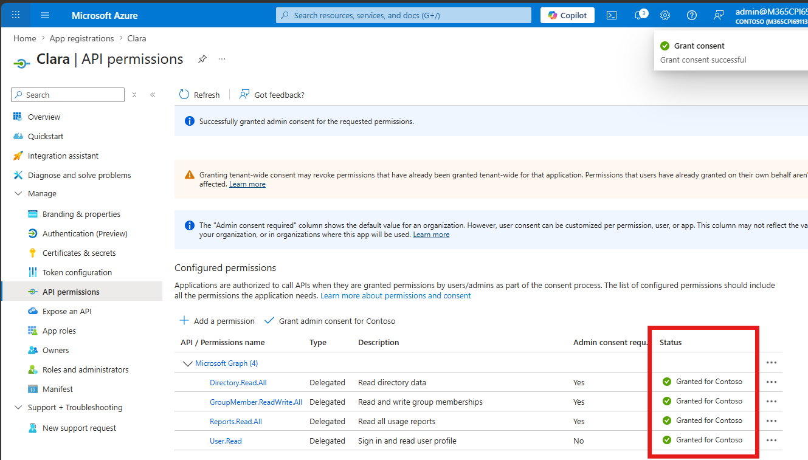

12. Click **Certificates & secrets** (left menu) → **Client secrets** tab → **+ New client secret**

    - **Description:** `Clara API Secret`
    - **Expires:** 6 months (or your preferred option)
    - Click **Add**
    
    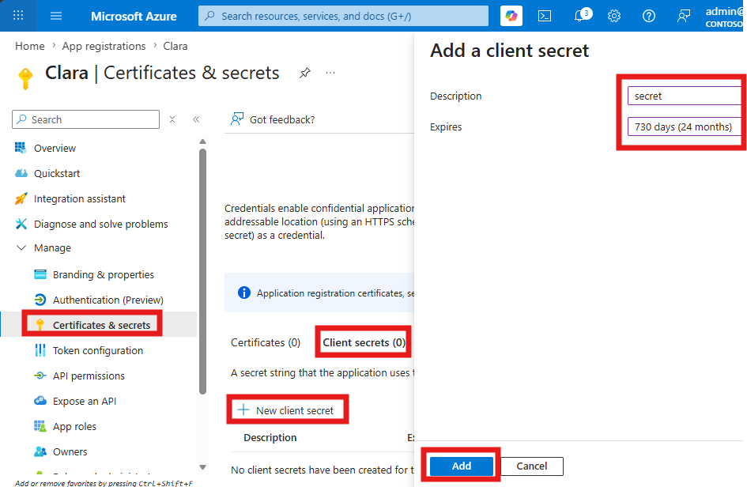

11. 🚨 **Immediately copy the Value** (not the Secret ID — the long string under the "Value" column) and save it to your tracker:

    ```
    Client Secret Value: ________________________
    ```

    
    > 🚨 The secret value is shown only **once**. After you navigate away from this page, it can't be retrieved — you'd need to delete it and create a new one.
    
    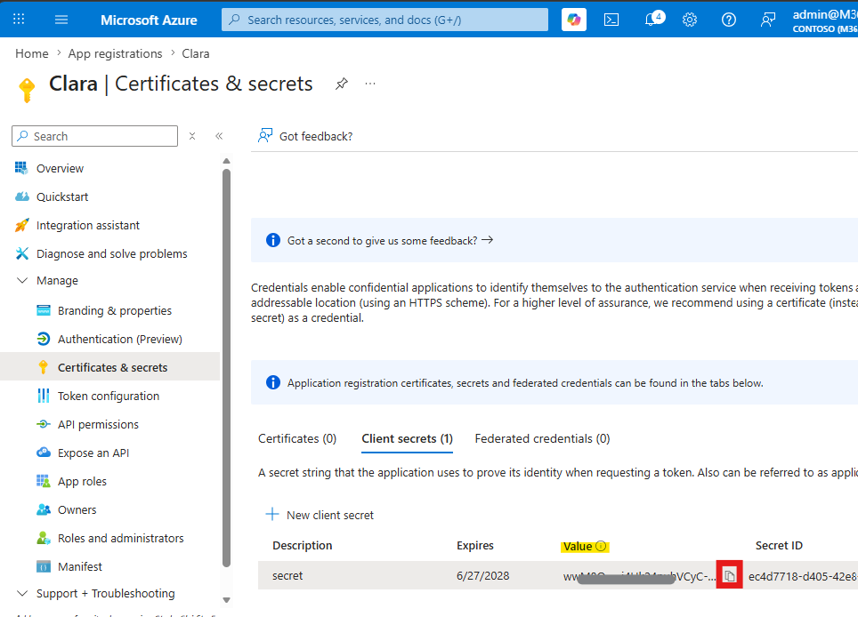

✅ **Validation:** Your tracker has all three values filled in (Application (client) ID, Directory (tenant) ID, Client Secret Value), and all 3 Graph permissions show "Granted" with green checkmarks.

> ⚠️ **Troubleshooting:**
> - **"New registration" grayed out?** You likely need at least the Application Developer or Cloud Application Administrator role in Entra ID.
> - **Consent button grayed out?** You likely need a Global Administrator (or Privileged Role Administrator) role — ask your tenant admin to grant it instead.
> - **Lost the secret value?** It cannot be retrieved — delete the secret (⋯ → Delete) and create a new one.

---

### 🧱 Step 5: Configure Clara Custom Connector

#### Why the Custom Connector Matters

The Clara Core package imports a custom connector called **Clara Graph APIs** — Clara's bridge to Microsoft Graph. It packages the specific Graph endpoints Clara needs (license overview, usage reporting, user lookup, and — once you add the optional provisioning packages — license assignment and group membership) into reusable actions her Power Automate flows can invoke. If the App Registration from Step 4 is Clara's identity badge, this connector is the toolkit she uses to actually do her job with that badge.

#### ⚠️ Important: This Connector Ships With Someone Else's Values

When you open the connector's Security tab for the first time, you'll find the OAuth fields **already filled in** — a Client ID and three Azure AD URLs that look completely valid. They aren't placeholders in the visual sense, but they aren't yours either: they're baked into the solution file from the tenant it was originally packaged in. **Every one of those pre-filled values must be overwritten** with the App Registration you created in Step 4. If you leave them as-is, the connector will try to authenticate against a tenant you don't control, and every connection attempt will fail — or, worse, silently point at the wrong tenant.

1. Open a **new browser tab** and navigate to: <https://make.powerautomate.com>

2. Sign in if prompted

3. In the left-hand menu, select **Custom connectors**.
   - If not pinned, click **More → Discover all → Custom connectors**.
   - Pin it — you'll come back to it.

4. Locate **Clara Graph APIs** in the list and click the **Edit** (pencil ✏️) icon.

   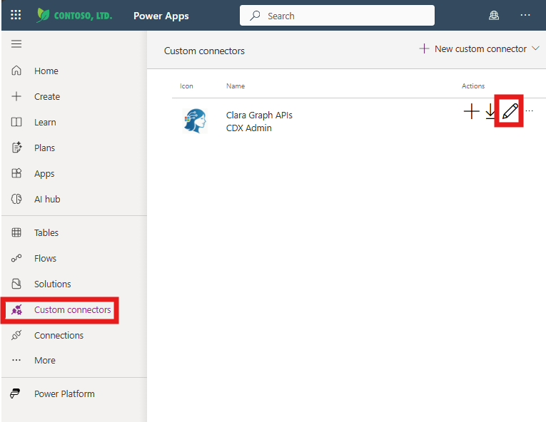

5. The connector editor opens with five tabs: **General**, **Security**, **Definition**, **Code**, **Test**. Click the **Security** tab.

   > 💡 What you'll see: authentication type and OAuth 2.0 fields — already populated with someone else's values, as noted above.

6. Under **Authentication type**, click **Edit**.

   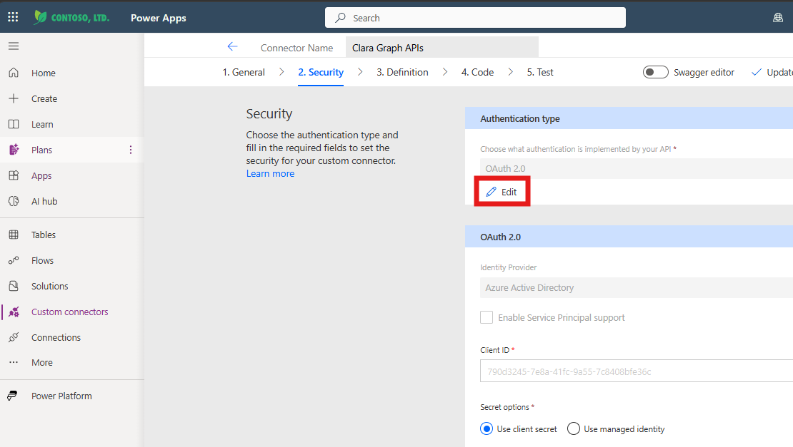

7. Confirm **Identity Provider** is set to **Generic OAuth 2**.

   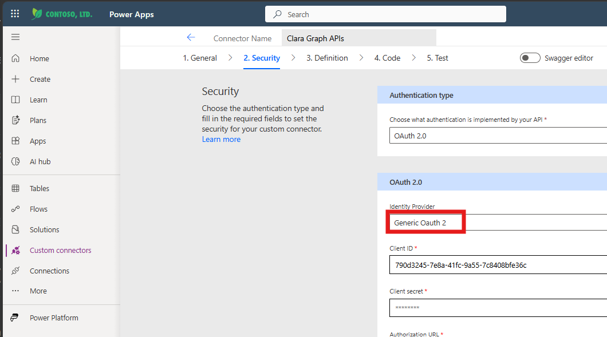

8. **Overwrite every field** below with your own values from Step 4 — don't assume the existing entries are correct, even though they look like real GUIDs and URLs:

   - **Client ID:** `[Your Application (client) ID]`
   - **Client Secret:** `[Your Client Secret Value]`
   - **Authorization URL:** `https://login.microsoftonline.com/[YOUR-TENANT-ID]/oauth2/v2.0/authorize`
   - **Token URL:** `https://login.microsoftonline.com/[YOUR-TENANT-ID]/oauth2/v2.0/token`
   - **Refresh URL:** `https://login.microsoftonline.com/[YOUR-TENANT-ID]/oauth2/v2.0/token` (same endpoint as Token URL in Azure AD v2.0)
   - **Scope:** `https://graph.microsoft.com/.default offline_access`

     - `https://graph.microsoft.com/.default` requests all the delegated permissions you granted in Step 4 (Directory.Read.All, GroupMember.ReadWrite.All, Reports.Read.All)
     - `offline_access` lets the connector refresh tokens automatically without re-authenticating

   
    
9. Before saving, double-check:

   - ✅ All three URLs contain **your** Tenant ID — not a tenant ID you don't recognize
   - ✅ Client ID is **your** Application (client) ID — not whatever was already there
   - ✅ Client ID and Client Secret are pasted without extra spaces
   - ✅ All URLs start with `https://`

10. Click **Update connector** (top right) and wait for the confirmation message: "Custom connector updated."

    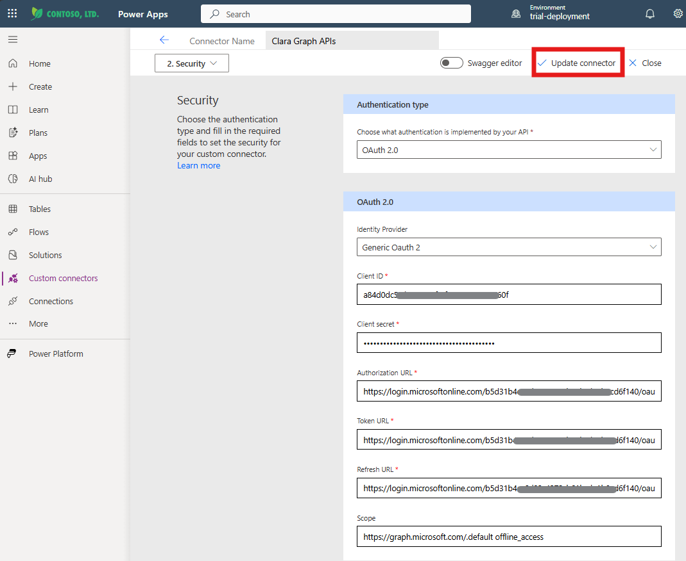

11. Still on the **Security** tab, scroll down to the **Redirect URL** field (read-only, lock icon). You'll see a URL shaped like:

    ```
    https://global.consent.azure-apim.net/redirect/csa-5fclara-20graph-20apis-5f[unique-suffix]
    ```

    > 💡 This redirect URL is generated **per connector**, specific to Clara Graph APIs in your environment — copy exactly what's shown to you here, don't reuse a value from this guide or another environment.

12. Click the **Copy** icon and save it to your tracker:

    ```
    Redirect URI: ___________________________
    ```

    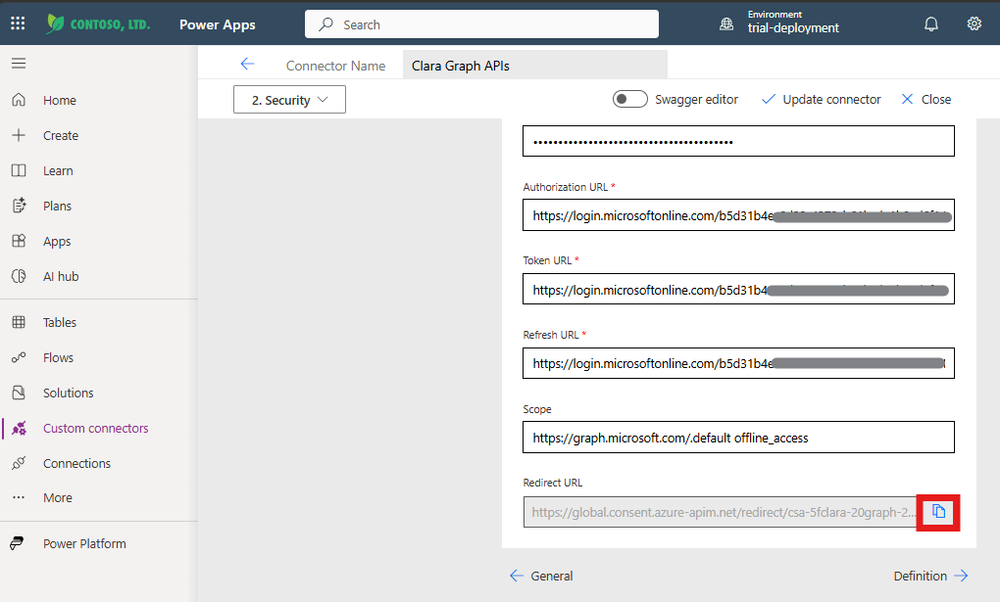

13. Switch to your **Azure Portal** tab → App registrations → **CLARA** → click **Authentication** (left menu).

14. Under **Platform configurations**, click **+ Add Redirect URI** → select **Web**.

    > ⚠️ Choose **Web**, NOT "Single-page application." Power Platform's connector infrastructure requires the Web platform.

   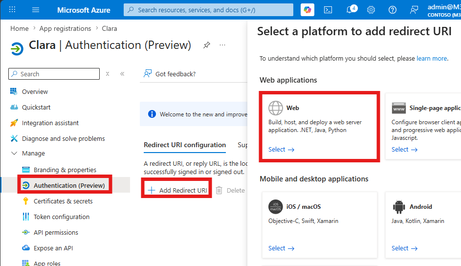
   
15. In the "Configure Web" panel, paste the Redirect URI you copied in step 12.
    - Leave **Front-channel logout URL** blank.
    - Leave **Implicit grant and hybrid flows** checkboxes unchecked.
    - Click **Configure**.

    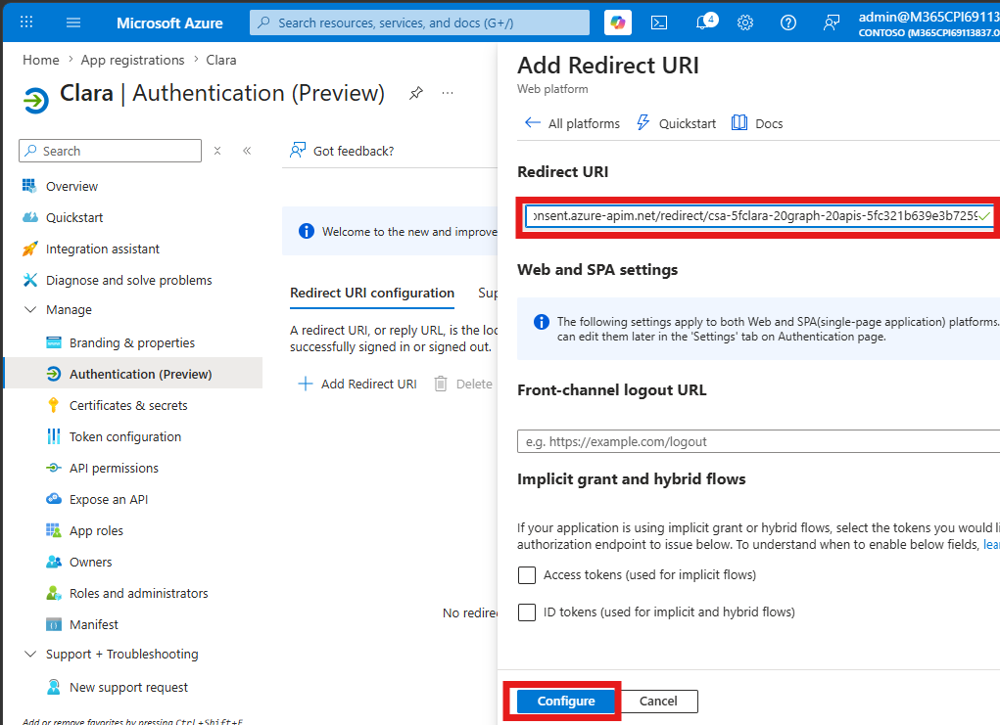
    
16. Verify the redirect URI now appears under the **Web** platform section.

    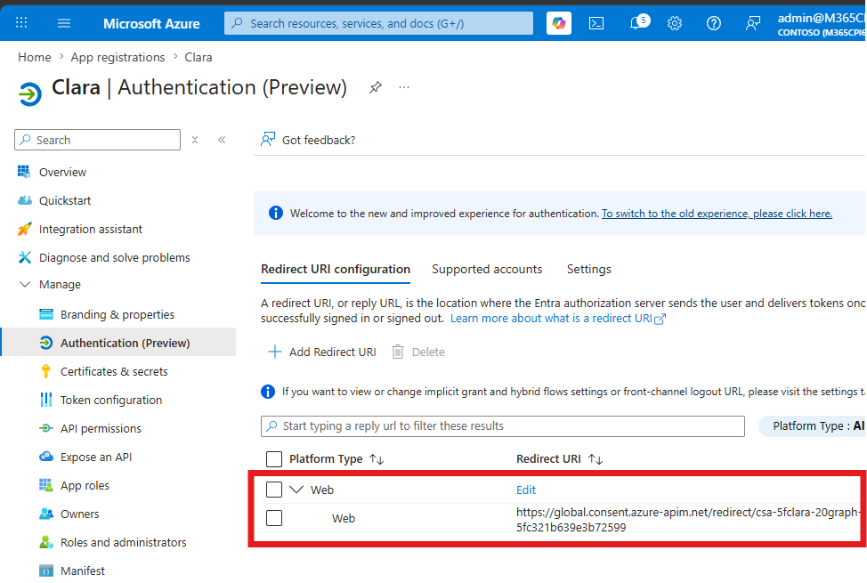

17. Switch back to **Power Automate**, with Clara's connector still open. Click the **Test** tab.

18. Under **Connections**, click **+ New connection**.

    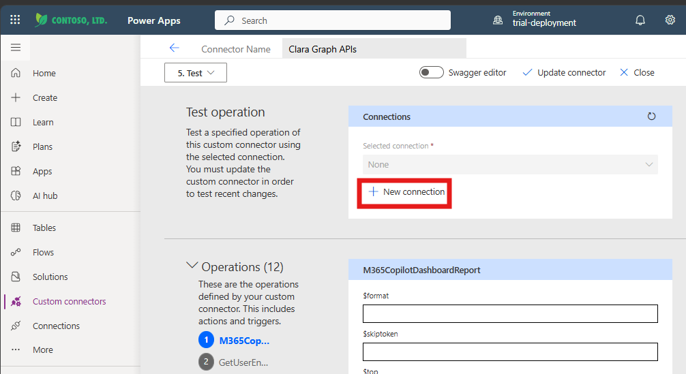

19. A pop-up redirects you to Microsoft sign-in — sign in with the tenant where you created the App Registration, review the consent screen (app name: Clara Graph APIs; permissions matching what you granted in Step 4), and click **Create**.
    
    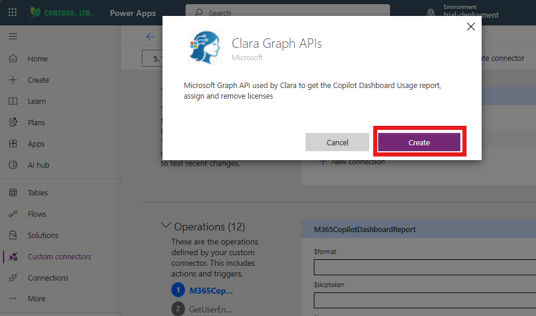

20. Re-open the connector (Custom connectors → Clara Graph APIs → Edit → Test tab) and verify your new connection appears and is selected (e.g., "[Your Name]'s connection" or "Connection 1").

21. Scroll to **Operations** and locate **GetM365CopilotLicenseOverview** — it calls `GET https://graph.microsoft.com/v1.0/subscribedSkus`, the same Graph endpoint behind the "Clara Graph APIs - M365 Copilot License Overview" tool you'll check off in Step 6.

22. Click **Test operation** and wait for the response (typically 5–10 seconds).

    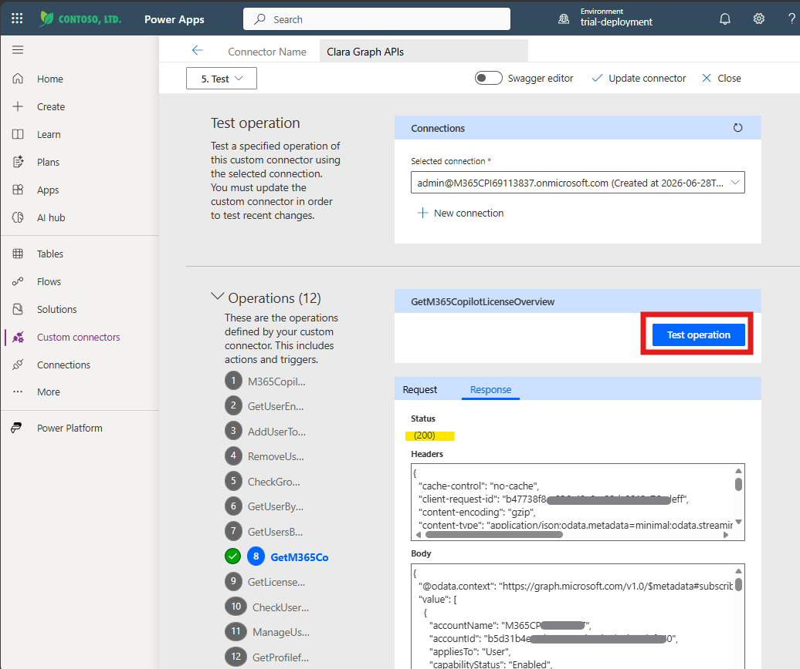

✅ **Validation:** Response shows `200 OK` with a JSON body listing your tenant's license SKU data. Failure looks like `401 Unauthorized` or `403 Forbidden` with an error body — see troubleshooting below.

> ⚠️ **Troubleshooting:**
> - **"Invalid URL" error:** Check all URLs use HTTPS and your real Tenant ID, with no brackets left in.
> - **Update button grayed out:** A required field may be empty — scroll through and check all of them.
> - **"Redirect URI mismatch" error:** Verify the exact URI from step 12 was added under "Web" (not "Single-page application") with no typos or trailing spaces.
> - **`401 Unauthorized` on test:** Delete the connection (Test tab → ⋯ → Delete) and recreate it (steps 17–19).
> - **`403 Forbidden` on test:** Go to Azure Portal → App registrations → CLARA → API permissions, confirm all 3 permissions show "Granted." If not, grant admin consent, wait a couple of minutes, then delete and recreate the connection.
> - **`404 Not Found` on test:** Generally fine for now — if step 18's connection succeeded, proceed; some environments don't surface every test operation the same way.

---

### 🧱 Step 6: Connect the Clara Graph APIs Connection Reference

#### Why This Step Matters

Back in Step 3, the import wizard couldn't match **Clara Graph APIs** to an existing connection, so its connection reference inside the solution was left unbound. Step 5 created and tested a connection for the connector itself — but that connection still needs to be explicitly assigned to the solution's connection reference before CLARA's flows and tools can actually use it.

1. Navigate back to Clara's solution — open Copilot Studio, go to **Solutions**, and click **Clara**.

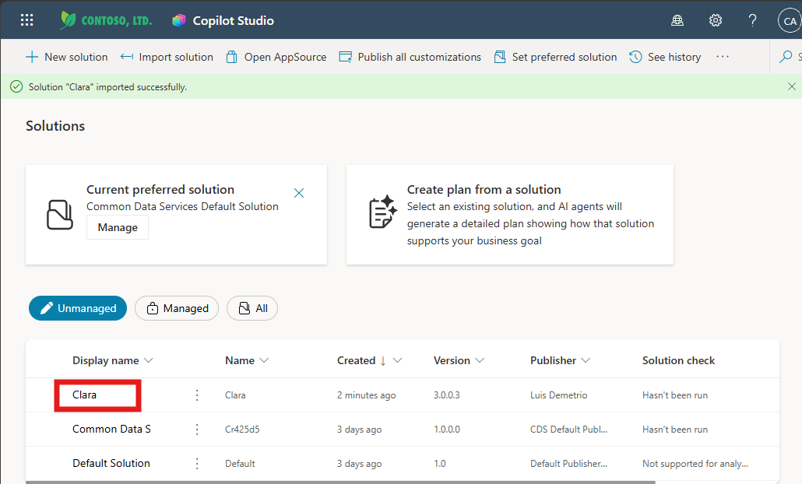

2. In the left-hand **Objects** menu, click **Connection references** (it'll show a count, e.g. "(3)").

3. You'll see 3 connection references — identify the one for **Clara Graph APIs**. Its Name is a long string ending in a unique suffix (in this environment, ending in `...ee048`); the other two are for Dataverse and Microsoft Copilot Studio. Click on it to open the **Edit** panel.

   > 💡 If you're unsure which is which, open each one and check the **Connector** field — the right one shows **Clara Graph APIs**.

4. In the Edit panel, under **Connection**, open the dropdown and select the connection you created and tested in Step 5 (listed by your sign-in account, e.g. `your-admin-account@yourtenant.onmicrosoft.com`).

   > ℹ️ Don't see your connection in the dropdown? Make sure you completed "Test the Connection" in Step 5 (steps 17–19) first — that's what creates it.

5. Click **Save**.

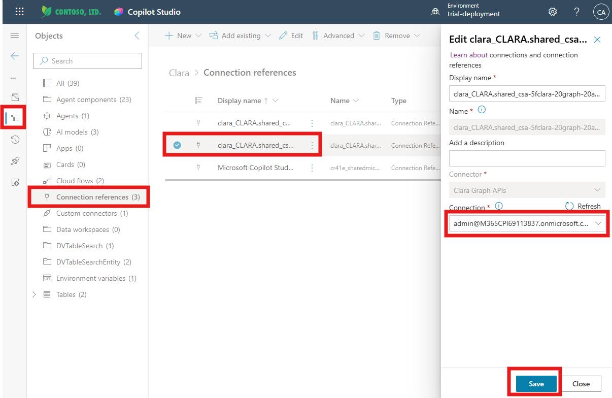

6. Back on the Solutions page, you should see a banner: *"Cloud flows are being updated for object '...'"* — this means Power Platform is propagating the new connection to Clara's flows. Give it a minute to finish before moving on.

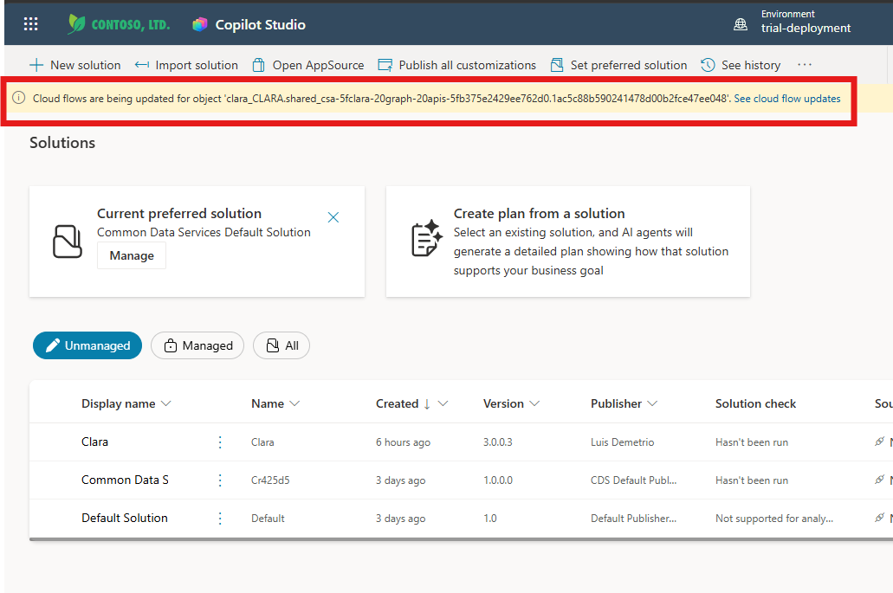

✅ **Validation:** The connection reference shows your selected connection, the save succeeds, and the "Cloud flows are being updated" banner appears (and clears shortly after).

### 🧱 Step 7: Verify CLARA Core in Copilot Studio

#### Why This Verification Matters

After importing the package, confirm that CLARA appeared correctly and that its foundation — tables, connector, flows, tools, and topics — is intact before layering on any optional package. **You're not testing functionality yet**; CLARA's Graph connection isn't authorized until the next exercise.

1. Switch back to <https://copilotstudio.microsoft.com>
2. After import completes, **CLARA** should appear in your Agents list
3. Click on **CLARA** to open the agent

   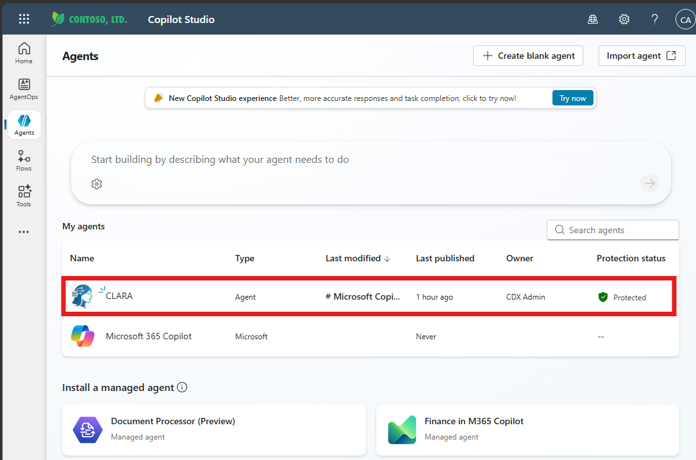
   
4. Confirm you can see:

   - Agent name: **CLARA**
   - Description visible
   - Test chat panel available
   
   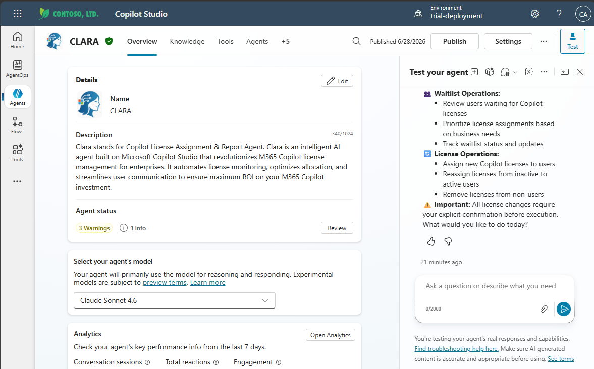

5. Click the **Knowledge** tab and confirm these two Dataverse tables are listed:

   - **Clara M365 Copilot Dashboard** (`clara_copilotlicensetracking`) — tracks Microsoft 365 Copilot license usage and activity
   - **CLARA User Profile** (`cr41e_clarauserprofile`)
   
   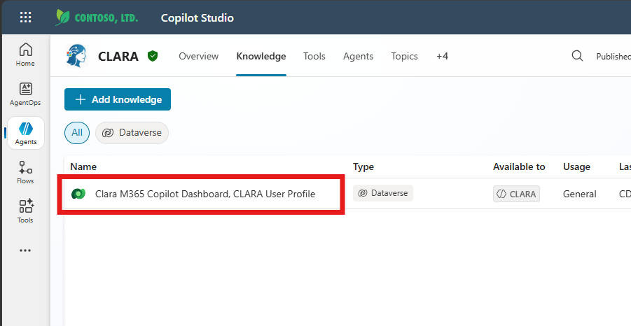

6. Click the **Tools** tab and confirm the following actions are available:

   - Clara Graph APIs - Get User By Email
   - Clara Graph APIs - Get Users By Name
   - Clara Graph APIs - M365 Copilot License Overview
   - Prompt - Clara User Profile Context
   - Microsoft Dataverse - Get License Grouped Count
   - Prompt - Query M365 Copilot User Activity
   
   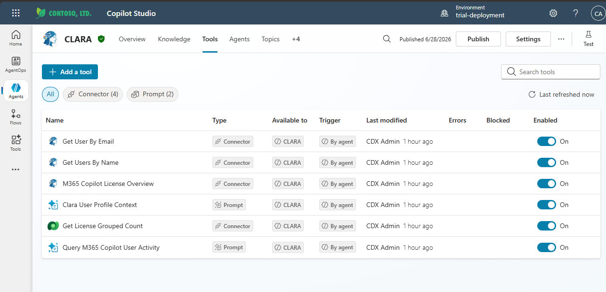
   
   
7. Click **Publish** (top-right of the agent canvas), then confirm in the dialog.

   > 💡 Publishing deploys CLARA's current configuration — the Knowledge, Tools, and Topics you just verified — so she's actually ready to test and use. Any future change to topics, tools, or knowledge sources needs a fresh publish before it takes effect outside the test chat pane.

   ⏱️ **Expected time:** 1–3 minutes.
   
   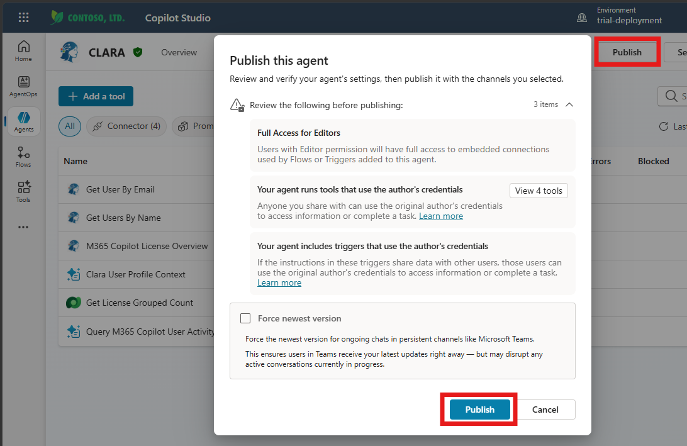

8. Click the **Overview** tab, scroll down to **Triggers** and confirm the two external (flow-based) triggers are present:

   - Clara - M365 Copilot Dashboard Sync
   - CLARA – M365 Copilot Licensed User Profiles Sync
   
   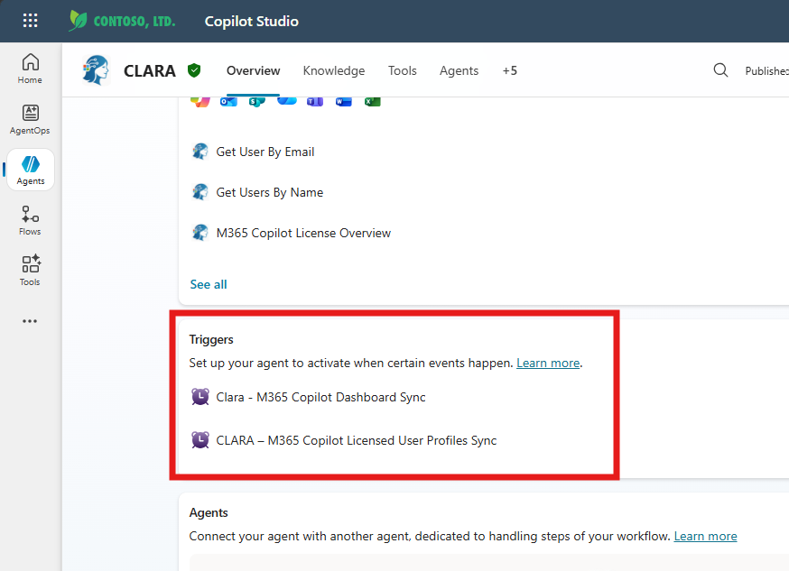


9. Turn on both flows — you can do this without leaving Copilot Studio:

    - Click on **Clara - M365 Copilot Dashboard Sync** in the Tools/Triggers list — this opens the flow in edit/designer mode.
    
    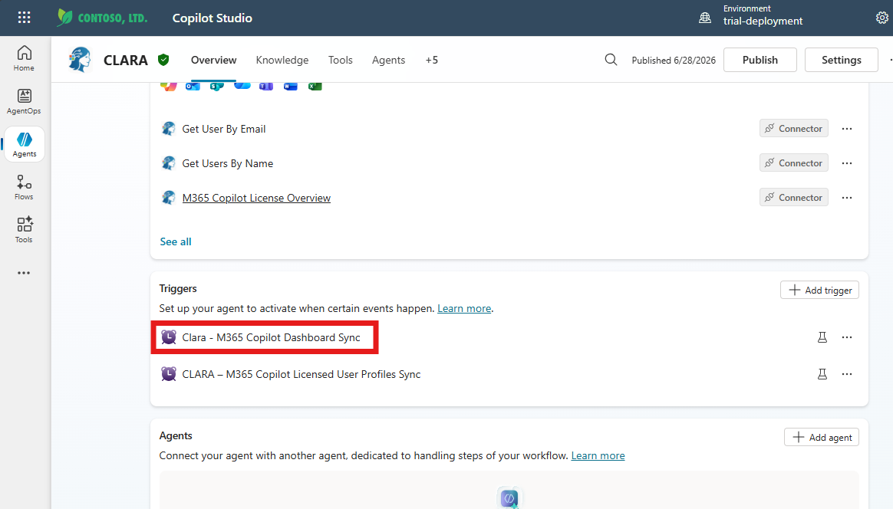
    
    - Click **Back** (top of the left panel) to return to the flow's overview page.
    
    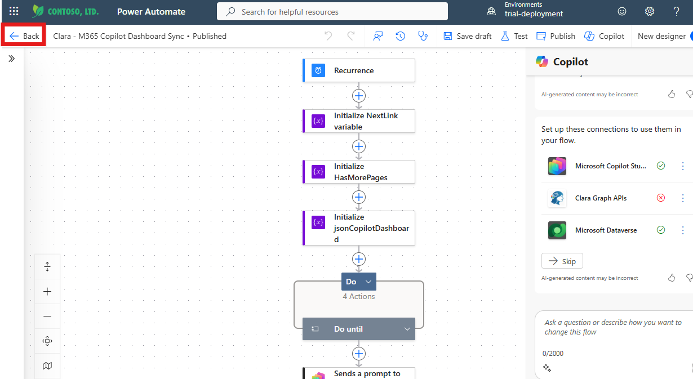
    
    - On the overview page, click **Turn on** in the menu bar (it can take 10 seconds to enable).
    
    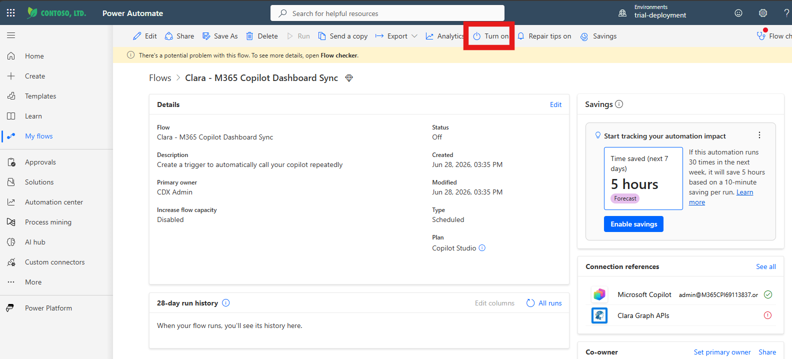
    
    > ⚠️ You can ignore the connection warning that appears before clicking Turn on - There's a potential problem with this flow. To see more details, open Flow checker.
    
    > ⚠️ Power Automate sometimes flags a connector step with a warning icon while the flow is still finishing activation in the background — it's the UI catching up, not a real connection problem. Wait a few seconds, then refresh the page; the warning should be gone. If it's still showing after a refresh, that's when it's worth investigating (see the troubleshooting note below).
    
    - Repeat the same three clicks for **CLARA – M365 Copilot Licensed User Profiles Sync**.

    ✅ Both flows now show status **On**.

10. **Test Clara with real prompts.** In the test chat panel, try each of the following:

    - `Hi Clara, show an overview of my licenses`
    
      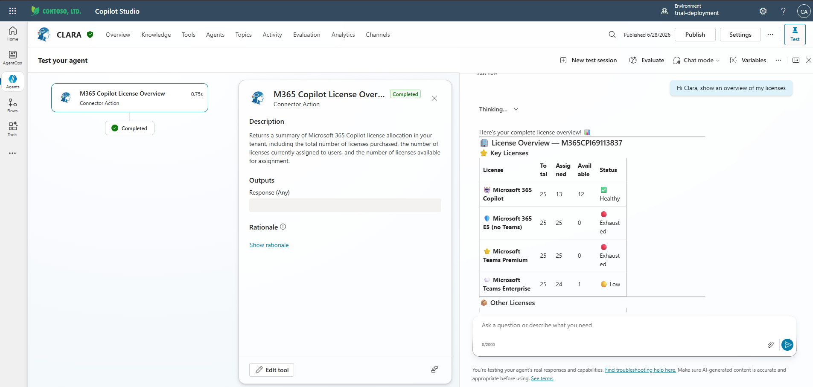
      
    - `Group the assigned licenses per country`
    
      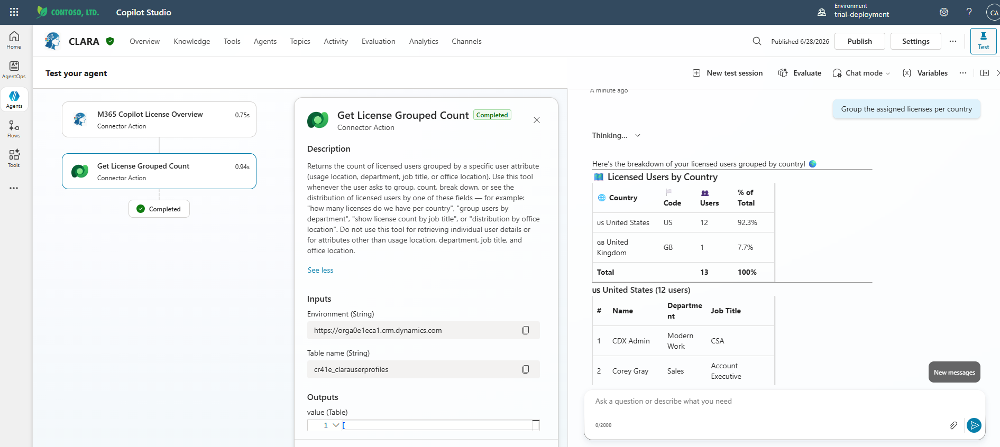
      
    - `Show the 5 least active users`
    
      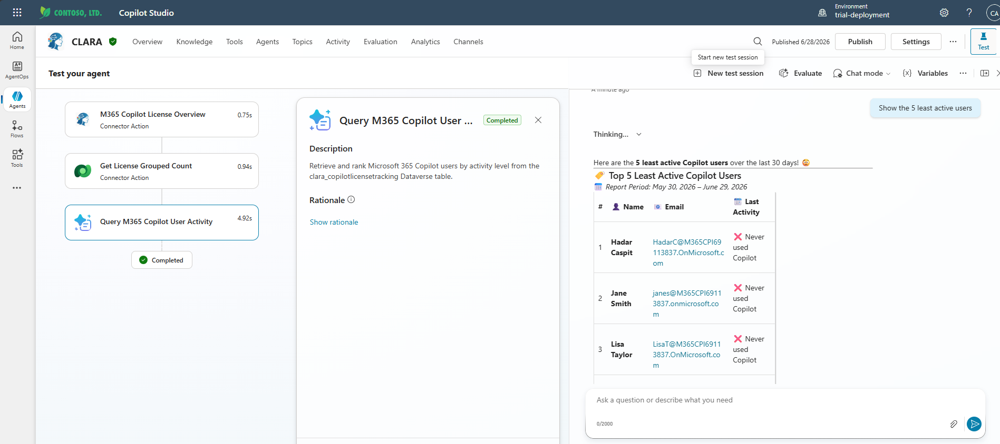

    Each prompt should route to one of Clara's tools and return real data from your tenant — license totals, the country/department/office breakdown (using the Dataverse Environment variable you set in Step 3), and usage activity from the Core tables and Graph reports.

✅ **Validation:** CLARA opens in Copilot Studio with both tables, all six tools, both triggers (now turned on), and the main topic visible — and all three test prompts return real data from your tenant.

> ⚠️ **Troubleshooting:** If any components are missing, verify the import completed without errors. Re-import the solution, or confirm your environment has Dataverse and Copilot Studio provisioned with the necessary licenses and permissions. If a prompt returns no data or an error, confirm the flow it depends on is turned on (step 10) and that the agent was published after your latest changes (step 8).

---

## Summary

You've successfully:

- ✅ Imported the Clara Core — Usage & Reporting package (1 of 6) to Copilot Studio
- ✅ Mapped the Dataverse, Clara Graph APIs, and Copilot Studio connections
- ✅ Created CLARA's Azure App Registration, with Graph permissions, admin consent, and a client secret
- ✅ Replaced the connector's pre-filled OAuth values with your own App Registration's credentials, registered its redirect URI, and confirmed a real call to Microsoft Graph returns license data
- ✅ Bound that connection to the Clara Graph APIs connection reference in the solution
- ✅ Verified the CLARA agent, its two Dataverse tables, six tools, two triggers, and main topic are present
- ✅ Published the agent, turned on both Power Automate flows, and confirmed CLARA answers real prompts using your tenant's data

---

## Troubleshooting

**Issue:** Import fails with an error

**Solutions:**
- Verify you have admin permissions on the environment
- Check the solution file isn't corrupted (re-download it)
- Ensure the correct environment is selected
- Try the import again — transient errors can occur

**Issue:** The Clara Graph APIs connection won't authorize

**Solutions:**
- This is expected until Step 4 (Azure App Registration), Step 5 (Custom Connector), and Step 6 (Connection Reference) are all complete — finish those in order, then check **Solutions > Clara > Connection references** to confirm the Clara Graph APIs reference shows your connection selected.

**Issue:** Lost the Azure client secret value

**Solutions:**
- It cannot be retrieved — go to **Certificates & secrets**, delete the old secret (⋯ → Delete), create a new one, and update your tracker.

**Issue:** Custom connector test returns `403 Forbidden`

**Solutions:**
- The connection works, but lacks permissions. Go to Azure Portal → App registrations → CLARA → API permissions, confirm all 3 permissions show "Granted," grant admin consent if needed, then delete and recreate the connector's connection.

---

