# Import Clara SharePoint List Waitlist Solution (Package 3 of 6)

## Objective

Import the **Clara SharePoint List Waitlist Solution** package into CLARA as a component collection, configure it to point at your organization's SharePoint waitlist, and verify that CLARA can read and manage waitlist entries.

---

## Before You Start

| | |
|---|---|
| **Package file** | `03 - Clara SharePoint Waitlist Solution 1.1.zip` |
| **Solution display name** | Clara - SharePoint Waitlist Solution |
| **Solution version** | 1.1 |
| **Depends on** | Clara Core (Exercise 4) — must be fully imported and configured first |

> ℹ️ This is one of two waitlist packages — **Clara ServiceNow Waitlist Solution** is the alternative for tenants that manage requests through ServiceNow. Deploy **only one** of them.

> ⚠️ **Important:** Unlike the Core package, which was imported via the Solutions page, optional packages are imported as **Component Collections** directly through CLARA's Settings. The entry point is different — follow the steps below carefully.

---

## What You'll Do

- Create the SharePoint waitlist list in your tenant
- Download the package
- Import it as a Component Collection through CLARA's Settings
- Map the two SharePoint connections
- Set the three environment variables
- Add the collection to the CLARA agent
- Turn on the flow and publish the agent
- Verify the new tools in Copilot Studio and test with real prompts

---

## What This Package Adds to CLARA

Once installed, this package extends CLARA with two new tools visible in the Tools tab:

| Tool | Type | What it does |
|---|---|---|
| **Manage SharePoint Waitlist** | Prompt | Main action — reads pending waitlist requests from SharePoint and lets the admin review and approve them |
| **Get Copilot Waitlist Users** | Connector | Retrieves waitlist items from the configured SharePoint list and view |

It also includes a Power Automate flow (**Clara - Update SharePoint WaitList**) that CLARA calls to update a waitlist item's status back in SharePoint when an admin approves or rejects a request.

---

## Prerequisites

CLARA doesn't create the SharePoint list — you need one already in place before importing.

### 🧱 Step 0: Create the SharePoint Waitlist List

1. Navigate to your SharePoint Online site (the one you'll use for CLARA's waitlist).

2. Create a new list named **`M365 Copilot Waitlist`** (this is the default name baked into the package — you can use a different name, but you'll need to update the environment variable to match).

3. Add the following columns to the list:

   | Column name | Type | Notes |
   |---|---|---|
   | **Title** | Single line of text | Built-in — use it for the user's display name or request title |
   | **Email** | Single line of text | The user's email address, used by CLARA to look up the Entra ID user |
   | **Status** | Choice | Values: `Pending`, `Approved`, `Rejected` |
   | **RequestedDate** | Date and Time | When the request was submitted |

4. Open the view you want CLARA to use for reading pending requests. From the browser URL, copy the **View ID** — it's the GUID in the format `{xxxxxxxx-xxxx-xxxx-xxxx-xxxxxxxxxxxx}` that appears in the query string. Save it to your notes.

   > 💡 You can use the default "All items" view, or create a filtered view that shows only `Status = Pending`. Either way, grab its GUID from the URL.

5. Note the **full URL** of your SharePoint site (e.g. `https://yourtenant.sharepoint.com` or `https://yourtenant.sharepoint.com/sites/IT`). Save it to your notes.

   ```
   SharePoint Setup
   ================
   Site URL: ____________________________________
   List name: M365 Copilot Waitlist (or your own name)
   View ID (GUID): ______________________________
   ```

✅ **Validation:** SharePoint list exists with the required columns, and you have the site URL and view GUID saved.

For more information about the detailed steps to create the list, please check: [Exercise 1: Prepare SharePoint Infrastructure](https://github.com/luishdemetrio/clara-copilot-agent/blob/main/labs/01-exercise1.md) 

---

## Tasks

### 🧱 Step 1: Download the Package

1. Navigate to Clara's GitHub repository:

   <https://github.com/luishdemetrio/clara-copilot-agent/tree/main/agent/3.0>

2. Locate and click **`03 - Clara SharePoint Waitlist Solution 1.1.zip`**

   > ℹ️ The version number may differ.

3. Click **Download**.

---

### 🧱 Step 2: Open CLARA's Settings

1. Navigate to <https://copilotstudio.microsoft.com> and open the **CLARA** agent.

2. Click **Settings** in the top-right area of the agent canvas.

   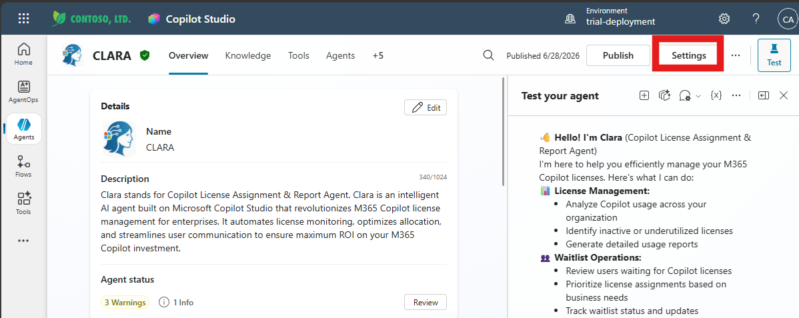

3. In the Settings left menu, click **Component collections**.

   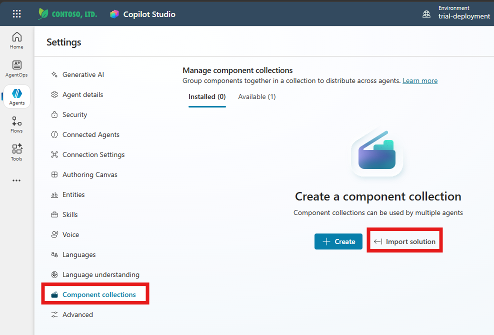

---

### 🧱 Step 3: Import the Solution as a Component Collection

1. On the **Manage component collections** page, click **Import solution**.

2. Click **Browse files**, select `03 - Clara SharePoint Waitlist Solution 1.1.zip`, then click **Next**.

   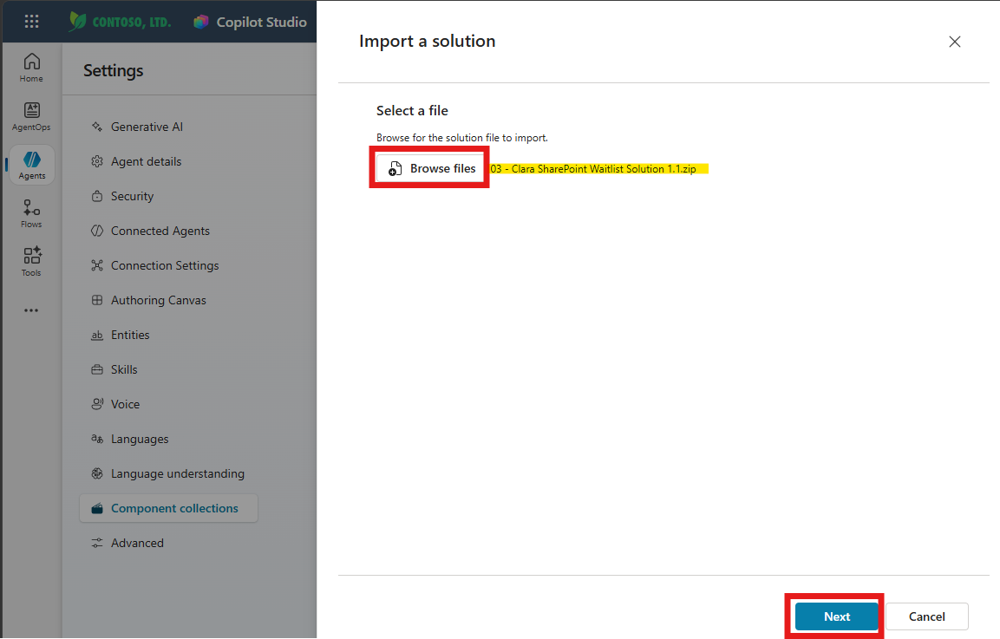

3. Review the solution details and click **Next**.

   - Name: **Clara - SharePoint Waitlist Solution**
   - Type: Unmanaged
   - Version: **1.1**
   - Publisher: CDS Default Publisher

   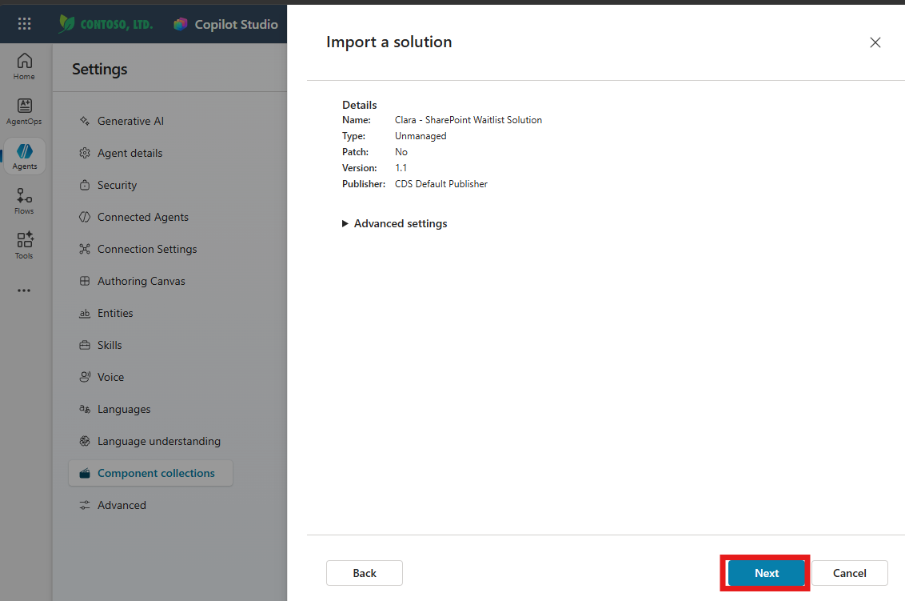

4. **Connections page** — the wizard shows two SharePoint connection references, both starting as **Not connected**:

   | Connection reference | What it connects to |
   |---|---|
   | `cr41e_clara.shared_sharepointonline.shared-sharepointonl-1fbf3912-...` | SharePoint Online — used by the flow |
   | **SharePoint List** (`cr41e_sharedsharepointonline_2dc06`) | SharePoint Online — used by the agent action |

   For each one showing **Not connected**:

   - Click the dropdown → **Create new connection**.

     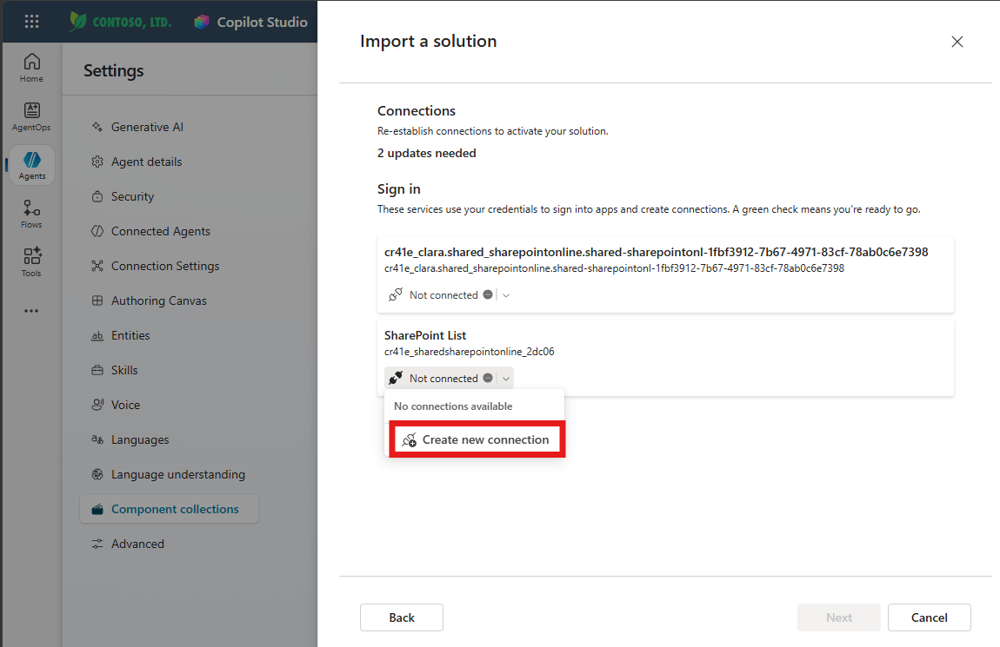

   - A **Connect to SharePoint** dialog appears. Leave **Connect directly (cloud-services)** selected and click **Create**.

     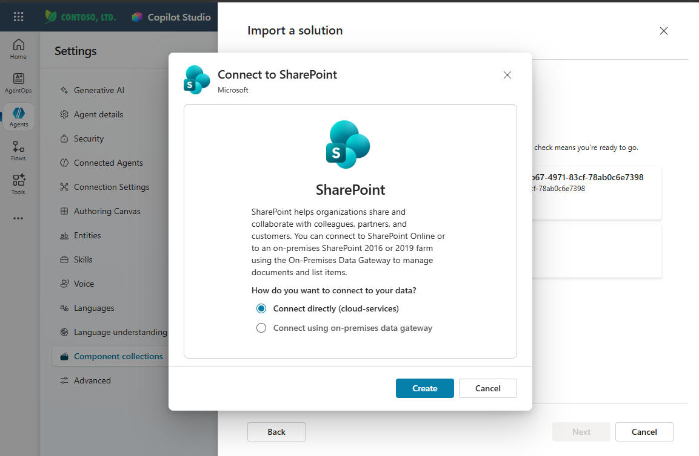

   - Sign in with your Microsoft 365 credentials when prompted. The dialog closes and the connection reference updates to show your account with a green check ✅.

   - Repeat for the second connection reference.

5. Once both show a green check ✅, click **Next**.

   

6. **Environment Variables page** — replace all three pre-filled values with your own:

   | Field | What to enter |
   |---|---|
   | **SharePoint Waitlist List Name** | Exact name of the list you created in Step 0. Default: `M365 Copilot Waitlist` |
   | **SharePoint Waitlist Site URL** | Full URL of your SharePoint site. Example: `https://yourtenant.sharepoint.com` |
   | **SharePoint Waitlist View ID** | The GUID you copied from the view URL in Step 0. Example: `28eba4c1-d992-4a4a-9f9f-890ed71e6946` |

   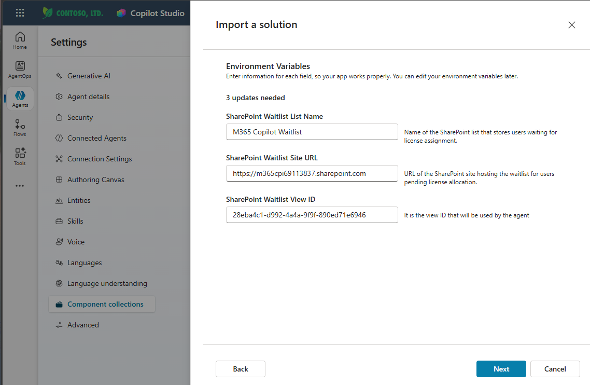

   > ⚠️ The package ships with sample values pointing at a test tenant. **Replace all three** — do not leave the defaults in place.

   > ℹ️ The View ID is a GUID (e.g. `28eba4c1-d992-4a4a-9f9f-890ed71e6946`), not the view's display name. If you enter the name instead of the GUID, CLARA won't be able to read the view.

7. Click **Next** to start the import. The page shows a **"Currently importing solution..."** progress banner.

   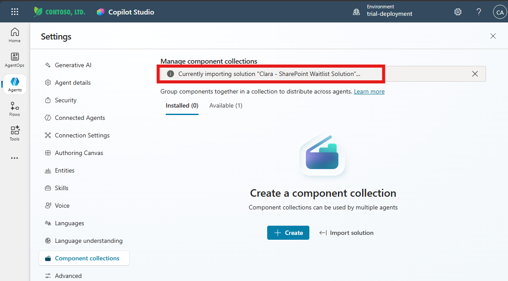

   ⏱️ **Expected time:** 1–3 minutes.

✅ **Validation:** A green banner appears: *"Solution 'Clara - SharePoint Waitlist Solution' imported successfully."* The **Available** tab now shows the collection.

---

### 🧱 Step 4: Add the Collection to CLARA

Importing the package makes it *available* — it still needs to be explicitly added to the CLARA agent before its tools and topics become active.

1. On the **Available** tab, locate **Clara - SharePoint Waitlist** in the list.

2. Click the **⋯** (ellipsis) next to it and select **Add to agent**.

   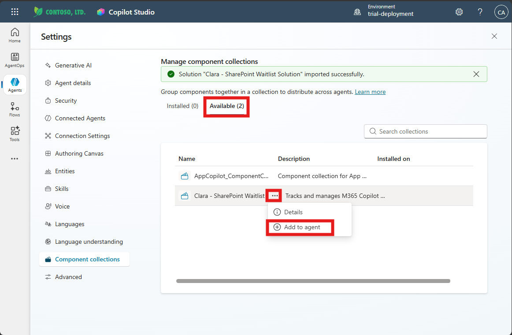

3. A confirmation dialog appears: *"This will add the collection and all of its components to the agent."* Click **Add to agent**.

   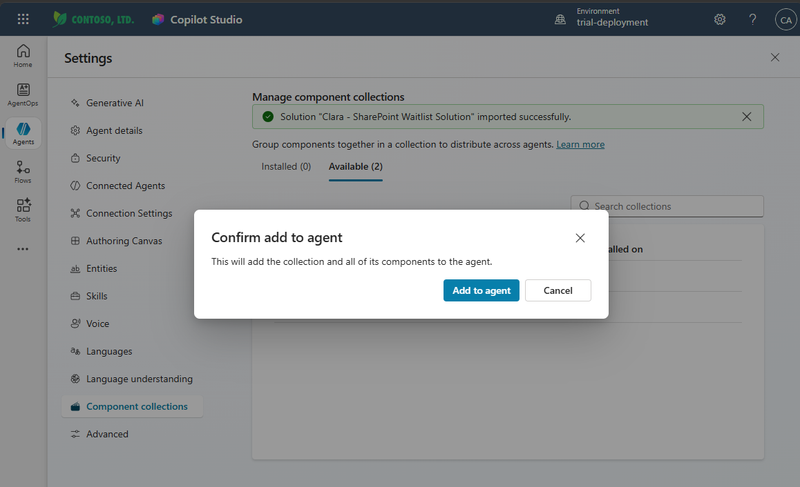

4. The collection moves to the **Installed** tab, showing **Installed (1)** and **Installed on: CLARA**.

   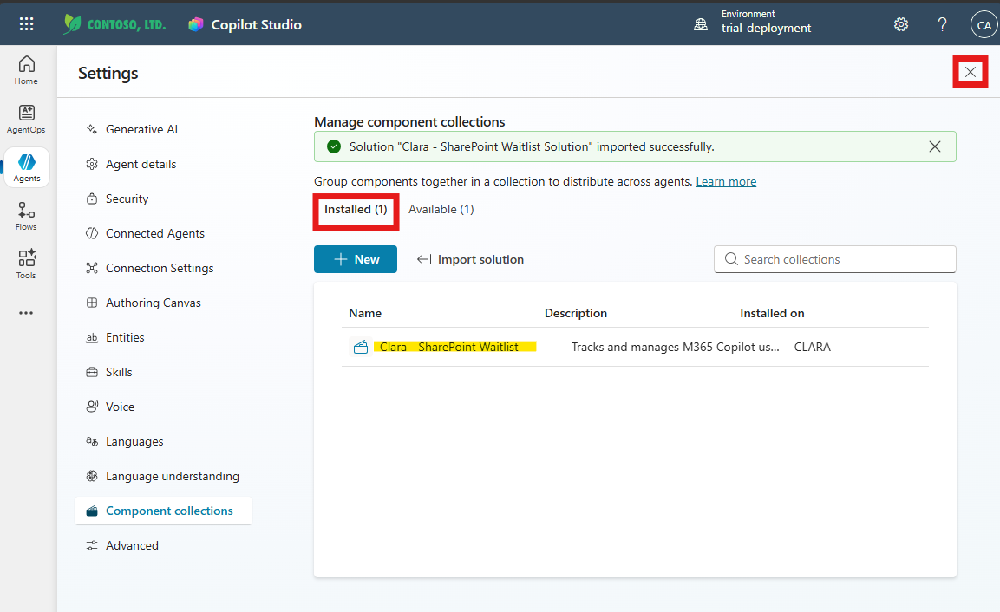

5. Click **X** to close the Settings panel and return to the agent canvas.

✅ **Validation:** Component collections → Installed tab shows **Clara - SharePoint Waitlist** installed on **CLARA**.

---

### 🧱 Step 5: Turn On the Flow

1. In CLARA's agent view, click the **Tools** tab.

2. Locate **Clara - Update SharePoint WaitList** under Triggers.

3. Click on **Clara - Update SharePoint WaitList** to open the flow in designer mode.

4. Click **Back** (top of the left panel) to return to the flow's overview page.

5. Click **Turn on** in the menu bar if the flow isn't already on.

   > ⚠️ A connection warning may briefly appear after clicking Turn on — this is normal. Power Automate flags the connector while the flow is still finishing activation in the background. Wait a few seconds and refresh; the warning should clear. If it persists after a refresh, open the flow and reconnect the SharePoint connector.

✅ **Validation:** The **Clara - Update SharePoint WaitList** flow shows status **On**.

---

### 🧱 Step 6: Publish the Agent

1. Back in CLARA's agent view, click **Publish** (top-right) and confirm.

   ⏱️ **Expected time:** 1–3 minutes.

> 💡 Publishing is required any time a component collection is added — without it, the new tools won't be active in the deployed agent.

---

### 🧱 Step 7: Verify the New Tools

In CLARA's **Tools** tab, confirm the two new tools are now visible (they appear highlighted in the list right after installation):

- **Manage SharePoint Waitlist** — Type: Prompt
- **Get Copilot Waitlist Users** — Type: Connector

  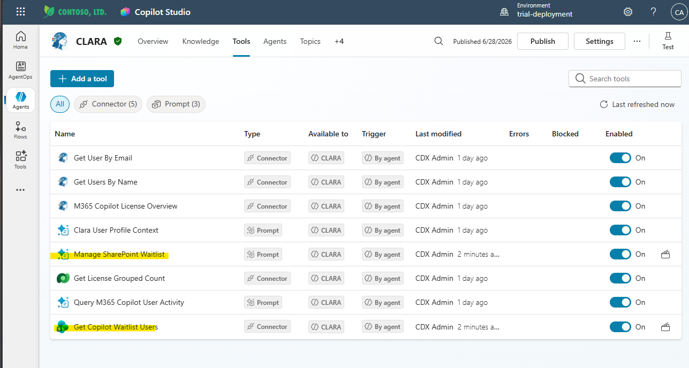

✅ **Validation:** Both new tools appear in the Tools list with **Enabled: On**.

---

### 🧱 Step 8: Test With Real Prompts

In CLARA's test chat panel, try:

- `Who is waiting for licenses?`


CLARA should connect to your SharePoint list, return the pending items from the configured view, and — on approval — call the **Clara - Update SharePoint WaitList** flow to update the item's status.

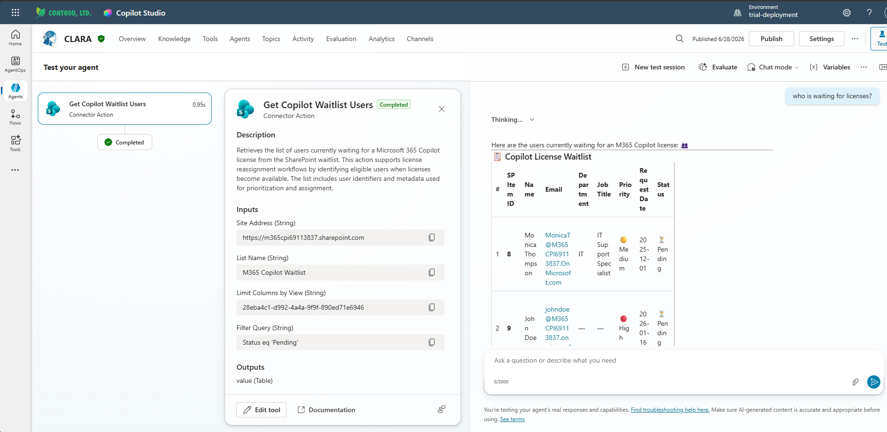

✅ **Validation:** CLARA reads pending requests from your SharePoint list and updates item status correctly.

> ⚠️ **Troubleshooting:** If CLARA returns no items, verify:
> - `SharePoint Waitlist View ID` holds the correct GUID (not the view's display name) from the view URL.
> - The view actually contains items with status `Pending`.
> - The two SharePoint connection references both show a green check (Settings → Component collections → Clara - SharePoint Waitlist → Details).

---

## Summary

You've successfully:

- ✅ Created the SharePoint waitlist list with the required columns
- ✅ Imported Clara SharePoint Waitlist Solution (package 3 of 6) as a Component Collection through CLARA's Settings
- ✅ Created and mapped both SharePoint connections
- ✅ Set the site URL, list name, and view ID environment variables
- ✅ Added the collection to the CLARA agent
- ✅ Turned on the Clara - Update SharePoint WaitList flow
- ✅ Published the agent and confirmed the two new tools are present
- ✅ Confirmed CLARA reads and updates waitlist entries from SharePoint

---

## Troubleshooting

**Issue:** Import fails with connection errors

**Solutions:**
- Make sure you completed the "Create new connection" step for **both** SharePoint connection references before clicking Next on the Connections page.

**Issue:** CLARA can't find the SharePoint list

**Solutions:**
- Check `SharePoint Waitlist Site URL` — must point to the **site root**, not the list itself (no `/Lists/...`).
- Check `SharePoint Waitlist List Name` — must match exactly, including capitalisation.
- Update via Settings → Component collections → Clara - SharePoint Waitlist → Edit environment variables.

**Issue:** The View ID isn't working

**Solutions:**
- The field expects a **GUID**, not the view name. Open the view in your browser and copy the GUID from the URL query string (the part after `viewid=`).

**Issue:** Flow connection warning doesn't clear after a refresh

**Solutions:**
- Open the flow, find the step showing the warning icon, click on it, and re-select the SharePoint connection. Save and re-enable.

---
