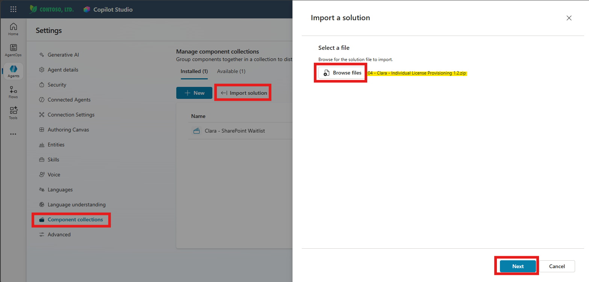
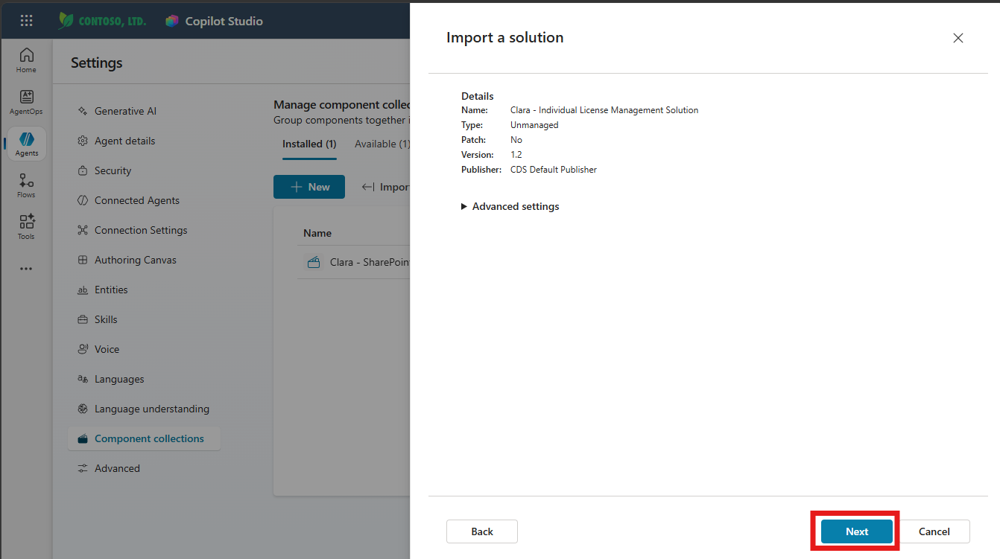
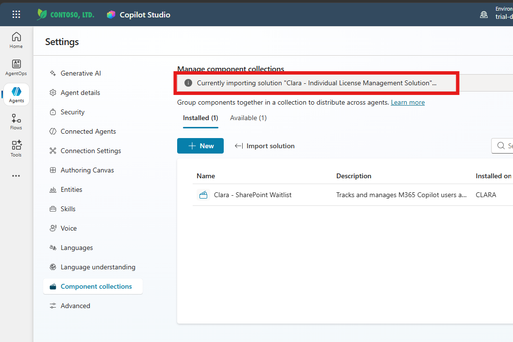
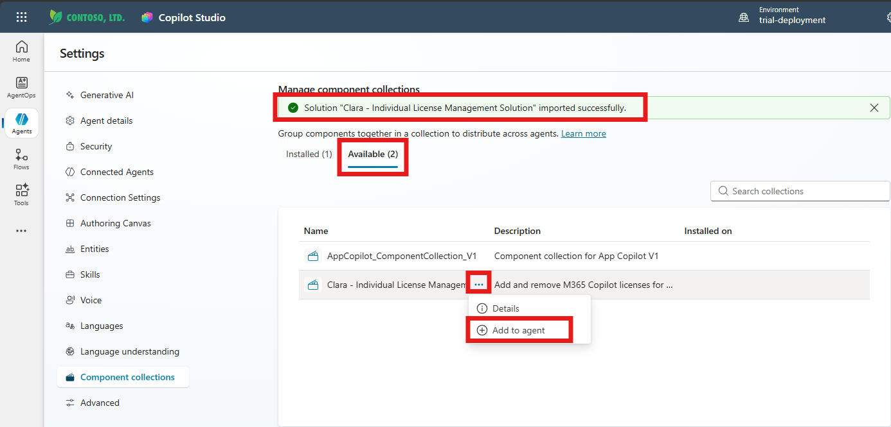
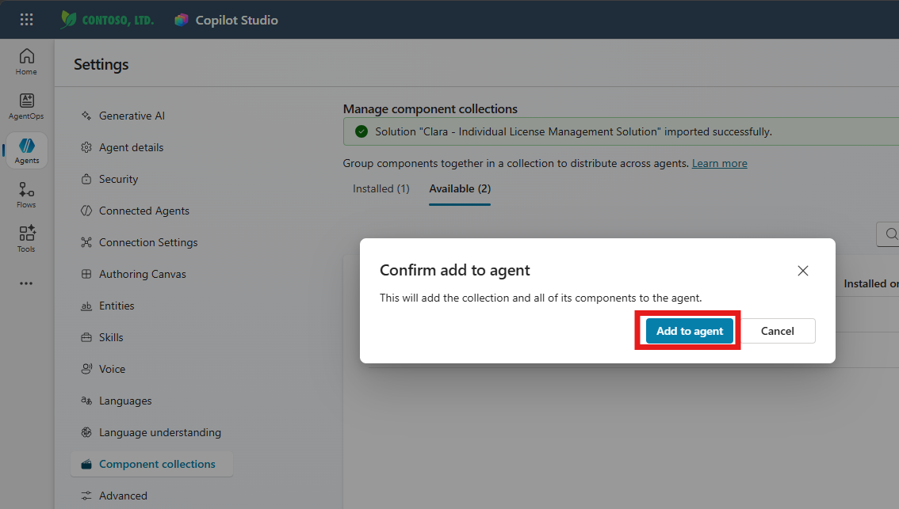
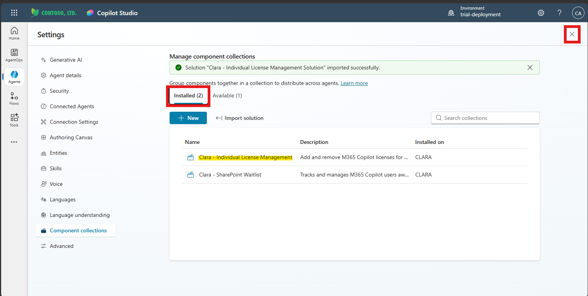
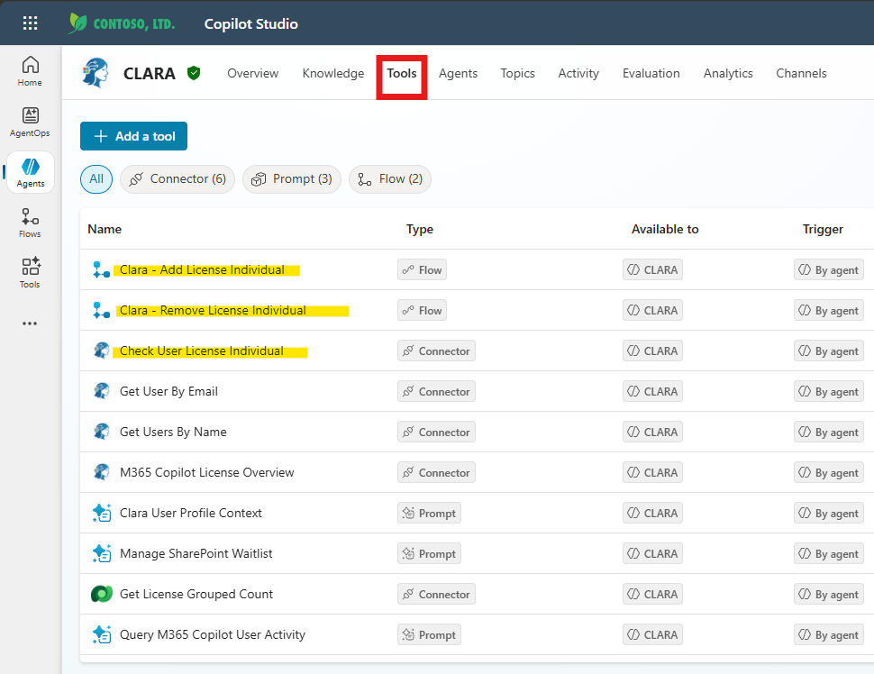
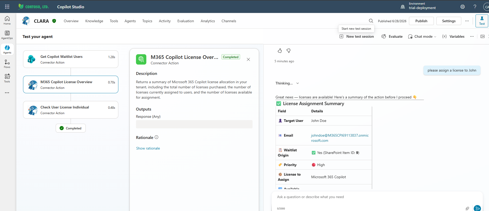

# Import Clara — Individual License Provisioning (Package 4 of 6)

## Objective

Import the **Clara — Individual License Provisioning** package into CLARA as a component collection, verify its connection, and test direct (per-user) Copilot license assignment and removal via the Microsoft Graph API.

---

## Before You Start

| | |
|---|---|
| **Package file** | `04 - Clara - Individual License Provisioning 1.2.zip` |
| **Solution display name** | Clara - Individual License Management Solution |
| **Solution version** | 1.2 |
| **Depends on** | Clara Core (Exercise 4) — must be fully imported and configured first |

> ℹ️ This is one of two provisioning packages — **Clara — Entra ID Group License Provisioning** is the alternative for tenants that manage Copilot access through group membership. Deploy **only one** of them. If your tenant assigns Copilot licenses directly to individual users, you're in the right place.

> 💡 Unlike the SharePoint Waitlist package, this one adds **no new environment variables** and reuses the **same Clara Graph APIs connection** you already authorized in Exercise 4 — so this import is noticeably quicker.

---

## What You'll Do

- Download the package
- Import it as a Component Collection through CLARA's Settings
- Confirm the existing Clara Graph APIs connection
- Add the collection to the CLARA agent
- Publish the agent
- Verify the new tools in Copilot Studio
- Test license assignment with a real prompt

---

## What This Package Adds to CLARA

Once installed, this package extends CLARA with three new tools, visible in the Tools tab:

| Tool | Type | What it does |
|---|---|---|
| **Clara - Add License Individual** | Flow | Assigns a Microsoft 365 Copilot license directly to a specific user's account via the Graph API `assignLicense` operation (individual assignment, not group-based) |
| **Clara - Remove License Individual** | Flow | Removes a Microsoft 365 Copilot license directly from a specific user's account, the same way |
| **Clara Graph APIs - Check User License Individual** | Connector | Checks a user's current license status before assigning or removing — this is what lets CLARA gracefully handle a user who's already licensed |

Both flows call the same **Clara Graph APIs** custom connector from Core — they each use their own connection reference internally, but both point at the connection you already created and tested in Exercise 4.

---

## Tasks

### 🧱 Step 1: Download the Package

1. Navigate to Clara's GitHub repository:

   <https://github.com/luishdemetrio/clara-copilot-agent/tree/main/agent/3.0>

2. Locate and click **`04 - Clara - Individual License Provisioning 1.2.zip`**

   > ℹ️ The version number may differ.

3. Click **Download**.

---

### 🧱 Step 2: Open Component Collections

1. Navigate to <https://copilotstudio.microsoft.com> and open the **CLARA** agent.

2. Click **Settings** (top-right of the agent canvas).

 


3. In the Settings left menu, click **Component collections**.

   You should already see **Clara - SharePoint Waitlist** listed under **Installed (1)** if you completed Exercise 5.

---

### 🧱 Step 3: Import the Solution as a Component Collection

1. On the **Manage component collections** page, click **Import solution**.

2. Click **Browse files**, select `04 - Clara - Individual License Provisioning 1.2.zip`, then click **Next**.

   

3. Review the solution details and click **Next**.

   - Name: **Clara - Individual License Management Solution**
   - Type: Unmanaged
   - Version: **1.2**
   - Publisher: CDS Default Publisher

   

4. **Connections page** — this package reuses the same **Clara Graph APIs** connection reference from Core. Since you already connected and authorized it in Exercise 4, it shows up with a green check ✅ automatically — no new sign-in needed.

   

   > ℹ️ If it shows **Not connected** instead, click the dropdown and select your existing connection (the same one used by Core) rather than creating a new one — reusing the connection keeps both packages pointed at the same authorized Graph identity.

5. Click **Next**.

6. There's no Environment Variables page for this package — the import starts immediately. You'll see a **"Currently importing solution..."** progress banner.

   

   ⏱️ **Expected time:** 1–3 minutes.

✅ **Validation:** A green banner appears: *"Solution 'Clara - Individual License Management Solution' imported successfully."* The **Available** tab now shows **Available (2)**.

   

---

### 🧱 Step 4: Add the Collection to CLARA

1. On the **Available** tab, locate **Clara - Individual License Management** in the list.

2. Click the **⋯** (ellipsis) next to it and select **Add to agent**.
 
   

   
3. A confirmation dialog appears: *"This will add the collection and all of its components to the agent."* Click **Add to agent**.

   
   
   
4. The collection moves to the **Installed** tab, now showing **Clara - Individual License Management**listed as installed on **CLARA**.

   
   
   

5. Click **X** to close the Settings panel and return to the agent canvas.

✅ **Validation:** Component collections → Installed tab shows **Clara - Individual License Management** installed on **CLARA**.

---

### 🧱 Step 5: Publish the Agent

1. Back in CLARA's agent view, click **Publish** (top-right) and confirm.

   ⏱️ **Expected time:** 1–3 minutes.

> 💡 Publishing is required any time a component collection is added — without it, the new tools won't be active in the deployed agent.

---

### 🧱 Step 6: Verify the New Tools

1. In CLARA's agent view, click the **Tools** tab.

2. Confirm the three new tools are now visible (they appear highlighted in the list right after installation):

   - **Clara - Add License Individual** — Type: Flow
   - **Clara - Remove License Individual** — Type: Flow
   - **Check User License Individual** — Type: Connector

   
   
   
✅ **Validation:** All three new tools appear in the Tools list, Available to **CLARA**, Trigger **By agent**.

---

### 🧱 Step 7: Test License Assignment

In CLARA's test chat panel, try:

```
please assign a license to John
```

CLARA should walk through the following sequence:

1. **Get Copilot Waitlist Users** / user lookup — to identify the target user
2. **M365 Copilot License Overview** — to confirm a license is available in your tenant
3. **Check User License Individual** — to confirm the user isn't already licensed

She'll then present a **License Assignment Summary** for confirmation before proceeding — showing the target user, email, waitlist origin (if applicable), priority, and the license to assign.



> 💡 Confirm the assignment to let CLARA proceed, or test a removal afterward with a prompt like `remove the Copilot license from John`.

✅ **Validation:** CLARA returns a license assignment summary built from real tenant data, and completes the assignment (or removal) when confirmed.

> ⚠️ **Troubleshooting:** If the flow fails with an authorization error, confirm the Clara Graph APIs connection reference used by this package is the same authorized connection from Exercise 4 (Settings → Component collections → Clara - Individual License Management → Details, or check the flow's connection in **Flows**).

---

## Summary

You've successfully:

- ✅ Imported Clara — Individual License Provisioning (package 4 of 6) as a Component Collection through CLARA's Settings
- ✅ Confirmed it reuses the existing, already-authorized Clara Graph APIs connection
- ✅ Added the collection to the CLARA agent
- ✅ Published the agent and confirmed the three new tools are present
- ✅ Tested license assignment with a real prompt and confirmed CLARA returns a real, data-backed summary

---

## Troubleshooting

**Issue:** Import fails or the connection shows "Not connected"

**Solutions:**
- This package depends entirely on the Clara Graph APIs connection from Exercise 4 — make sure that exercise is fully complete (App Registration, custom connector test, and connection reference bound in Core) before importing this package.
- If the connection shows "Not connected," select your existing connection from the dropdown rather than creating a new one.

**Issue:** License assignment fails with `403 Forbidden`

**Solutions:**
- Confirm the Azure App Registration's permissions from Exercise 4 are still granted — specifically the permission that allows assigning licenses (`User.ReadWrite.All` or equivalent). If you only granted Directory.Read.All, GroupMember.ReadWrite.All, and Reports.Read.All in Exercise 4, you'll need to add the license-assignment permission and re-grant admin consent.

**Issue:** CLARA says the user is already licensed when they shouldn't be

**Solutions:**
- This is the **Check User License Individual** tool working as intended — it's preventing a duplicate assignment. Verify the user's actual license status directly in the Microsoft 365 admin center if you believe this is incorrect.

---

**Next:** Exercise 7: Import Clara — Entra ID Group License Provisioning *(skip if you already deployed Individual Provisioning)*, then Exercise 8: Import Clara Communication
