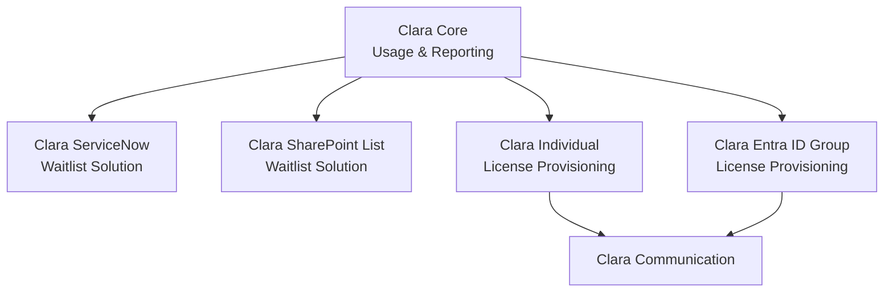

# 👧 CLARA — Copilot License Assignment & Report Agent

**Version 3.0** · Built on Microsoft Copilot Studio + Power Platform

CLARA is an AI agent that manages the full lifecycle of Microsoft 365 Copilot licenses inside an organization — from usage reporting and license-pool visibility, through waitlist management, to provisioning and user communication. It runs on Copilot Studio with a Power Platform backend (Dataverse, Power Automate, and a custom Microsoft Graph connector authenticated via a Service Principal).

> 🏆 Winner — Microsoft Global Hackathon (Brazil venue)

---

## What's new in v3

Versions 1 and 2 shipped CLARA as a single, monolithic solution. **v3 re-architects CLARA into a core package plus independent, optional component packages**, so customers only deploy the capabilities they actually need.

Benefits of the new model:

- **Smaller blast radius** — each package is its own Power Platform solution with its own connection references, so an issue in one package doesn't take down the others.
- **Faster, lower-risk deployments** — import only what's relevant to your tenant's process (e.g., skip ServiceNow entirely if you manage waitlists in SharePoint).
- **Flexible provisioning model** — choose per-user direct provisioning *or* Entra ID group-based provisioning, depending on how your tenant manages Copilot licensing.
- **Independent versioning** — packages can be updated and re-imported without touching Core.

---

## Architecture



**Core is the only required package.** Every optional package depends on Core's Dataverse tables and reporting layer. The two waitlist packages are alternatives to each other (pick the one matching your intake process), as are the two provisioning packages (pick the one matching your licensing model). Communication is triggered by whichever provisioning package you deploy.

---

## Package catalog

| Package | Type | Summary |
|---|---|---|
| **Clara Core — Usage & Reporting** | Required | License overview, M365 Copilot user activity, grouped license counts |
| **Clara ServiceNow Waitlist Solution** | Optional | Review pending requests, manage waitlist users via ServiceNow |
| **Clara SharePoint List Waitlist Solution** | Optional | Review pending requests, manage waitlist users via a SharePoint list |
| **Clara — Individual License Provisioning** | Optional | Assign/remove Copilot licenses, send welcome emails, handle already-licensed users — per user, via Graph API |
| **Clara — Entra ID Group License Provisioning** | Optional | Assign/remove Copilot licenses, send welcome emails, handle already-licensed users — via Entra ID group membership |
| **Clara Communication** | Optional | Sends the welcome email to newly licensed users |

---

## Package details

### 1. Clara Core — Usage & Reporting *(required)*

The foundation every other package builds on.

- **Dataverse tables:** `clara_userprofile`, `clara_copilotlicensetracking`
- **Reporting:** FetchXML aggregate queries grouping license counts by Entra ID attributes (usage location, department, job title, office location)
- **Usage data source:** Microsoft Graph reporting endpoints for per-user Copilot interaction and activity data
- **Connector:** Custom Graph API connector authenticated via Service Principal (client credentials flow)

**Deploy this first.** No other package will function without it.

### 2a. Clara ServiceNow Waitlist Solution

- Surfaces pending Copilot license requests submitted through a ServiceNow catalog item
- Flow Designer–driven approval/intake flow
- Lets an admin review, approve, or reject waitlisted users from inside CLARA

### 2b. Clara SharePoint List Waitlist Solution

- Functionally equivalent to the ServiceNow variant, for tenants without (or not wanting to use) ServiceNow
- Pending requests are tracked in a SharePoint list instead of a ServiceNow catalog
- Use **either** this **or** the ServiceNow package — not both

### 3a. Clara — Individual License Provisioning

- Assigns and removes Copilot licenses directly via `POST /users/{userId}/assignLicense` (Graph API)
- Detects and gracefully handles users who are already licensed
- Triggers Clara Communication on successful assignment
- Best fit when Copilot is licensed per user rather than through a group

### 3b. Clara — Entra ID Group License Provisioning

- Assigns and removes Copilot access by adding/removing users from a license-assigning Entra ID group
- Checks existing group membership before acting, to handle already-licensed users
- Triggers Clara Communication on successful group assignment
- Best fit when Copilot licensing is managed through group-based licensing

> Use **either** the Individual **or** the Entra ID Group provisioning package, matching your tenant's licensing model.

### 4. Clara Communication

- Sends the welcome email to users once they're licensed
- Consumed by whichever provisioning package (3a or 3b) is deployed
- Kept as its own package so the email template/flow can be customized without touching provisioning logic

---

## Tech stack

| Layer | Technology |
|---|---|
| Agent / conversational layer | Microsoft Copilot Studio |
| Orchestration | Power Automate |
| Data | Microsoft Dataverse |
| Identity & licensing | Microsoft Entra ID, Microsoft Graph API |
| Intake (optional) | ServiceNow / SharePoint Online |
| Auth | Service Principal (client credentials) via custom connector |

---

## Prerequisites

- Power Platform environment with Dataverse
- Entra ID app registration with a Service Principal, granted (as applicable to the packages you deploy):
  - `User.ReadWrite.All` — license assignment/removal, user lookup
  - `Organization.Read.All` — license SKU/usage data
  - `GroupMember.ReadWrite.All` — Entra ID Group Provisioning package only
  - `Reports.Read.All` — Copilot usage reporting
  - `Mail.Send` — Clara Communication package
- ServiceNow instance with catalog item + Flow Designer access (ServiceNow Waitlist package only) **or** a SharePoint Online site (SharePoint Waitlist package only)
- Power Platform environment maker/admin access to import solutions

---

## Installation

1. **Import Clara Core** and configure its connection references (Dataverse + the custom Graph connector with your Service Principal credentials).
2. Confirm Core's reporting queries return data for at least one license SKU before adding any optional package.
3. **Import your chosen waitlist package** (ServiceNow *or* SharePoint List) and point it at your intake source.
4. **Import your chosen provisioning package** (Individual *or* Entra ID Group) and grant the corresponding Graph permissions to the Service Principal.
5. **Import Clara Communication** and customize the welcome email template/sender.
6. Re-publish the Copilot Studio agent so it picks up the newly imported topics/actions from each package.
7. Test end-to-end with a single pilot user before rolling out broadly.

---

## Repository structure

```
clara/
├── packages/
│   ├── clara-core/                          # required
│   ├── clara-servicenow-waitlist/           # optional
│   ├── clara-sharepoint-waitlist/           # optional
│   ├── clara-individual-provisioning/       # optional
│   ├── clara-entra-group-provisioning/      # optional
│   └── clara-communication/                 # optional
├── docs/
│   ├── architecture/                        # DFD, network diagram, support model, DR plan
│   └── deployment-guide.md
└── README.md
```

---

## Known limitations

- Some Copilot Studio custom connector operations involving empty array payloads require workaround handling to avoid being dropped or mismatched on Content-Type during serialization.
- Per-user Copilot prompt-count detail is only available through the user-level interactions reporting endpoint, due to Microsoft's privacy thresholds — there is no device-level breakdown.

## Roadmap

- [ ] Self-service license reclamation flow (inactive-user detection)
- [ ] Configurable approval chains for the waitlist packages
- [ ] Multi-language welcome email templates

---

## Contributing

Issues and pull requests are welcome. Please open an issue describing the package affected before submitting a PR.

