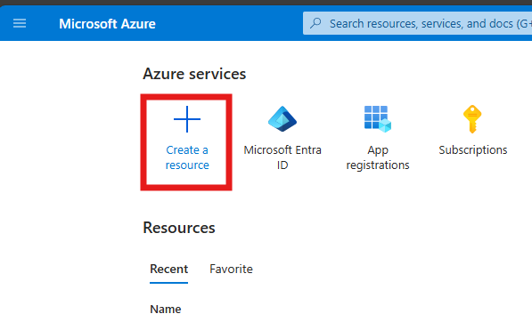
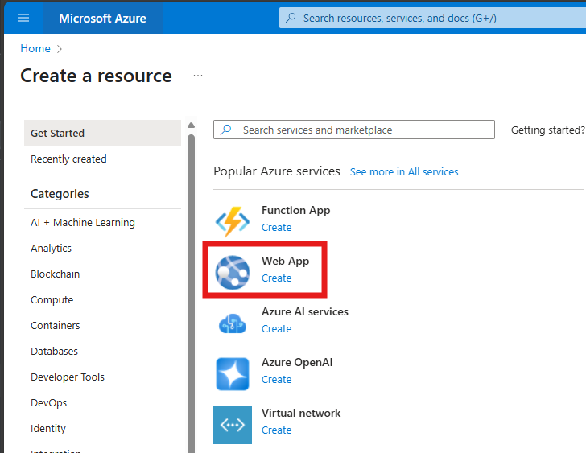
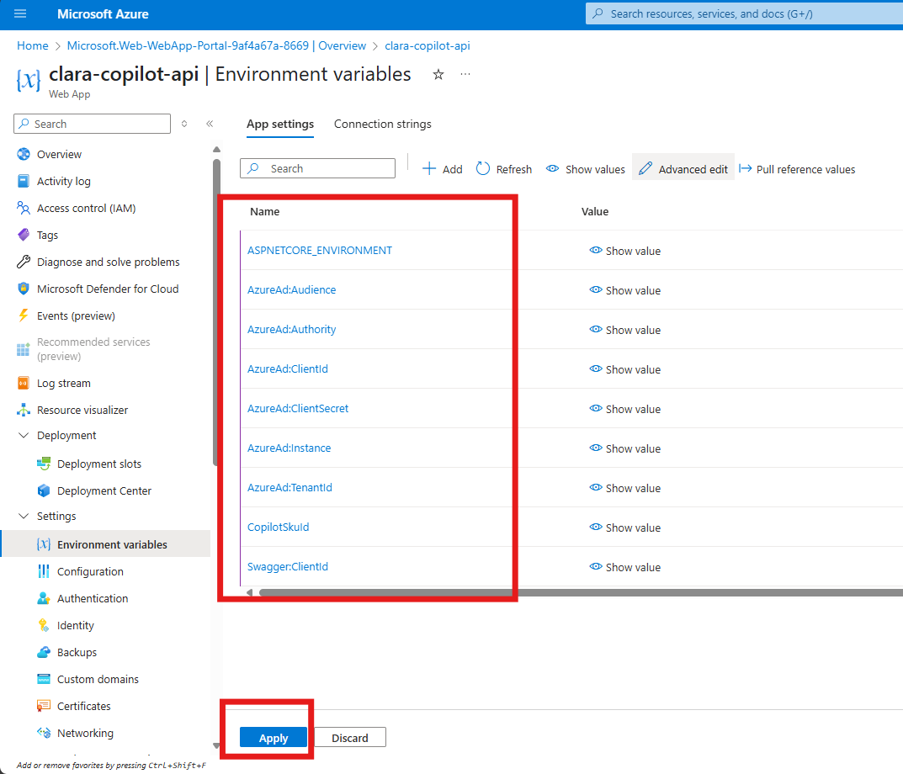
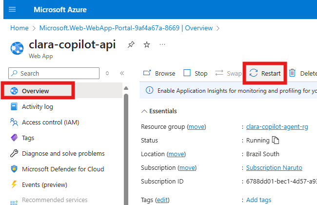
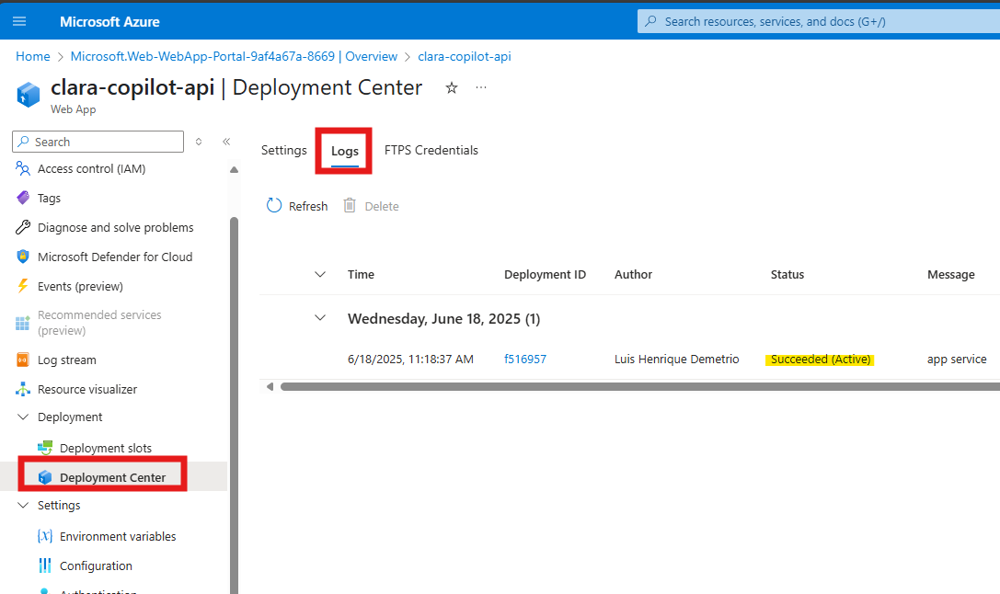
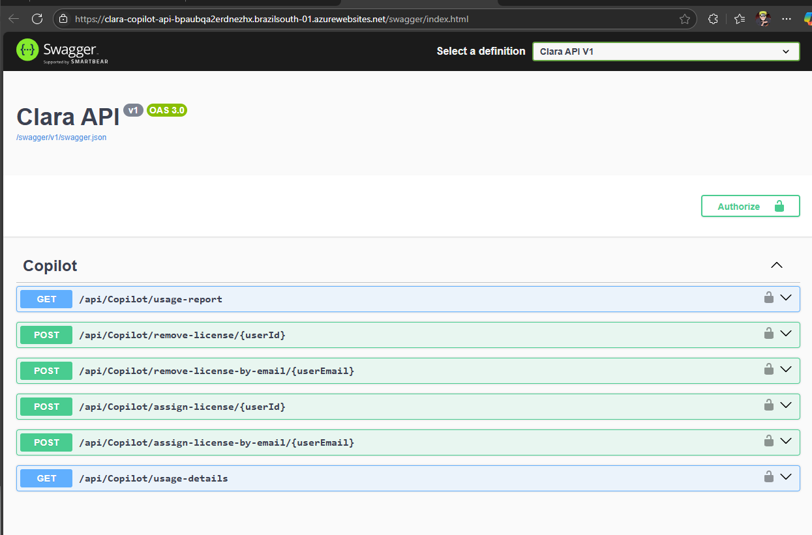

# 👧 CLARA -Copilot License Assignment & Report Agent

[](https://opensource.org/licenses/MIT)
[](https://copilotstudio.microsoft.com/)
[](https://dotnet.microsoft.com/)

**Clara** is an intelligent AI agent built on Microsoft Copilot Studio that revolutionizes M365 Copilot license management for enterprises. It automates license monitoring, optimizes allocation, and streamlines user communication to ensure maximum ROI on your M365 Copilot investment.

| [Documentation](https://github.com/luishdemetrio/clara-copilot-agent) |  [Azure Application Registration guide ](https://github.com/luishdemetrio/clara-copilot-agent/blob/main/docs/azure_deployment.md)  | [Local Deployment guide (opcional)](https://github.com/luishdemetrio/clara-copilot-agent/blob/main/docs/local_deployment.md) |[SharePoint M365 Copilot Wait List](https://github.com/luishdemetrio/clara-copilot-agent/blob/main/docs/sharepoint_deployment.md) |[Import CLARA to Copilot Studio](https://github.com/luishdemetrio/clara-copilot-agent/blob/main/docs/import_clara.md) |[Azure REST API](https://github.com/luishdemetrio/clara-copilot-agent/blob/main/docs/appservice_deployment.md)
| ---- | ---- | ---- |  ---- | ---- | ---- |  


## ☁ Deploying Clara REST API to Azure App Service

---
### 🧱 Step 1: Open Azure Portal

   1. Go to [Portal Azure](https://portal.azure.com/) and sign in with your Azure credentials.

---   
### 🧱 Step 2: Create a New Web App Service

   1. In the left menu, click on **Create a resource**.
   
      
   
   2. Search for **Web App** and click **Create**.
   
      

   3. Fill in the required fields:

      - **Subscription**: Select your Azure subscription.
    
      - **Resource Group:** Select an existing group or create a new one (e.g., **clara-copilot-agent-rg**).
      
        
      
      - **Name**: Enter a unique name for your app (e.g., clara-copilot-api).

      - Publish: Select Code.
      
      - Runtime stack: Choose .NET 8 (LTS) or the version required by Clara.
      
      - Region: Choose the region closest to your users.
      
   5. Click **Review + create**.
   
      
      
   6. Click **Create**.   
   
      
      
   7. After created, click on **Go to resource**.   
   
        
   
---   
### Step 3: Configure Environment Variables for Clara REST API

   1. Once the Web App is deployed, go to your new Web App resource.
      
   2. In the left menu, scroll down and click on **Environment Variables**.
   
      - Under the **Application settings** tab, click on **Advanced edit** (top right of the Application settings section).
      
      - Replace the existing content (if any) with the following JSON:
      
        ```json
        [
          {
            "name": "ASPNETCORE_ENVIRONMENT",
            "value": "Development",
            "slotSetting": false
          },
          {
            "name": "AzureAd:Audience",
            "value": "api://<Clara Copilot Agent - API Client ID>",
            "slotSetting": false
          },
          {
            "name": "AzureAd:Authority",
            "value": "https://login.microsoftonline.com/<YOUR TENANT ID>",
            "slotSetting": false
          },
          {
            "name": "AzureAd:ClientId",
            "value": "<Clara Copilot Agent - API Client ID>",
            "slotSetting": false
          },
          {
            "name": "AzureAd:ClientSecret",
            "value": "<Clara Copilot Agent - API Client Secret>",
            "slotSetting": false
          },
          {
            "name": "AzureAd:Instance",
            "value": "https://login.microsoftonline.com/",
            "slotSetting": false
          },
          {
            "name": "AzureAd:TenantId",
            "value": "<YOUR TENANT ID>",
            "slotSetting": false
          },
          {
            "name": "CopilotSkuId",
            "value": "<YOUR COPILOT SKU ID>",
            "slotSetting": false
          },
          {
            "name": "Swagger:ClientId",
            "value": "<Clara Copilot Agent - Swagger Client ID> (opcional)",
            "slotSetting": false
          }
        ]
        ```
    
       - Replace <Clara Copilot Agent - API Client ID>, <Clara Copilot Agent - API Client Secret>, <YOUR TENANT ID>, <YOUR COPILOT SKU ID>, and <Clara Copilot Agent - Swagger Client ID> with the values from your environment.
       
       - Click **OK**.
    
          

       - Ensure that the settings were created.
       
       - Click **Apply**.
       
          
       
---   
### 🧱 Step 4: Configure Deployment Center for GitHub Integration

   
   1. In the left menu, click on **Deployment Center**.
   2. Under **Source**, select **External Git**.
   3. Enable **SCM Basic Authentication** (if not already enabled):
   
      - If Basic authentication is disabled, click the **Enable here** link.
   
         
      
      - You will be redirected to the **Configuration** page.
      
      - Enable the **SCM Basic Auth Publishing Credentials** option and click **Save**.
      
         
        
      - In the left menu, click on **Overview**.  
      
      - Click on **Restart** to restart the app service.
      
         
      
      - After the restart, return to **Deployment Center**.
      
   4. Configure your repository settings:
      - Repository: The repository containing the Clara REST API code:
        
        `https://github.com/luishdemetrio/clara-copilot-agent.git`
        
      - Branch: The branch you want to deploy:
      
        `main`
        
   5. Click **Save** to set up continuous deployment.
   
        

---   
### 🧱 Step 5: Monitor Deployment

  1. In the Deployment Center, you can view the status of your deployment.
  2. Wait for the deployment to complete. You’ll see logs and status updates.
  
      
     
  3. Once complete, your Clara REST API will be live at:
  
     `https://<your-app-name>.azurewebsites.net/swagger`
     
     
       


