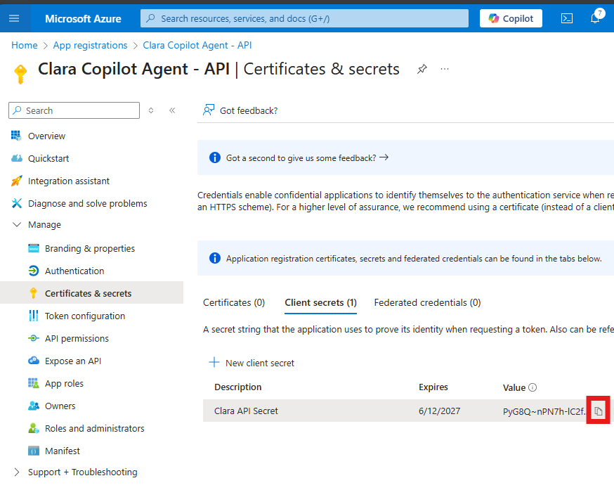
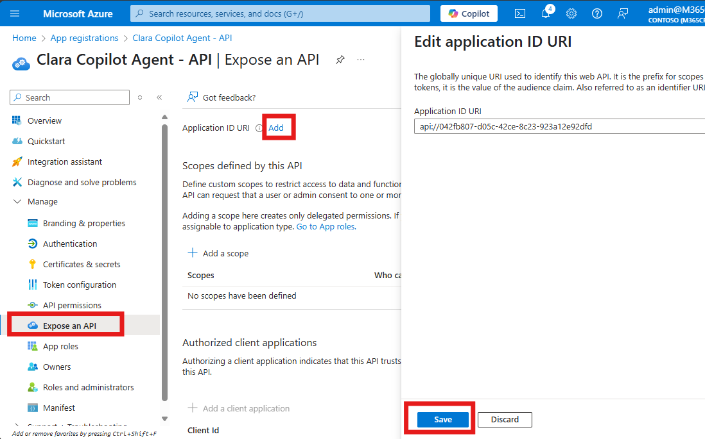
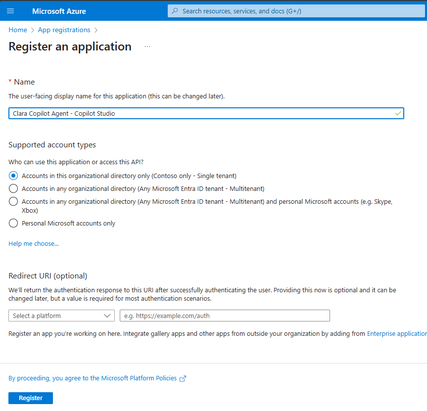
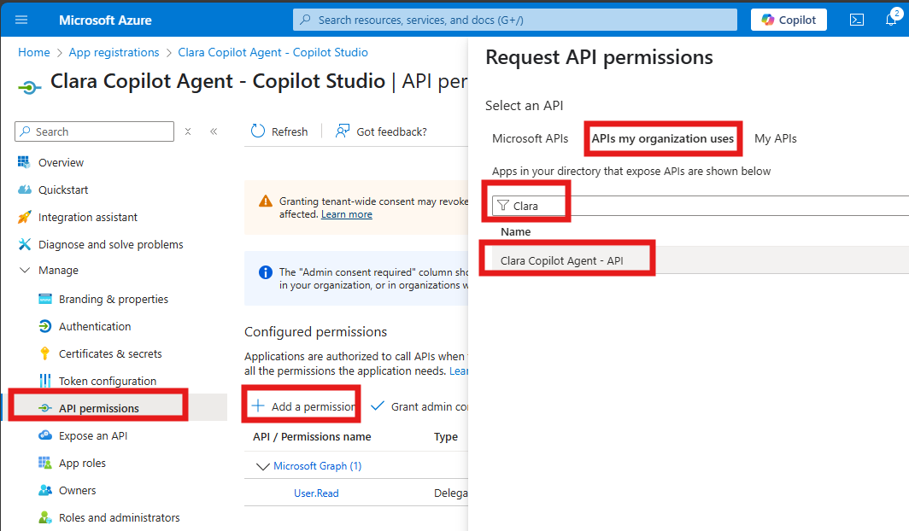
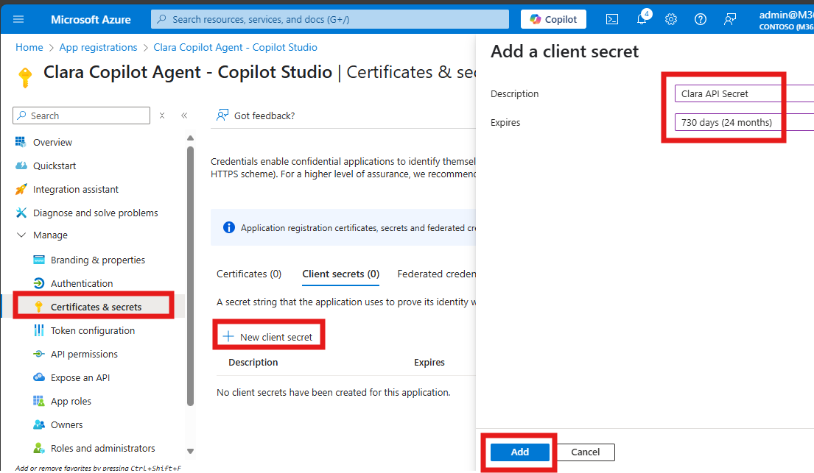
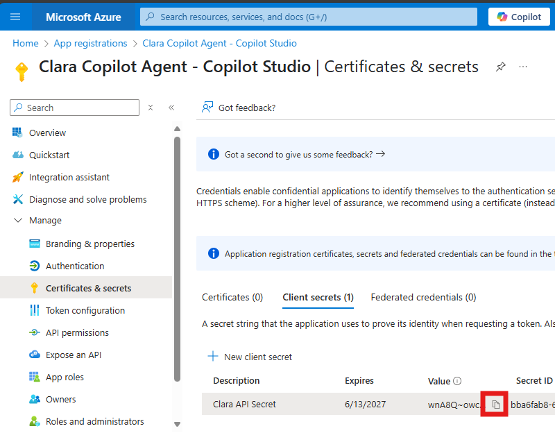
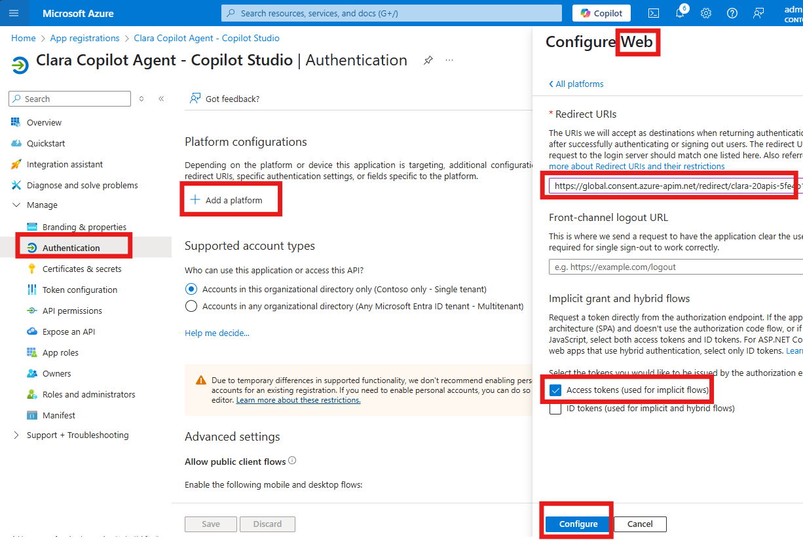

# 👧 CLARA -Copilot License Assignment & Report Agent

**Clara** is an intelligent AI agent built on Microsoft Copilot Studio that revolutionizes M365 Copilot license management for enterprises. It automates license monitoring, optimizes allocation, and streamlines user communication to ensure maximum ROI on your M365 Copilot investment.

| [Documentation](https://github.com/luishdemetrio/clara-copilot-agent) |  [Azure Application Registration guide ](https://github.com/luishdemetrio/clara-copilot-agent/blob/main/docs/azure_deployment.md)  | [Local Deployment guide (opcional)](https://github.com/luishdemetrio/clara-copilot-agent/blob/main/docs/local_deployment.md) |[SharePoint M365 Copilot Wait List](https://github.com/luishdemetrio/clara-copilot-agent/blob/main/docs/sharepoint_deployment.md) |[Import CLARA to Copilot Studio](https://github.com/luishdemetrio/clara-copilot-agent/blob/main/docs/import_clara.md) |[Azure REST API](https://github.com/luishdemetrio/clara-copilot-agent/blob/main/docs/appservice_deployment.md)
| ---- | ---- | ---- |  ---- | ---- | ---- |  

## Instructions

In this hands-on lab you’ll learn how to register and configure Azure AD applications for both the API and the Copilot client.

---

## Lab Structure

This lab is divided into three main parts:

- 🧩 Part 1: Azure App Registration Setup for the Server API
- 🧩 Part 2: Azure App Registration Setup for the Client App

    
Each part contains step-by-step instructions and visual callouts for important notes, warnings, and tips.

>ℹ️ Note:
>
>You will configure two separate app registrations: one for the client (Copilot/consumer) and one for the server (API).

### Why Two App Registrations?

   - **Client App Registration:** Represents the frontend or tool that initiates the login flow (e.g., Copilot, Postman, Swagger UI).
   - **Server App Registration (API):** Represents the backend API that requires access control and validates tokens.

### Benefits:

   - Clear permission boundaries
   - Better security and token scoping
   - Easier management of roles and consent

--- 

## 🧩 Part 1: Azure App Registration Setup for the Server API

### 🧱 Step 1: Register a New Application

1. Go to https://portal.azure.com
2. Navigate to **Azure Active Directory** > **App registrations**
3. Click **+ New registration**

   
   
4. Fill in the details:
   - **Name**: `Clara Copilot Agent - API`
   - **Supported account types**: Choose based on your org (e.g., "Single tenant")
   - **Redirect URI**: Leave blank or set to `Web` - `https://localhost` for now
5. Click **Register**

   

---

### 🧱 Step 2: Configure API Permissions

1. In the app registration, go to **API permissions**
2. Click **+ Add a permission**
3. Choose **Microsoft Graph** 

   

4. **Application permissions**

5. Add permissions like:
   - `Directory.Read.All`
   - `Directory.ReadWrite.All`
   - `Reports.Read.All`
   - `User.Read.All`
6. Click **Add permissions**

   
   
7. Click **Grant admin consent** (if required)

   

---

### 🧱 Step 3: Generate a Client Secret
1. Go to **Certificates & secrets**
2. Click **+ New client secret**
3. Add a description (e.g., `Clara API Secret`) and choose an expiry
4. Click **Add**

   
   
5. **Copy the secret value** immediately — you won’t see it again!

   

---

### 🧱 Step 4: Define a Custom Scope and Expose the API

To allow your REST API to be securely accessed by clients (like the Clar agent), you need to expose it as an API in Azure AD and define scopes.

1. Go to Expose an API

      - Go to **Expose an API**
      - Click **Add** for Application ID URI (e.g., api://<client-id>), keep the default value and then click on Save.

        
   
      - Click **+ Add a scope**
        - Name: `access_as_user`
        - Admin consent display name: `Access Clara Copilot Agent API`
        - Description: `Allows the app to access Clara Copilot Agent API on behalf of the user`
        - Click **Add scope** to save.

        
        
 
## 🧩 Part 2: Azure App Registration Setup for Copilot Studio
  
       
### 🧱 Step 5: Register a New Application

1. Go to https://portal.azure.com
2. Navigate to **Azure Active Directory** > **App registrations**
3. Click **+ New registration**

   
   
4. Fill in the details:
   - **Name**: `Clara Copilot Agent - Copilot Studio`
   - **Supported account types**: Choose based on your org (e.g., "Single tenant")
   - **Redirect URI**: Leave blank for now.
5. Click **Register**

   

---

### 🧱 Step 2: Configure API Permissions

1.  Go to **API permissions** 
   - Click on **+ Add a permission**
   - Choose **APIs my organization uses**
   - Select the **Clara Copilot Agent - API**

     
  
   - Check the `access_as_user` scope

   - Click **Add permissions**

     

   - Click **Grant admin consent**
  
     

---

## 🧱 Step 3: Generate a Client Secret
1. Go to **Certificates & secrets**
2. Click **+ New client secret**
3. Add a description (e.g., `Clara API Secret`) and choose an expiry
4. Click **Add**

   
   
5. **Copy the secret value** immediately — you won’t see it again!

   
   
## 🧱 Step 4: Add Custom Connector Redirect URI:

1. Go to **Authentication**.

2. Under the **Redirect URIs** section, add the following URI:

    `https://global.consent.azure-apim.net/redirect/clara-20apis-5fe4b1fa84f5c2dfb1-5f0af71351437b9f07`

3. Enable Access Tokens.

4. Click Save to apply the changes.

   

>ℹ Info:
>
> This URI is used by Copilot Studio to receive the authorization code after the user signs in. Without it, the OAuth flow will fail.

