# 👧 CLARA -Copilot License Assignment & Report Agent

[](https://opensource.org/licenses/MIT)
[](https://copilotstudio.microsoft.com/)
[](https://dotnet.microsoft.com/)

**Clara** is an intelligent AI agent built on Microsoft Copilot Studio that revolutionizes M365 Copilot license management for enterprises. It automates license monitoring, optimizes allocation, and streamlines user communication to ensure maximum ROI on your M365 Copilot investment.

| [Documentation](https://github.com/luishdemetrio/clara-copilot-agent) |  [Azure Application Registration guide ](https://github.com/luishdemetrio/clara-copilot-agent/blob/main/docs/azure_deployment.md)  | [Local Deployment guide (opcional)](https://github.com/luishdemetrio/clara-copilot-agent/blob/main/docs/local_deployment.md) |[SharePoint M365 Copilot Wait List](https://github.com/luishdemetrio/clara-copilot-agent/blob/main/docs/sharepoint_deployment.md) |[Import CLARA to Copilot Studio](https://github.com/luishdemetrio/clara-copilot-agent/blob/main/docs/import_clara.md) |[Azure REST API](https://github.com/luishdemetrio/clara-copilot-agent/blob/main/docs/appservice_deployment.md)
| ---- | ---- | ---- |  ---- | ---- | ---- |  


## Importing CLARA Agent into Copilot Studio


---
### 🧱  Step 1: Access Microsoft Copilot Studio

**1. Navigate to Copilot Studio**
   - Open your web browser
   - Go to [Microsoft Copilot Studio](https://copilotstudio.microsoft.com)
   - Sign in with your Microsoft 365 credentials

**2. Access Solutions**

   - On the left-hand side menu, click on the **ellipsis**  (...) and then select **Solutions**.
   
   

---
### 🧱  Step 2: Import the Agent

**1. Start Import**

   - In the top menu, click **Import solution**.
   
   - Click **Browse**, locate [Clara](https://github.com/luishdemetrio/clara-copilot-agent/blob/main/agent/ClaraCopilotAgent_1_0_0_1.zip) solution file, select it, and click Open  

     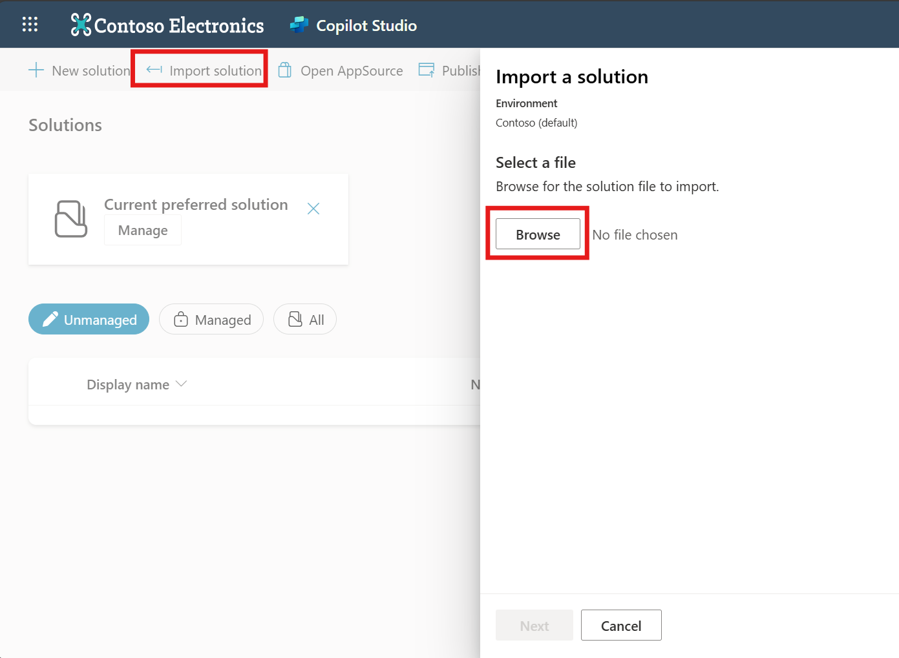
 
**2. Proceed with Import**
 
   - Click Next to continue.
   
      
       
   - Review the details, then click Next again.  
   
      
        
   - Click Import to begin.
   
        
       
**3. Wait for Completion**       

   - The import may take a few minutes.
   
     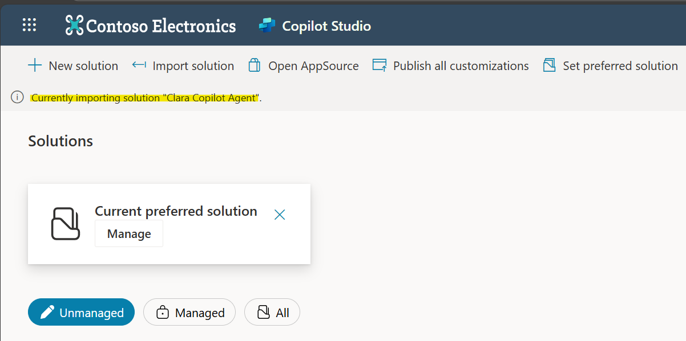 
       
**4. Import Complete**              
   - You may see a warning after import—this is expected and relates to SharePoint configuration. You can ignore it for now.
   
   - The agent will appear in your solutions list .
   
     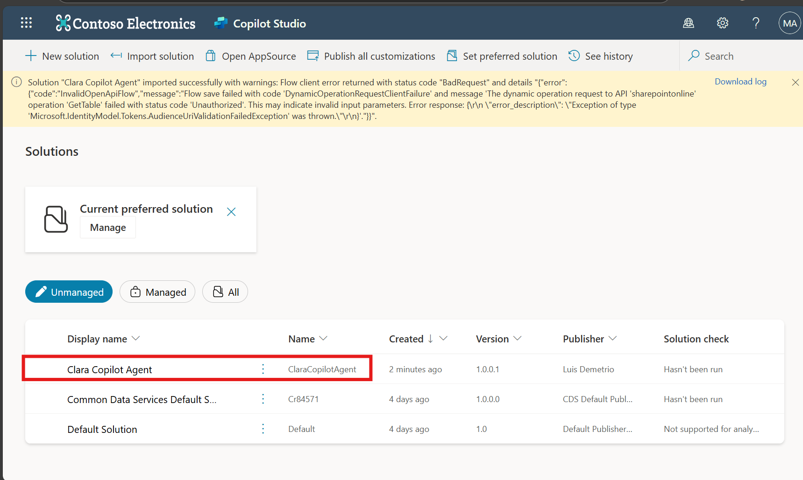 
  
---
### 🧱  Step 3: Configure the Clara Custom Connector in Power Automate

**1. Access Power Automate**

   - Open your web browser and go to [Power Automate](https://make.powerautomate.com/).
   - Sign in with your Microsoft 365 credentials.

**2. Locate Custom Connectors**
   
   - In the left-hand menu, look for Custom Connectors.
  
     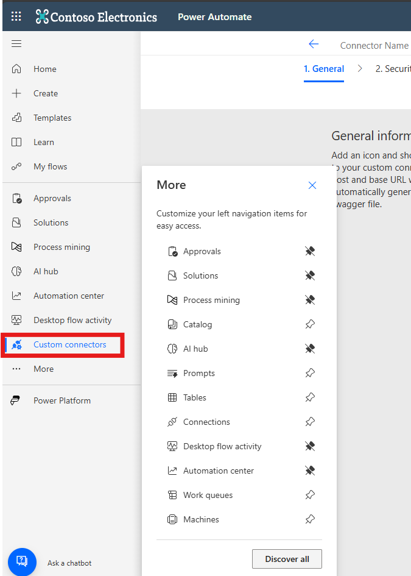 
   
   - If **Custom Connectors** is not pinned:
   
     - Click on **More** at the bottom of the menu.
     - Select **Discover all**.
     - Find and click on **Custom Connectors** in the expanded list.

**3. Find and Edit the Clara Connector**

   - In the Custom Connectors list, locate the **Clara API** connector.
   
   - Click the **Edit** (pencil) icon next to the **Clara API** connector.
   
      
     
**4. Update Authentication Settings**

   - Go to the **Security** tab.
   
   - Under **Authentication Type**, click **Edit**.
   
        
       
**5. Change Identity Provider**

   - Set the Identity Provider to **Generic OAuth 2**.
   
   - Enter the **Client Secret** for the **Clara Copilot Agent - Copilot Studio** App Registration in the appropriate field. 
   
     > Please check the [Azure Application Registration guide ](https://github.com/luishdemetrio/clara-copilot-agent/blob/main/docs/azure_deployment.md) for more details.
   
   - Click **Update connector** to save your changes.
   
     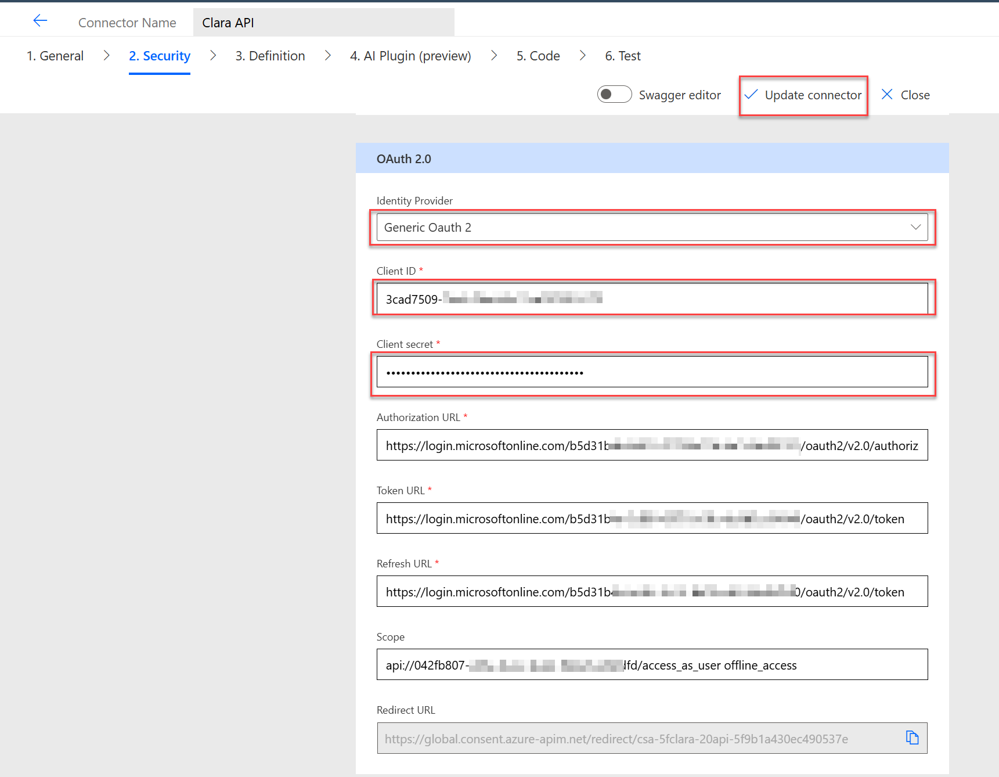 

**6. Go to the Test Tab**

   - Click on the Test tab at the top.

**7. Create a New Connection**

   - Click **+ New connection**.
   
   - Sign in using your Microsoft 365 credentials when prompted.
   
     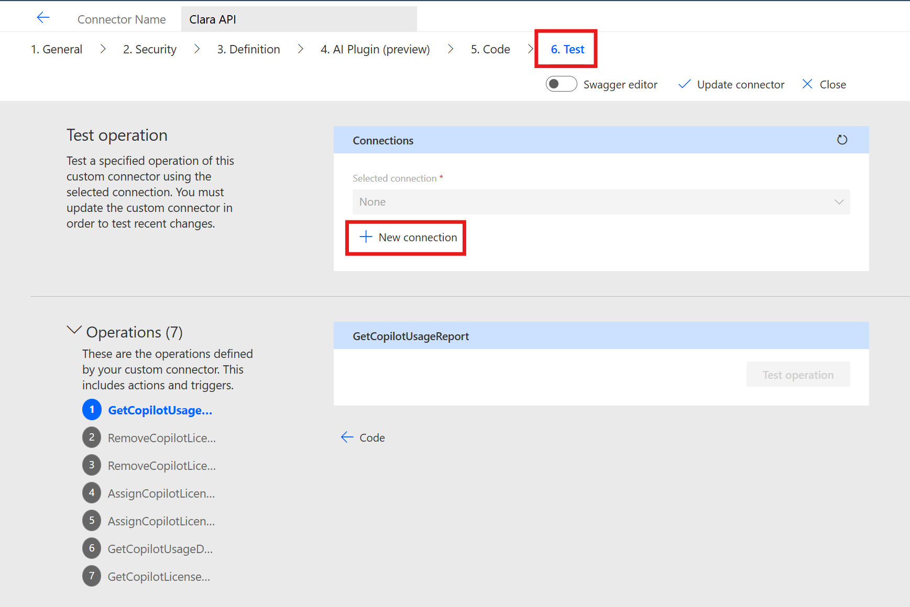 
   
**8. Test the Operation**

   - In the list of available operations, find **GetCopilotLicenseAvailability**.
   
   - Click on **Test operation**.
   
      
     
**9. Review the Results**

   - You should receive a JSON response containing:
     - totalLicenses
     - assignedLicenses
     - availableLicenses
     
   - Example response:
   
      ```json
         {
           "totalLicenses": 100,
           "assignedLicenses": 75,
           "availableLicenses": 25
         }
      ```
---
### 🧱  Step 4: Open the Agent in Copilot Studio


**1. Return to Copilot Studio Home**

   - After importing, go back to the Copilot Studio home page.
   - Your agent (Clara) should now be visible in the list.
   - Click on the Clara agent to open it.
   
     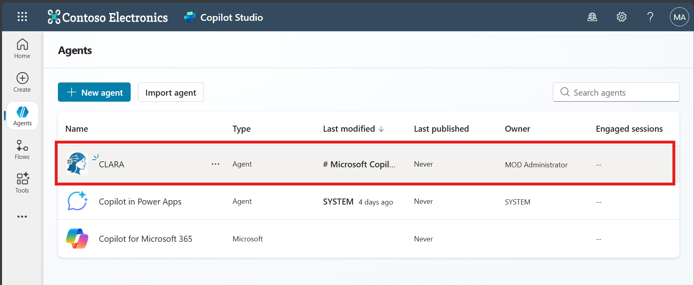

  

**3. Verify Custom Connectors**

   - Go to the Tools tab.
   - Confirm that the custom connectors are listed.
     
      

**4. Test the Copilot License Availability**     

   - In the Test your agent panel, use the following prompt:

     `How many Copilot licenses do we have, and how many are still available?`
     
   - You will be prompted to connect. Click Connect.

     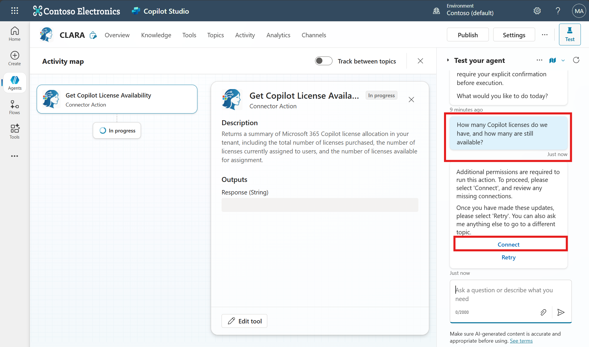 

**5. Manage Your Connections**

   - On the Manage your connections page, click Connect again.
   
      
     
   - Sign in with your Microsoft 365 credentials.     
     
      
     

**6. Troubleshooting: AADSTS50011 Error**

   - If you receive the error message AADSTS50011: The reply URL specified in the request does not match the reply URLs configured for the application, you need to update your app registration:
    
     
      
     1. Access the [Azure Portal](https://portal.azure.com/).
     2. Navigate to Azure Active Directory > App registrations.
     3. Find and select the **Clara Copilot Agent - Copilot Studio** app registration.
     4. Go to the **Authentication** menu.
     5. In the **Web - Redirect URIs** section, add the redirect URI shown in Copilot Studio.
     6. Click **Save**.     
     
    
         

**7. Retry the Connection**

   - Return to Copilot Studio and try signing in again.
   
   - After successful sign-in, go back to the Test your agent panel and click Retry.     
   
     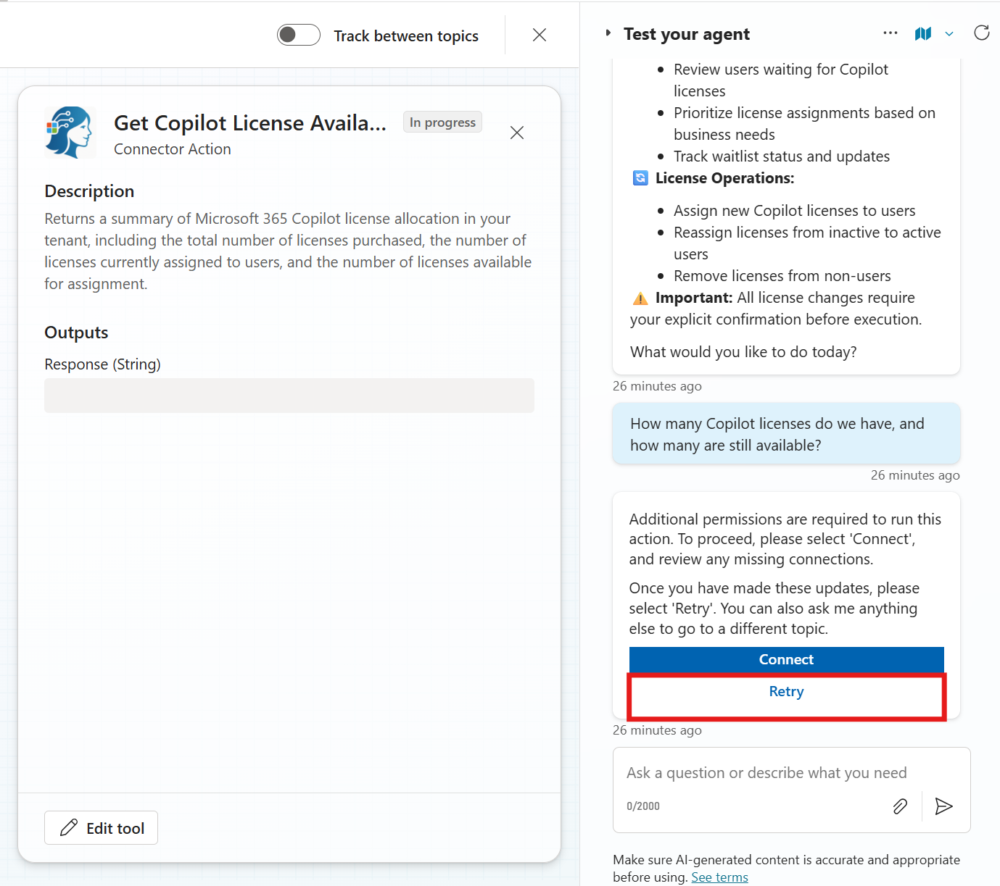   
     
**8. Review the Agent’s Response**

   - You should receive an answer similar to:

     ```plaintext
     You have a total of 25 Copilot licenses. Out of these, 7 licenses are currently assigned, leaving 18 licenses available for assignment.     
     ```
     
      
     
---
### 🧱  Step 5: Configure the SharePoint List Reference for the Waitlist


**1. Update the SharePoint Connector Settings**

   - Go to the Tools tab in your Clara agent.
   - Find and click on the **Get Copilot Waitlist Users** connector.
     
     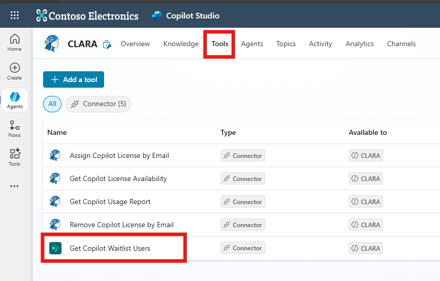
     
**2. Set SharePoint Site and List**

   - In the connector settings:
     - Set the **Site Address** to your SharePoint site (e.g., https://yourcompany.sharepoint.com/sites/your-site).
     
     - Set the **List Name** to the name of your SharePoint list that contains the Copilot waitlist (e.g., M365 Copilot Waitlist).
     
   - Click **Save** to apply your changes.     
   
     
     
   > ℹ️
   >
   > For more details about the M365 Copilot waitlist check the guide [SharePoint M365 Copilot Wait List](https://github.com/luishdemetrio/clara-copilot-agent/blob/main/docs/sharepoint_deployment.md) 
     
**3. Test the SharePoint Connector**     

   - Go to the Test your agent panel.
   - Use the following prompt to test the SharePoint connector:

     `What's the current waitlist status?`
     
   - You will be prompted to connect. Click **Connect**.
   
   
     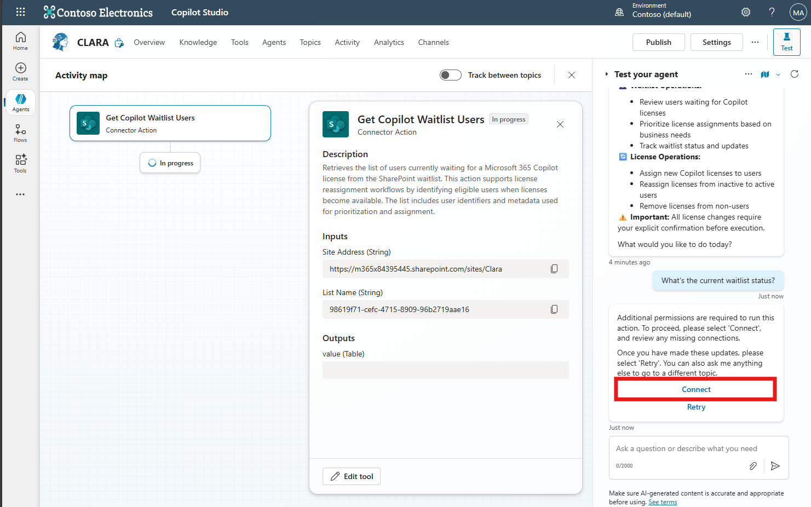
     
**4. Manage Your SharePoint Connection**

   - In the **Manage your connections** page, locate the SharePoint connector and click **Connect**.
   
     
     
   - In the **Create or pick a connection** dialog, sign in with your Microsoft 365 credentials and click **Submit**.
   
     
     
   - After signing in, the connection status should show as Connected.
   
     
     
**5. Retry the Test**     

   - Return to Copilot Studio and click Retry in the Test your agent panel.
   
     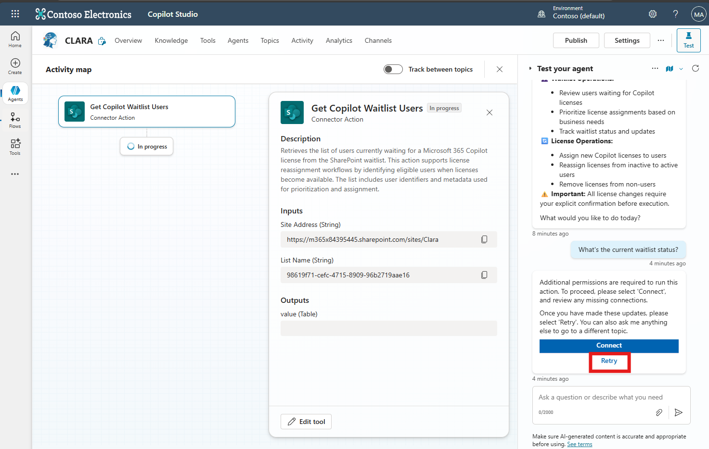
     
**6. Review the Results**
   
   - The expected result is a list of items from your M365 Copilot Waitlist SharePoint list.
   - If your SharePoint list is empty, you may see a message like:

     ```plaintext
     It appears that there are no users currently on the waitlist for Copilot licenses. If you have any other questions or need further assistance, please let me know!
     ```

   - This confirms that the connection is working.

   - Tip: You can add sample items to your SharePoint list to see how the agent responds with actual data.     
   
---
### 🧱  Step 6: Update the Waitlist Status to Approved   

**1. Open the Topic**
   
   - Go to the **Topics** tab in Copilot Studio.
   - Click on the topic named **"Update the waitlist status to approved"**.
   
      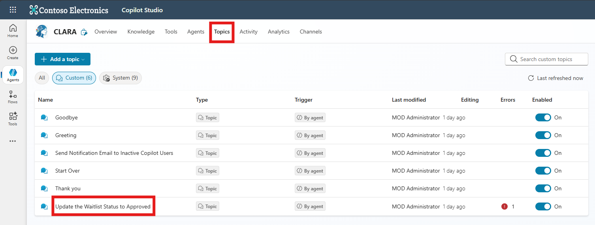
   
**2. Access the Flow Details**
   
   - In the topic editor, locate the Action node.
   - Click on **View flow details**. 
   
     
     
**3. Edit the Update SharePoint Wait List Flow**

   - In the flow details, switch to the **Designer** tab.
   
     
     
   
**4. Update SharePoint Site and List**
   
   - In the Update item node:
   
   - Set the **Site Address** to your SharePoint site (e.g., https://yourcompany.sharepoint.com/sites/your-site).

   - Set the **List Name** to your SharePoint waitlist list (e.g., M365 Copilot Waitlist).

   - After updating the Site Address and List Name, click **Publish** to save and apply your changes.
   
      
     
