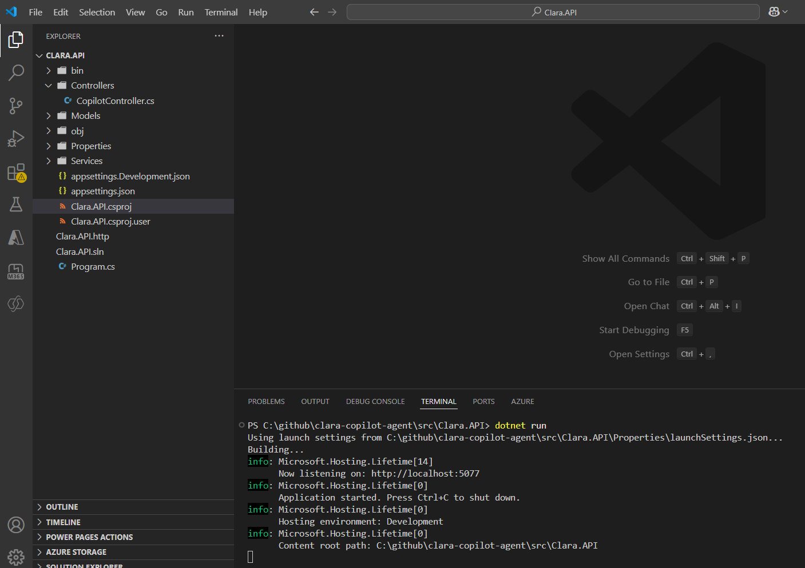
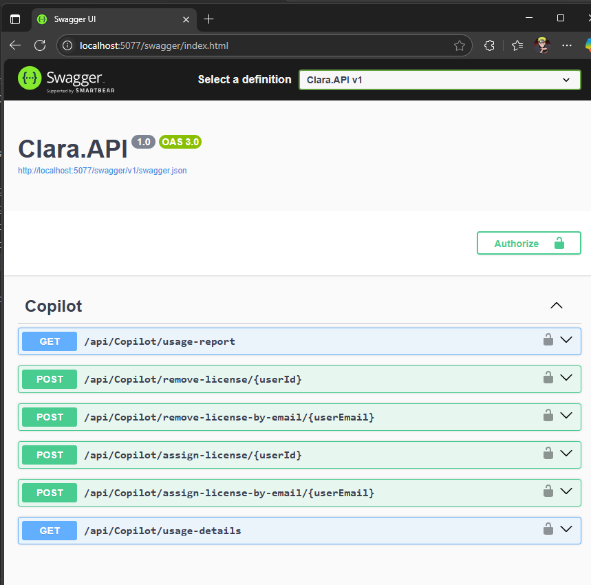
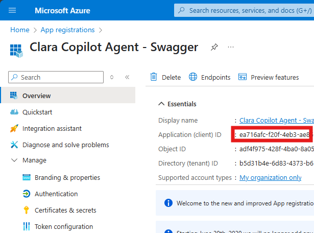
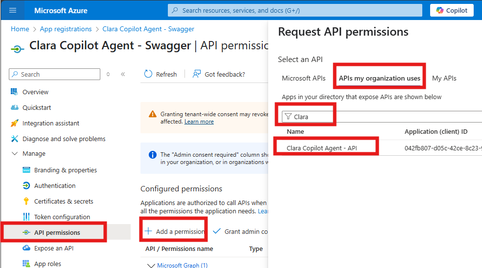
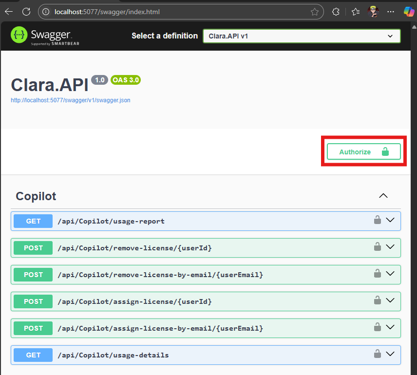
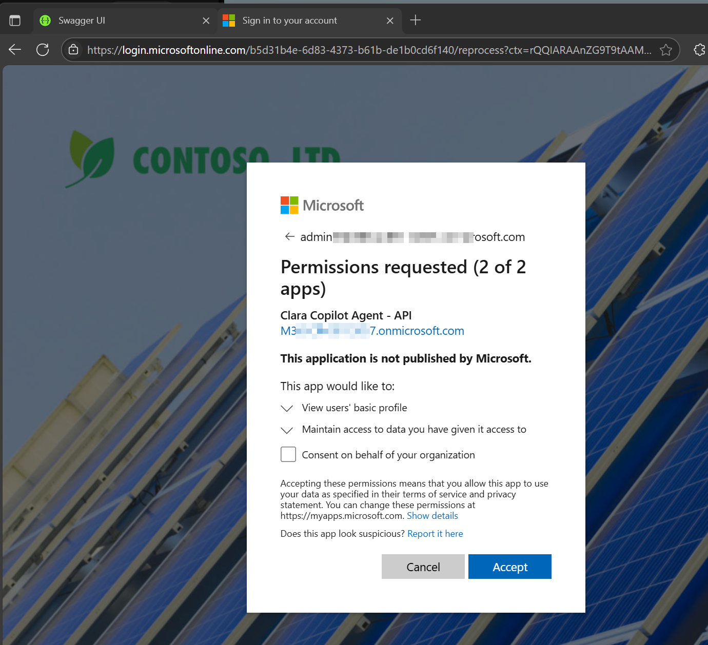
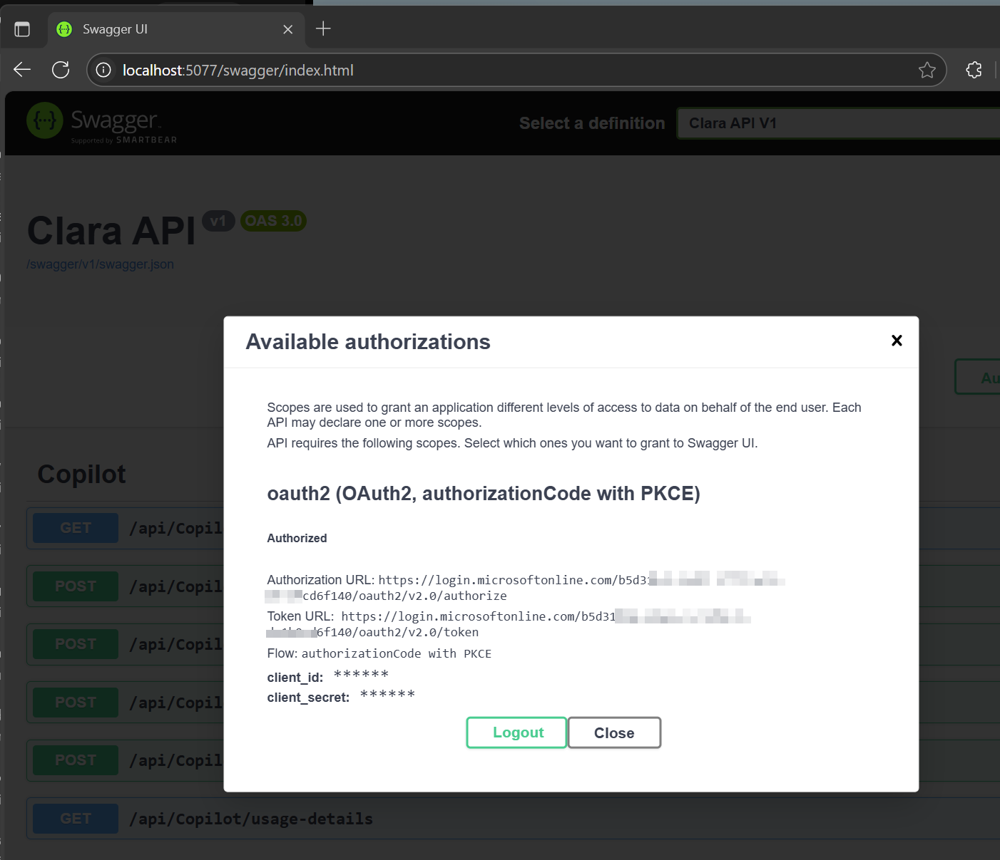
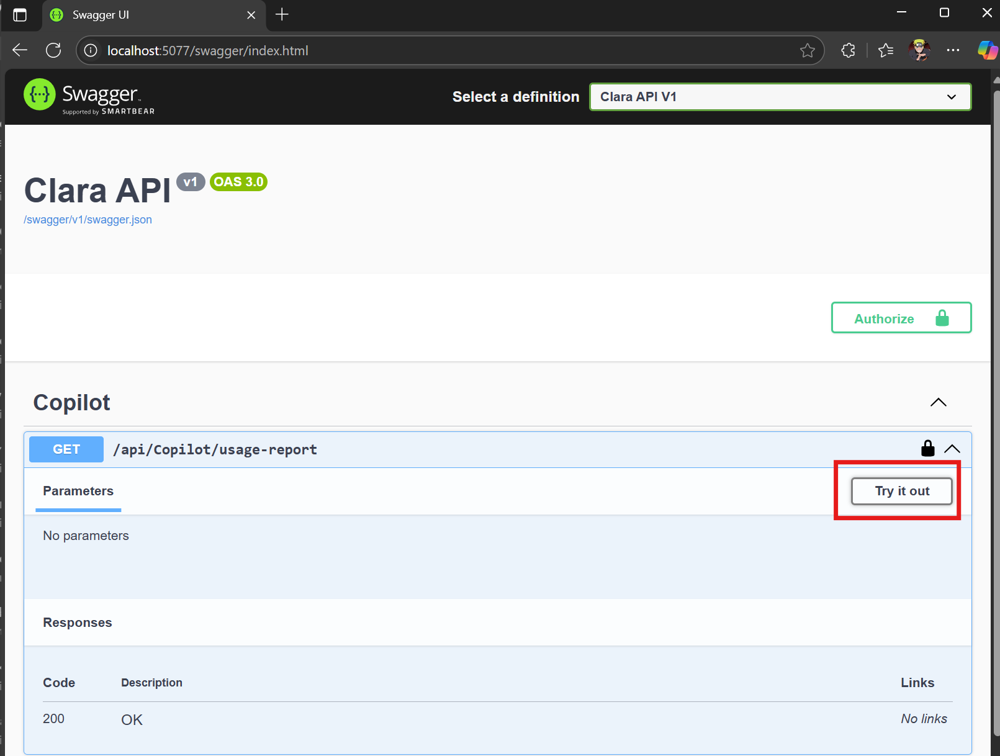
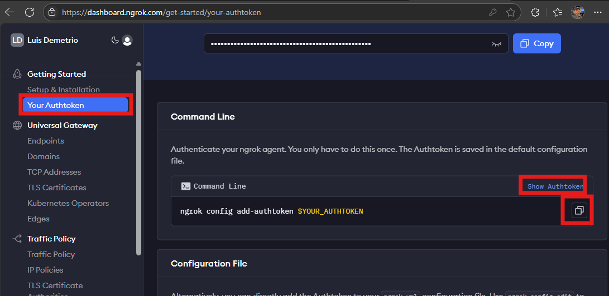
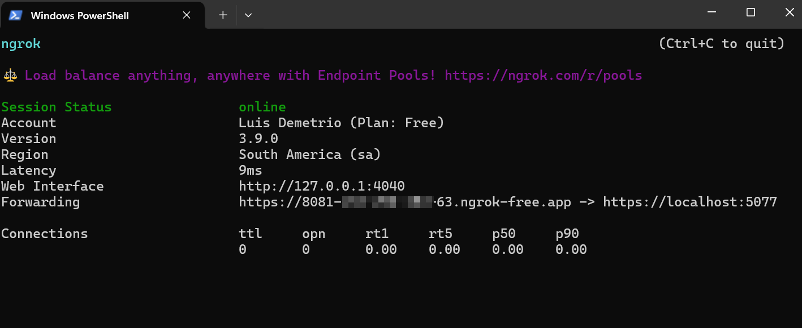

# 👧 CLARA -Copilot License Assignment & Report Agent

[](https://opensource.org/licenses/MIT)
[](https://copilotstudio.microsoft.com/)
[](https://dotnet.microsoft.com/)

**Clara** is an intelligent AI agent built on Microsoft Copilot Studio that revolutionizes M365 Copilot license management for enterprises. It automates license monitoring, optimizes allocation, and streamlines user communication to ensure maximum ROI on your M365 Copilot investment.


| [Documentation](https://github.com/luishdemetrio/clara-copilot-agent) |  [Azure Application Registration guide ](https://github.com/luishdemetrio/clara-copilot-agent/blob/main/docs/azure_deployment.md)  | [Local Deployment guide (opcional)](https://github.com/luishdemetrio/clara-copilot-agent/blob/main/docs/local_deployment.md) |[SharePoint M365 Copilot Wait List](https://github.com/luishdemetrio/clara-copilot-agent/blob/main/docs/sharepoint_deployment.md) |[Import CLARA to Copilot Studio](https://github.com/luishdemetrio/clara-copilot-agent/blob/main/docs/import_clara.md)
| ---- | ---- | ---- |  ---- | ---- |  

## 🚀  Local Debugging
This lab guides you through configuring Azure App Registration for client access to the Clara API and testing the implementation locally and externally.

### 🎯 Learning Objectives
By completing this lab, you will:

* Create and configure Azure App Registrations for API client access
* Set up OAuth2 authentication flows with proper scopes
* Test APIs locally using Swagger UI with Azure AD authentication
* Expose local APIs to the internet for external testing


Before starting this lab, ensure you have access to the following:

### 📋 Prerequisites

- Microsoft 365 E3/E5 licenses with Copilot enabled
- Microsoft Copilot Studio access
- SharePoint Online subscription
- Power Automate Premium license
- Azure subscription with App Registration permissions


### 🪛 Development Tools

Git installed on your local machine
* .NET 8.0 SDK or later
* Visual Studio Code or preferred IDE
* Modern web browser (Chrome, Edge, Firefox)

### ☁️ Azure Prerequisites

* Access to create Azure AD App Registrations
* Basic understanding of Azure AD authentication concepts

### 🎯 Lab Overview
This comprehensive lab will guide you through:

* Local API Setup - Clone, build, and configure the Clara API
* Azure AD Authentication - Set up secure authentication with Azure Active Directory
* Client App Registration - Create and configure a client application for testing
* API Testing - Validate functionality using Swagger UI

⏱️ Estimated completion time: 45-60 minutes

---
## 🧩 Part 1: Local API Setup

### 🧱 Step 1: Clone and Navigate to Repository
Open your terminal or PowerShell and execute:

   ```PowerShell
   git clone https://github.com/luishdemetrio/clara-copilot-agent.git
   cd clara-copilot-agent
   ```

### 🧱 Step 2: Build the .NET Application
Navigate to the API project and restore dependencies:
   ```PowerShell
   cd src/Clara.API
   dotnet restore
   dotnet build
   ```
   
   
   
> ℹ
>
> ️Alternative: Open the project in Visual Studio Code for a better development experience.

   
### 🧱 Step 3: Configure Azure AD Authentication

To enable secure access to the Clara API using Azure Active Directory (Azure AD), update the appsettings.Development.json file in the **Clara.API** project with the values from your Azure App Registration.

1. Locate Configuration File

   Find the appsettings.Development.json file in the Clara.API project folder.

2. Update Authentication Settings

   Replace the placeholder values with your Azure AD configuration:

   ```json
    "AzureAd": {
      "Instance": "https://login.microsoftonline.com/",
      "Domain": "<your-tenant>.onmicrosoft.com",
      "TenantId": "<your-tenant-id>",
      "ClientId": "<your-app-client-id>",
      "Audience": "<your-app-client-id>"
    },
    "Swagger": {
        "ClientId": "NEW_SWAGGER_CLIENT_ID"
    },
   ```

   

Explanation of Each Field


<table>
<thead>
	<tr>
		<th>Field</th>
		<th>Description</th>
	</tr>
</thead>
<tbody>
	<tr>
		<td>Instance</td>
		<td>Base URL for Azure AD authentication. Always use <code style="font-family: source-code-pro, Menlo, Monaco, Consolas, &quot;Courier New&quot;, monospace;">https://login.microsoftonline.com/`</td>
	</tr>
	<tr>
		<td>Domain</td>
		<td>Your Azure AD tenant domain, e.g., <code style="font-family: source-code-pro, Menlo, Monaco, Consolas, &quot;Courier New&quot;, monospace;">contoso.onmicrosoft.com`</td>
	</tr>
	<tr>
		<td>TenantId</td>
		<td>The unique GUID of your Azure AD tenant</td>
	</tr>
	<tr>
		<td>ClientId</td>
		<td>The Application (client) ID of your registered app in Azure AD</td>
	</tr>
	<tr>
		<td>Audience</td>
		<td>Should match the Application ID URI set when exposing the API. If you accepted the default, this is the same as ClientId</td>
	</tr>
		<tr>
		<td>Swagger.ClientId</td>
		<td>Client ID for the Swagger UI authentication (separate app registration for testing)</td>
	</tr>
</tbody>
</table>


> ℹ
>
> Note: Don't have the AzureAd values yet? Follow the [Azure Application Registration ](https://github.com/luishdemetrio/clara-copilot-agent/blob/main/docs/azure_deployment.md) to create your Azure AD App Registration..

The steps to create the **ClientId for Swagger** will be explained in the next session. 


---
### 🧱 Step 4: Run the API Locally

1. Start the Development Server

   From the Clara.API directory, run:

   ```PowerShell
   dotnet run
   ```
    
   
    
2. Verify the API is Running

   - API Base URL: `http://localhost:5077`
   - Swagger UI: `http://localhost:5077/swagger/index.html`


3. Test API Authentication

   - Open the Swagger UI in your browser  `http://localhost:5077/swagger/index.html`
   
   
   
   

> ℹ Security Note:
> 
> All API endpoints are protected by Azure AD authentication. You'll need to complete Part 2 to fully test the API functionality.


## 🧩 Part 2: Azure App Registration for Client Access

**Objective:** Register a client application that will consume the Clara API

**Prerequisites for Client Registration**

Azure portal access with permission to create App Registrations
The Clara API must be registered in Azure AD (covered in the  [Azure Application Registration ](https://github.com/luishdemetrio/clara-copilot-agent/blob/main/docs/azure_deployment.md))
  
---
### 🧱 Step 5: Create Client App Registration

1. Go to [Azure](https://portal.azure.com).
2. Navigate to **Azure Active Directory** > **App registrations**
3. Click **+ New registration**

   
   
4. Fill in the details:
   - **Name**: `Clara Copilot Agent - App`
   - **Supported account types**: Choose based on your org (e.g., "Single tenant")
   - **Redirect URI**: set to `Single-page application (SPA)` - `http://localhost:5077/swagger/oauth2-redirect.html`
   
5. Click **Register**

   

6. **Important:** Copy and save the Application (client) ID - you'll need this later

   
   

---

### 🧱 Step 6: Configure API Permissions
Grant the client app permission to access the Clara API

1.  Go to **API permissions** 
   - Click on **+ Add a permission**
   - Choose **APIs my organization uses**
   - Select the **Clara Copilot Agent - API**

     
  
   - Check the `access_as_user` scope

   - Click **Add permissions**

     

   - Click **Grant admin consent**
  
     
       
---

### 🧱 Step 7: Configure Application Settings
Update the Clara API configuration to use the new client registration

1. Locate Configuration File

   - Navigate to your **Clara API** project folder
   - Open **appsettings.Development.json**


2. Update Swagger Configuration

   ```json
    json{
      "Swagger": {
        "ClientId": "YOUR_CLIENT_APP_ID_HERE"
      }
    }
    ```

    

   - Replace YOUR_CLIENT_APP_ID_HERE with the Application (client) ID from Step 5

3. Verify Other Settings

   - Ensure your appsettings.Development.json also contains:
   
    ```json
    json{
      "AzureAd": {
        "Instance": "https://login.microsoftonline.com/",
        "TenantId": "YOUR_TENANT_ID",
        "ClientId": "YOUR_API_CLIENT_ID",
        "Audience": "api://YOUR_API_CLIENT_ID"
      }
    }
    ```


## 🧩 Part 3: Local API Testing
Verify Azure AD authentication is working correctly with your local API

---
### 🧱 Step 8: Test Clara API Locally via Swagger

Now that you have configured Azure AD authentication and registered a client application, you can test the Clara API locally using the built-in Swagger UI.

✅ Prerequisites
- Clara API is running locally (e.g., via dotnet run)
- You have the following values from your Azure App Registration:

  - Client ID
  - Client Secret
  - Tenant ID
  - Scope (usually api://<client-id>/.default)

#### 🧪 Steps to Test

1. Launch Swagger UI

   - Open your browser
   - Navigate to: `https://localhost:5077/swagger/index.html`
   - Verify the Swagger page loads successfully
   
2. Initiate Authentication

   - Look for the **"Authorize"** button (usually a lock icon)
   - Click the button to open OAuth2 configuration dialog
   
   


3. Configure OAuth2 Settings

   - Fill in the authentication form

   - **Client ID:** Paste your Azure AD app’s client ID
   - **Scope:** check the API scope with access_as_user
   - Leave Client Secret empty (not needed for SPA flow)
   
4. Authenticate

   - Click "Authorize"
   
     
     
   - You'll be redirected to Microsoft login
   - Sign in with your Azure AD credentials
   - Grant consent if prompted
   
      

   
5. Test API Endpoints

   - After successful authentication, click **Close** to test secured endpoints

     
   
   - Try calling /api/license/usage or similar endpoints. Expand the first API and click **Try it out**:
   
     
     
   - Click on **Execute**:
   
     
   
   - Verify you receive data (not 401 Unauthorized)

     


    #### 🔧 Troubleshooting Common Issues
   | Issue               | Possible Cause             | Solution                                             |
   |---------------------|----------------------------|------------------------------------------------------|
   | 401 Unauthorized    | Invalid client credentials | Verify Client ID matches Azure registration          |
   | Invalid scope error | Incorrect API scope format | Check scope format: `api://CLIENT_ID/access_as_user` |
   | Redirect error      | Wrong redirect URI         | Ensure redirect URI matches Azure configuration      |
   | Login loop          | Browser cache issues       | Clear browser cache or try incognito mode            |


## 🧩 Part 4: External API Exposure

This section teaches you how to securely expose your local Clara API to the internet for external testing. This is essential when integrating with cloud services like Power Platform, Copilot Studio, or third-party applications that need to access your API during development.

### 🔍 Why External Exposure is Needed

- **Cloud Service Integration:** Services like Power Platform can't reach localhost
- **Third-party Testing:** External applications need public endpoints
- **Mobile App Development:** Mobile apps require accessible APIs
- **Webhook Testing:** Services that send callbacks need reachable URLs
- **Team Collaboration:** Share your API with remote team members

### ⚙️ Prerequisites

 - Clara API running locally on `https://localhost:5077`
 - Internet connection
 - Administrative privileges (for some installations)
 - Basic command line familiarity
 
---
### 🧱 Step 9: Expose API Using ngrok

#### 🌐 What is ngrok?
ngrok is a secure tunneling service that creates a public URL pointing to your local development server. It acts as a reverse proxy, forwarding internet traffic to your local application.

##### How it works:
`Internet → ngrok Cloud → Your Local Machine → Clara API`

1. Install ngrok

   - Visit https://ngrok.com/download
   - Download appropriate version for your OS
   - Extract and install following platform-specific instructions

2. Account Setup (First-time only)

   - Create free account at https://ngrok.com
   - Navigate to Your Auth Token
   - Copy your authentication token
   
     
     
   - Run: ngrok config add-authtoken `YOUR_TOKEN_HERE`

3. Start tunnel

    ```PowerShell
    ngrok http https://localhost:5077
    ```
   - Understanding the Output:
   
        - Session Status    online
        - Account           your-email@domain.com
        - Version           3.x.x
        - Region            United States (us)
        - Forwarding        https://abc123-def456.ngrok-free.app -> https://localhost:5077
        
   
   

4. Testing the Tunnel

   - Click on the public URL (Forwarding) or copy it to your browser
   - You may see an ngrok warning page (for free accounts)
   
5. Bypass Warning Page

   - Click "Visit Site" to proceed
   - This warning appears only on free accounts

   
   
5. Access Swagger Interface

   - Navigate to: https://YOUR_NGROK_URL/swagger/index.html
   - Verify the Swagger UI loads correctly

     

> ℹ️ Important Notes:
>
>- Keep the ngrok tunnel running during testing
>- Free ngrok URLs change each restart (consider paid plans for stable URLs)
>- Never use ngrok tunnels in production environments
>- Be cautious about exposing sensitive APIs publicly


### 🔗 Additional Resources

- [ngrok Documentation](https://ngrok.com/docs)
- [Azure AD Authentication with ngrok](https://docs.microsoft.com/en-us/azure/active-directory/develop/v2-protocols)
- [Power Platform Custom Connectors](https://docs.microsoft.com/en-us/connectors/custom-connectors/)
- [API Security Best Practices](https://owasp.org/www-project-api-security)


> ℹ️
> 
> Remember: ngrok is a powerful development tool, but with great power comes great responsibility. Always prioritize security and never expose sensitive production data through development tunnels.