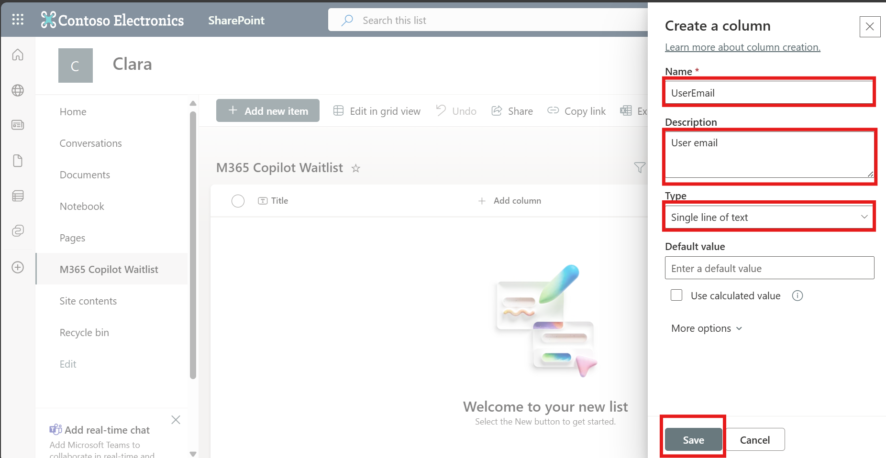
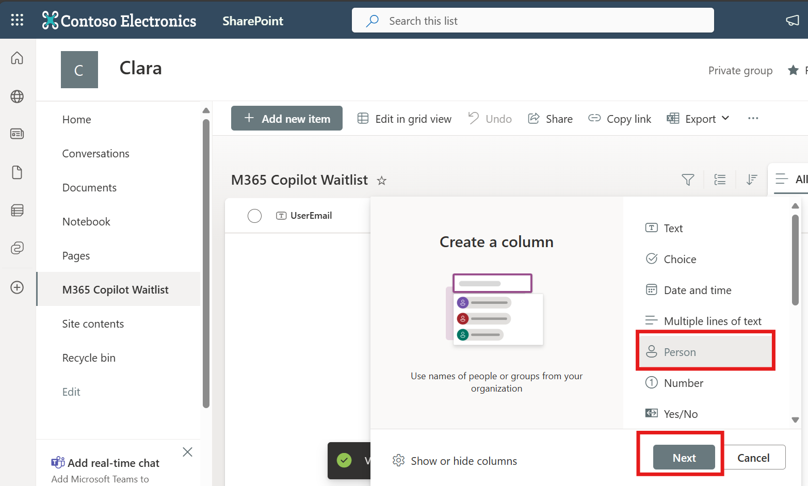
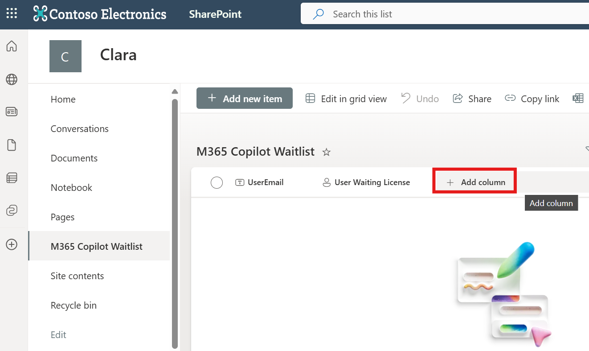
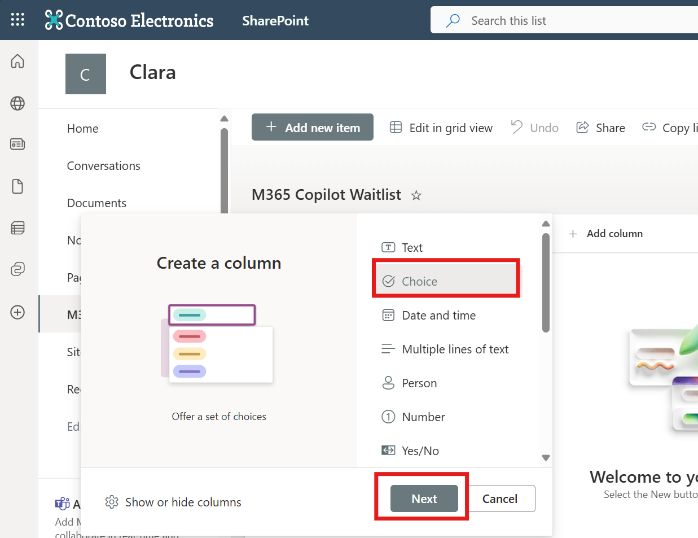

# 👧 CLARA -Copilot License Assignment & Report Agent

**Clara** is an intelligent AI agent built on Microsoft Copilot Studio that revolutionizes M365 Copilot license management for enterprises. It automates license monitoring, optimizes allocation, and streamlines user communication to ensure maximum ROI on your M365 Copilot investment.

| [Documentation](https://github.com/luishdemetrio/clara-copilot-agent) |  [1. Azure Application Registration guide ](https://github.com/luishdemetrio/clara-copilot-agent/blob/main/docs/azure_deployment.md)  | [2. Azure REST API](https://github.com/luishdemetrio/clara-copilot-agent/blob/main/docs/appservice_deployment.md) |[3. SharePoint M365 Copilot Wait List](https://github.com/luishdemetrio/clara-copilot-agent/blob/main/docs/sharepoint_deployment.md) |[4. Import CLARA to Copilot Studio](https://github.com/luishdemetrio/clara-copilot-agent/blob/main/docs/import_clara.md) | [(Opcional) Local Deployment guide ](https://github.com/luishdemetrio/clara-copilot-agent/blob/main/docs/local_deployment.md)
| ---- | ---- | ---- |  ---- | ---- | ---- |  

## Create the Required SharePoint Lists

Before beginning the Clara agent configuration,  you must create SharePoint lists to track users waiting for M365 Copilot licenses.

### 🧱  Step 1: Navigate to SharePoint

1. Open your web browser
2. Navigate to your SharePoint site where you want to create the lists
   - Example: `https://yourcompany.sharepoint.com/sites/YourSiteName`
3. Sign in with your Microsoft 365 credentials if prompted

---
### 🧱  Step 2: Create the M365 Copilot Waitlist

1. From your SharePoint site homepage, click **"New"** in the top navigation
2. Select **"List"** from the dropdown menu 

   
   
3. Choose **"List"** option

   
   
4. Configure the list:
   - **Name**: `M365 Copilot Waitlist`
   
5. Click **"Create"**

   

---
### 🧱  Step 3: Add Required Columns

1. Hide the Default Title Column

 - Since the Title column is not needed, hide it for a cleaner list view.

   

2. Add Columns

  **a. UserEmail**
  
    - Click **"+ Add column"**

      
  
    - Select **"Text"** and then **Next**:
 
      
  
    - **Column name**: `UserEmail`
    - **Description**: `User email`
    - **Type**: Select **"Single line of text"**
    - Click **"Save"**

      

  **b. User Waiting License**
  
    - Click **"+ Add column"**
    - Select **"Person"** and then **Next**:

      
  
    - **Column name**: `User Waiting License`
    - **Description**: `User Waiting License`
    - **Type**: Select **"Person or Group"**
    - Click **"Save"**

      

 **c. Status**
 
    - Click **"+ Add column"**
      

    - Select **"Choice"** and then **Next**:
      
  
    - **Column name**: `Status`
    - **Description**: `Status`
    - **Type**: Select **"Choice"**
    - Add the choices:
      - Requested
      - Approved
    - Click **"Save"**
      
  
 **d. Approved By**
 
    - Click **"+ Add column"**
    - Select **"Person or Group"** and then **Next**:
      
  
    - **Column name**: `Approved By`
    - **Description**: `Person who approved the M365 Copilot License`
    - **Allow multiple selections**: Leave unchecked
    - Click **"Save"**

      

**Expected Result:**

Your list should now look like this:

