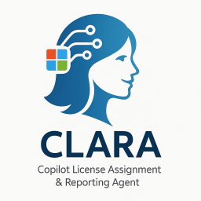

# Deploying CLARA: Enterprise Copilot License Management Agent

## Welcome!

In this hands-on lab, you'll deploy **CLARA** (Copilot License Assignment & Report Agent)—an intelligent AI agent that automates M365 Copilot license management through natural conversation.



## What is CLARA?

CLARA is a production-ready custom agent built on Microsoft Copilot Studio that helps enterprises:

- 📊 **Monitor** license inventory in real-time
- 📋 **Manage** waitlists with automated queue processing  
- 🔄 **Optimize** allocation by reassigning inactive licenses
- 📧 **Communicate** with automated onboarding emails
- 💰 **Maximize** ROI on M365 Copilot investments


## Lab Overview

**Duration:** 50 minutes  
**Format:** Hands-on deployment in Skillable environment  
**Outcome:** Fully functional Clara agent managing Copilot licenses

### Example Interactions with CLARA

```
You: "Show me an overview of my Copilot licenses"
CLARA: [Displays total, assigned, and available licenses]

You: "What users are waiting for licenses?"
CLARA: [Lists users from SharePoint waitlist with priorities]

You: "Show the top 5 inactive users"
CLARA: [Identifies users who haven't used Copilot recently]

You: "Assign a license to the first person on the waitlist"
CLARA: "I found John Smith at the top with High priority.
       Should I proceed with the assignment?"
You: "Yes, proceed"
CLARA: "License assigned successfully! John will receive 
       access within a few minutes."
```

## Why Clara Matters

### For CSAs & CSAMs
- **Transfer tool for customer conversations:** Live demo of production enterprise agent
- **Conversation starter:** "What processes could you automate?"
- **Reference architecture:** Complete blueprint for enterprise agent deployment

### For Engineers
- **Production-ready patterns you can reuse:** Multi-system orchestration, governance workflows
- **Real-world solution:** Solves actual constraints (token limits, scale, governance)
- **Everything on GitHub, ready to adapt:** Full source code and deployment templates

## 🏗 Clara's Architecture

Clara orchestrates six Microsoft systems:

```
┌───────────────────────────────────────────────────────┐
│                        CLARA AGENT                    │
│                     (Copilot Studio)                  │
└───────────────────────────────────────────────────────┘
                              │
        ┌─────────────────────┼─────────────────────┐
        │                     │                     │
        ▼                     ▼                     ▼
┌──────────────┐    ┌──────────────┐    ┌──────────────┐
│ SharePoint   │    │ Microsoft    │    │ Dataverse    │
│ List         │    │ Graph API    │    │ Table        │
│              │    │              │    │              │
│ Waitlist     │    │ Licenses     │    │ Analytics    │
│ Operations   │    │ Real-time    │    │ Historical   │
└──────────────┘    └──────────────┘    └──────────────┘
        │                     │                     │
        └─────────────────────┼─────────────────────┘
                              │
        ┌─────────────────────┼─────────────────────┐
        ▼                     ▼                     ▼
┌──────────────┐    ┌──────────────┐    ┌──────────────┐
│ Power        │    │ Outlook      │    │ Entra        │
│ Automate     │    │ Connector    │    │ Security     │
│              │    │              │    │ Group        │
│ Flows        │    │ Emails       │    │ Membership   │
│ Automation   │    │ Branded      │    │ Control      │
└──────────────┘    └──────────────┘    └──────────────┘
```

## What's Pre-Configured

Your Skillable environment includes:

✅ SharePoint site with M365 Copilot License Waitlist  
✅ M365 Copilot Licensed Users security group  
✅ Power Automate flows for automation  
✅ Sample waitlist data for testing  
✅ CLARA solution package ready to import

## Lab Exercises

### Exercise 1: Import CLARA (8 min)
Import the solution package and verify components

### Exercise 2: Azure App Registration (10 min)
Configure permissions, consent, and credentials

### Exercise 3: Custom Connector (10 min)
Set up OAuth authentication with Azure

### Exercise 4: Copilot Studio Configuration (12 min)
Connect tools and configure the agent

### Exercise 5: Test CLARA (10 min)
Validate with live license management scenarios

**Total:** 50 minutes

## Learning Objectives

By completing this lab, you will:

1. ✅ Deploy custom agents using Copilot Studio
2. ✅ Configure Azure AD with OAuth for API access
3. ✅ Set up custom connectors for Microsoft Graph
4. ✅ Integrate multiple systems in one agent
5. ✅ Test production-ready governance workflows

## Success Criteria

You'll complete the lab successfully when:

✅ CLARA is imported and visible in Copilot Studio  
✅ Azure app has permissions with admin consent  
✅ Custom connector authenticates to Graph API  
✅ All tools show "Connected" status  
✅ CLARA responds to conversational prompts  
✅ License assignment completes end-to-end

## Important Notes

⚠️ **Client Secrets:** Visible only ONCE—copy immediately!  
⚠️ **Admin Consent:** Required for API permissions  
⚠️ **Browsers:** Use Edge or Chrome for best results  
⚠️ **Validation:** Complete checkpoints before continuing

## Lab Environment Access

All portals are accessible from your Skillable environment:

- **Azure Portal:** https://portal.azure.com
- **Copilot Studio:** https://copilotstudio.microsoft.com  
- **Power Automate:** https://make.powerautomate.com
- **SharePoint:** [URL provided in Skillable]

Credentials are pre-configured in your Skillable VM.

## Getting Help

- 🙋 Raise your hand for proctor assistance
- 📋 Check troubleshooting in each exercise
- ✅ Don't skip validation checkpoints
- ⏱️ Watch time estimates to stay on track

## Before You Begin

Prepare your workspace:

- [ ] Open Notepad for saving configuration values
- [ ] Verify access to Azure Portal
- [ ] Verify access to Copilot Studio
- [ ] Review architecture diagram above

## Ready?

When you're ready, proceed to **Exercise 1** to import CLARA into Copilot Studio.

Let's build an enterprise AI agent together! 🚀

---
