# Exercise 1: Import CLARA to Copilot Studio

**Estimated time:** 10 minutes

## Objective

Import the CLARA solution package into Microsoft Copilot Studio and verify all components are created successfully.

---

## What You'll Do

- Navigate to Copilot Studio
- Import the CLARA solution package
- Verify the agent, custom connector, and Azure app creation
- Prepare configuration values for next exercises

---

## Tasks

### 🧱 Step 1: Access Copilot Studio

1. In your Skillable environment, open **Microsoft Edge**

2. Navigate to: https://copilotstudio.microsoft.com

3. Sign in with the credentials provided in your Skillable environment

✅ **Validation:** Copilot Studio home page loads with Agents tab visible.

---

### 🧱 Step 2: Import the Solution

1. Access Solutions:

   - On the left-hand side menu, click on the ellipsis (**...**) and then select Solutions.

   
  
2. In the top menu, click **Import solution**.   
   

3. When prompted:
   - Click **Browse** or **Choose file**
   - Navigate to **Desktop**
   - Select `Clara_Copilot_Agent.zip`
   - Click **Open**
   
   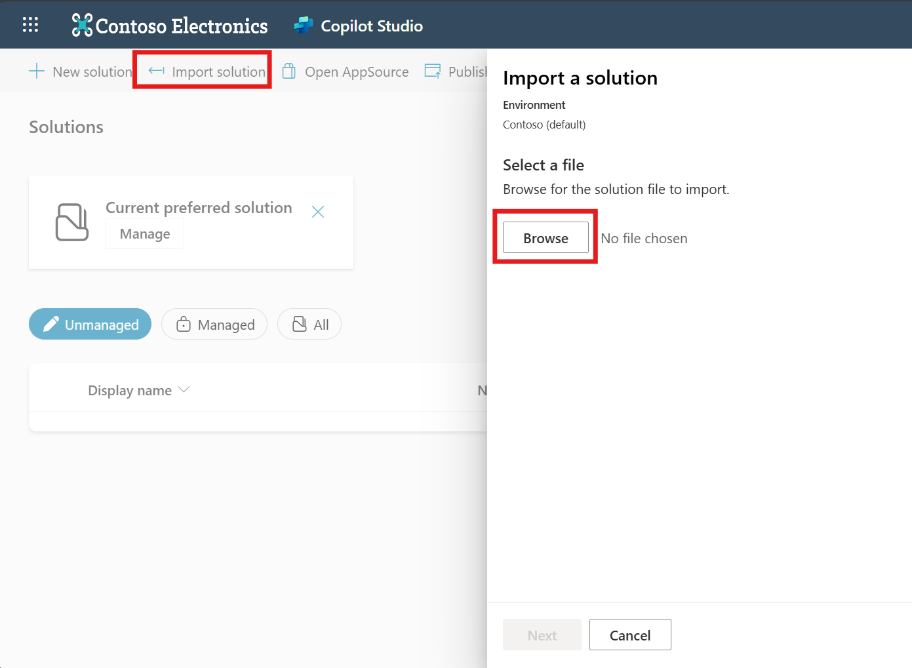

4. Click **Import** to start the process

   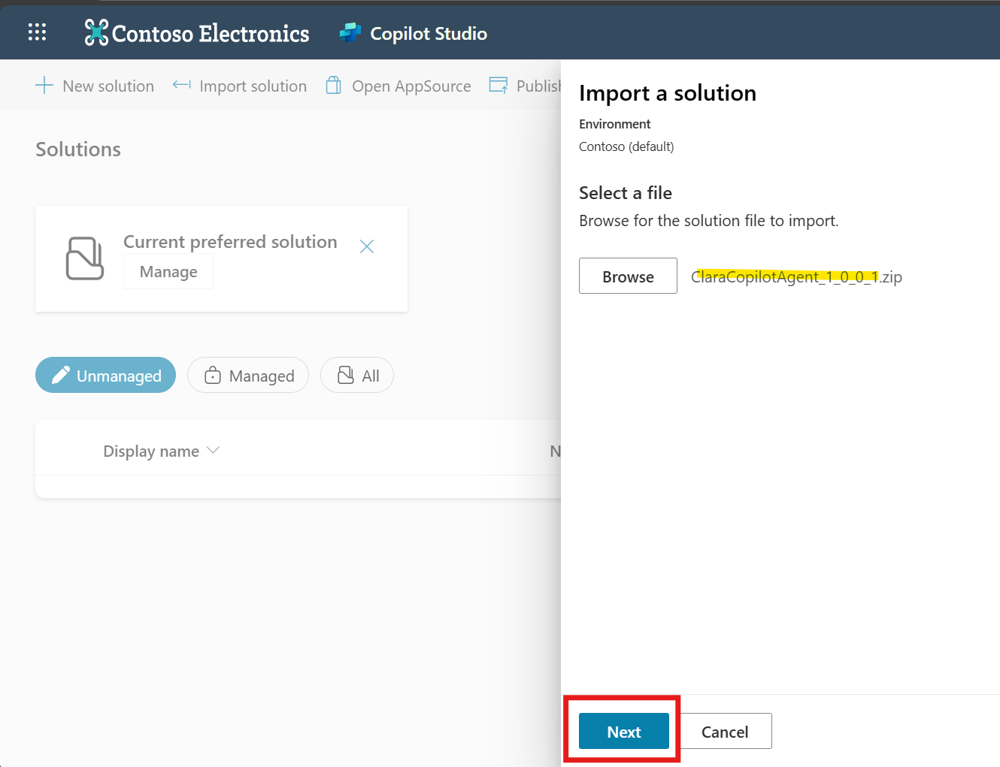
   
   > ℹ️ Please not that the agent version can be different.
   
   - Review the details, then click **Next** again.
   
   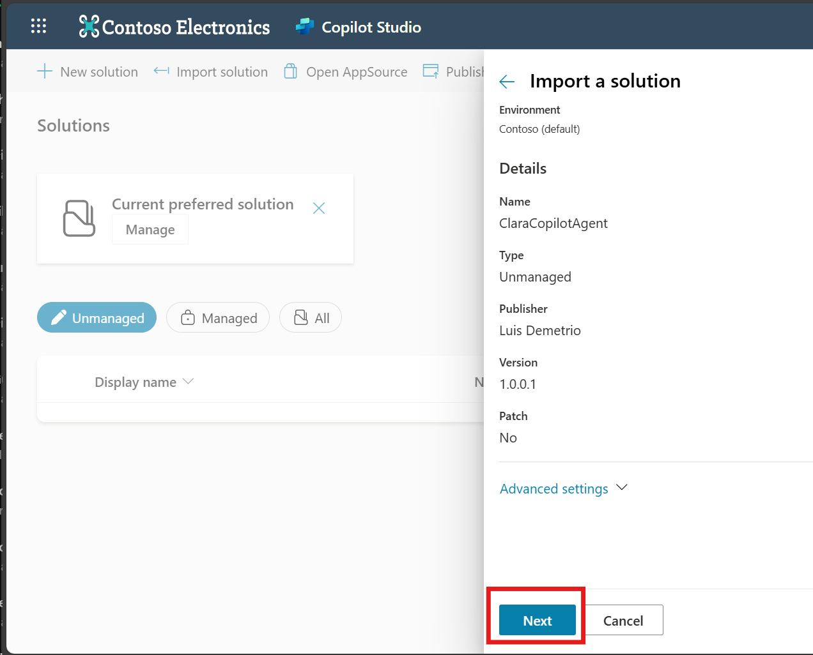
   
   - Click **Next** to proceed.

   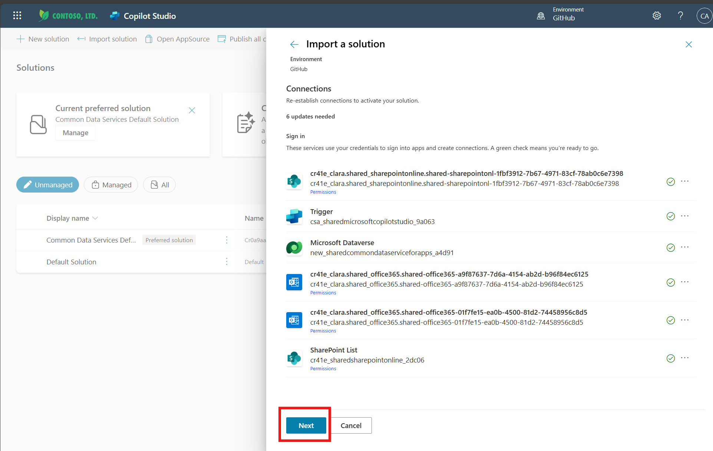
   
5. Proceed with the Environment Variable Values

   - Fill up the following fields:
   
     - **Use Mock Data:** Allows the agent to use mock telemetry data during project import for testing purposes when the customer environment does not have telemetry enabled. Leave this value empty if you do not want to use mock data. To enable mock data, provide the tenant name domain (e.g., M365CPI69113837.onmicrosoft.com). After testing, you can clear the value to disable mock mode and use real data.
   
     - **SharePoint Waitlist Site URL**: URL of the SharePoint site hosting the waitlist for users pending license allocation.

     - **SharePoint Email Images Folder URL**: URL of the SharePoint folder containing images used in email notifications sent to users.

     - **AZURE_ENTRA_COPILOT_GROUP_ID**: Security group used to manage and assign Microsoft 365 Copilot licenses to eligible users. Membership in this group grants access to Copilot features across Microsoft 365 applications.
     
     > ℹ️
     >
     >Clara relies on three key resources to operate effectively:
     > - **SharePoint List** – Stores and manages users waiting for Copilot licenses.
     > - **SharePoint Folder** – Contains the images used in email communications.
     > - **Microsoft Entra Security Group** – Controls license assignments and access.
     >
     > Your Skillable environment already includes these resources configured.

  - Click **Import** to begin.
  
    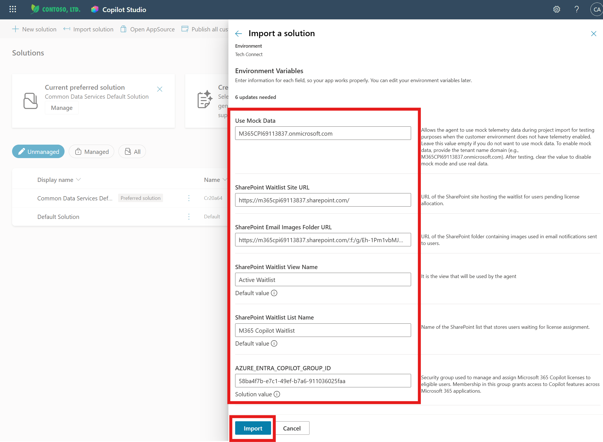

6. Wait for import to complete

   ⏱️ **Expected time:** 2-4 minutes

   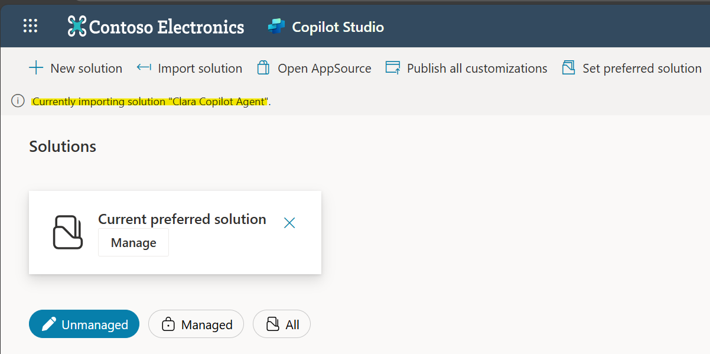
   
✅ **Validation:** 
   - You may see a warning after importing the solution. You can ignore it for now.
   - The agent will appear in your solutions list.

     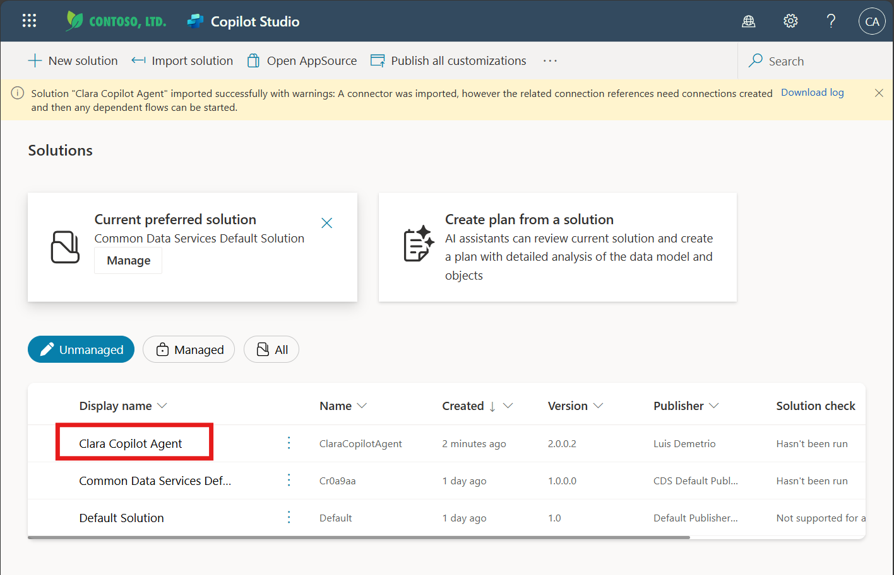
   

---

### 🧱 Step 3: Verify CLARA Agent in Copilot Studio

#### Why This Verification Matters:

After importing the agent package, the next critical step is confirming that Clara appeared correctly in your Copilot Studio environment. This verification ensures the import completed successfully and that all agent components—topics, configurations, and the basic structure—are intact. Think of this as a "health check" before we move forward with configuration. **You're not testing functionality yet** (Clara won't work at this stage), but you are confirming that the foundation is in place and ready for the setup steps ahead.

1. Switch back to: https://copilotstudio.microsoft.com

2. After import completes, **CLARA** should appear in your Agents list

   

3. Click on **CLARA** to open the agent

4. Verify you can see:
   - Agent name: CLARA
   - Description visible
   - Triggers (Clara Copilot Dashboard Daily Sync)
   - Test chat panel available

   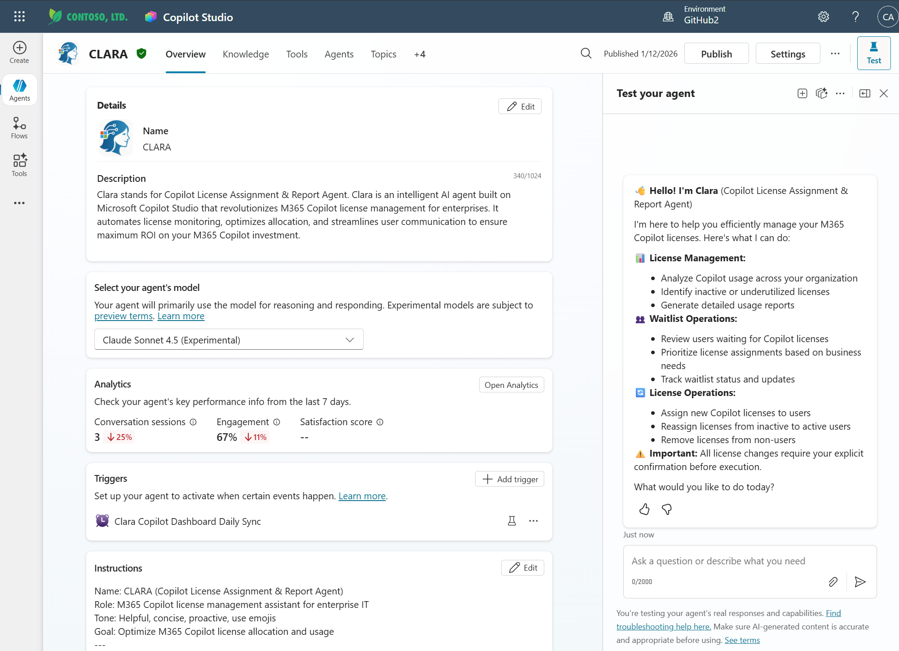

5. Click on the **Knowledge** tab to verify that **Clara M365 Copilot Dashboard** table for Dataverse is listed..

   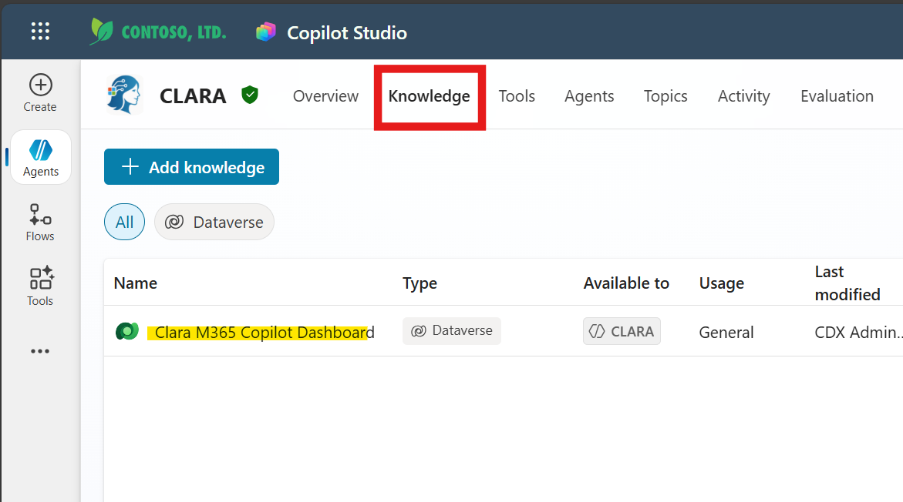
   
6. Click on the **Tools** tab and check if the following tools (Flows and Connectors) are available:

   - Clara - Flow to Assign Copilot License via Group
   - Clara - Flow to get real-time M365 Copilot Dashboard Report
   - Clara - Flow to Remove Copilot License via Group
   - M365 Copilot License Overview
   - Get Copilot Waitlist Users
   
   
   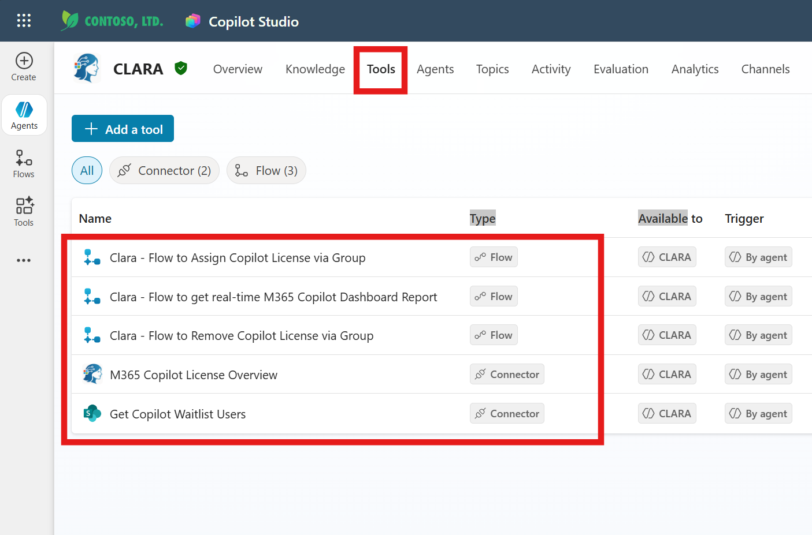

7. Finally, check if you have the following topics:

   - Send a welcome email to Copilot licensed user
   - Send Notification Email to Inactive Copilot Users
   - Update the Waitlist Status to Approved

   
   
✅ **Validation:** CLARA agent opens in Copilot Studio 

>💡 **Note:**
>
>Clara is not expected to work at this stage. This is by design —we will complete Clara’s configuration first.

> ⚠️ **Troubleshooting**:
>
>If any components are missing, verify that the import completed without errors. You may need to re-import the solution package or check that your environment has the necessary licenses and permissions.
---

### 🧱 Step 4: Verify Azure App Registration (Auto-Created)

#### Why Azure App Registration Matters:
When you imported Clara's solution package, **Copilot Studio automatically created an Azure App Registration** behind the scenes. This app registration is Clara's identity in your Microsoft 365 tenant—think of it as Clara's security badge that allows her to authenticate and interact with protected services like Microsoft Graph API, SharePoint, and Outlook.

Custom Agents like Clara need this identity because they perform actions on behalf of users: assigning licenses, reading usage data, sending emails, and managing waitlists. Each of these operations requires secure authentication using OAuth 2.0. The Azure App Registration provides the credentials (Client ID and Tenant ID) that Clara uses to prove her identity when making these API calls.

While the app registration is created automatically during import, you'll still need to configure its permissions and client secret manually in the next steps. This separation is intentional—it ensures that sensitive credentials aren't embedded in the solution package and that you maintain full control over what Clara can access in your environment.

Steps:  

1. Open a **new browser tab**

2. Navigate to: https://portal.azure.com

3. Sign in with Skillable credentials (if prompted)

4. Search for and click: **App Registrations**

  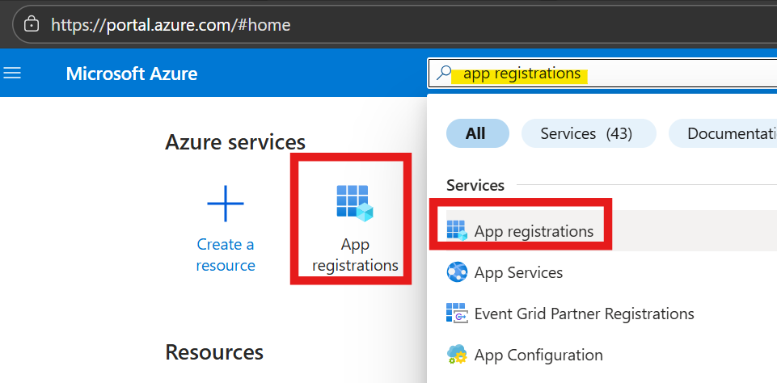


5. Click **All applications** tab

6. Search for: **CLARA**

7. Click on the CLARA application

   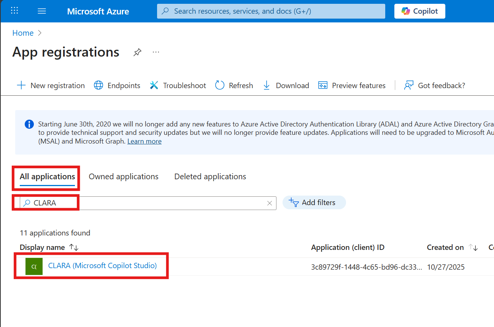

8. On the Overview page, copy these values to **Notepad**:

   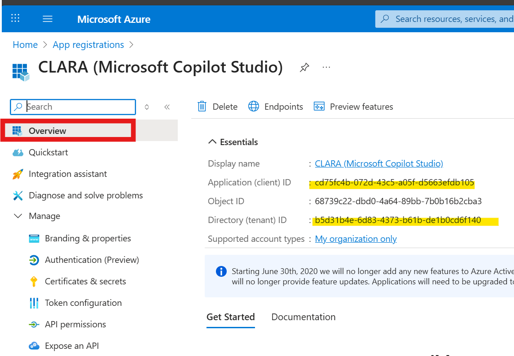

   ```
   Application (client) ID: ____________________
   Directory (tenant) ID: ______________________
   ```

✅ **Validation:** CLARA app visible in Azure with Client ID and Tenant ID saved.

💡 **Tip:** Keep Notepad open—you'll add more values as you progress through the configuration steps.

---

### 🧱 Step 5: Verify Custom Connector

#### Why the Custom Connector Matters:
Along with the agent and Azure App Registration, the solution package also imported a Custom Connector called Clara Graph APIs. This connector is Clara's bridge to Microsoft Graph API—the unified API endpoint that provides programmatic access to Microsoft 365 services and data.

While Copilot Studio has built-in connectors for many common operations, Clara needs specialized access to Graph API endpoints that aren't covered by standard connectors—specifically, license assignment operations, usage analytics from the M365 Copilot Dashboard API, and security group membership management. The custom connector packages these specific Graph API calls into reusable actions that Clara's Power Automate flows can invoke.

Think of it this way: the Azure App Registration (from Step 4) is Clara's identity badge, and the Custom Connector is the specialized toolkit she uses to perform her job. Together, they enable Clara to read license inventory, assign and remove licenses, and retrieve usage data—all through secure, authenticated API calls.

The connector was imported automatically, but you'll need configure the connection details in Exercise 3 by linking it to the Azure App Registration credentials you just verified.

Steps:


1. Open a **new browser tab**

2. Navigate to: https://make.powerautomate.com

3. Sign in if prompted

4. In the left-hand menu, select Custom Connectors.

   - If not pinned, click More → Discover all → Custom Connectors.
   
    

5. Locate **Clara Graph APIs** in the list.

    

✅ **Validation:** "Clara Graph APIs" connector visible in list.

💡 **Note:** Status shows "Not connected"—this is expected. You'll configure it in Exercise 3.

---

## Summary

You've successfully:

- ✅ Imported CLARA solution to Copilot Studio
- ✅ Verified CLARA agent is visible and accessible
- ✅ Confirmed Azure app registration was auto-created
- ✅ Verified custom connector import
- ✅ Saved Client ID and Tenant ID

---

## Configuration Tracker

Save these values for upcoming exercises:

```
CLARA Configuration Values
===========================
Application (client) ID: ____________________
Directory (tenant) ID: ______________________

(More values will be added in Exercise 2)
```

---

## Troubleshooting

**Issue:** Import fails with error

**Solutions:**
- Verify you have admin permissions
- Check solution file is not corrupted
- Ensure correct environment selected
- Try import again (transient errors can occur)

---

**Issue:** Can't find CLARA app in Azure AD

**Solutions:**
- Wait 1-2 minutes for Azure AD sync
- Refresh the App registrations page
- Search in "All applications" tab
- Verify correct tenant

---

**Issue:** Custom connector not visible

**Solutions:**
- Verify same environment as Copilot Studio
- Refresh Power Automate page
- Check under Data > Custom connectors
- If missing, import may have failed—retry

---

## ⏱️ Time Check

You should be approximately **10 minutes** into the lab.

- ⏰ On track: Continue to Exercise 2
- ⏰ Behind: Raise your hand for assistance

---

**Next:** [Exercise 2: Configure Azure App Registration](./exercise2.md)
