# Exercise 1: Prepare SharePoint Infrastructure

**Estimated time:** 8 minutes

## Objective

Import the M365 Copilot License Waitlist template into SharePoint and configure an optimized view for Clara's operations. This list serves as Clara's operational memory for tracking license requests and assignments.

---

## What You'll Learn

Clara needs a place to store and track license requests in real-time. SharePoint Lists provide the perfect balance of:
- **Fast read/write operations** for conversational workflows
- **Built-in versioning** for audit trails
- **Native Microsoft 365 integration** with Power Automate and Copilot Studio
- **Familiar interface** for IT admins to review and manage manually when needed

Instead of creating columns manually (which takes time), you'll import a pre-configured template that includes all the columns Clara needs with proper data types and settings.

---

## What You'll Do

- Download the SharePoint List template (CSV)
- Import the template into your SharePoint site
- Create an optimized view to reduce payload size

---

## Before You Begin

You'll need:
- ✅ Access to a SharePoint site (Site Owner or Member permissions)
- ✅ Ability to create lists and manage views
- ✅ The SharePoint site URL (you'll use this in Exercise 4)

> 💡 **Recommended:** Use a dedicated site for Clara (e.g., "IT Automation" or "License Management"), or use your existing IT/Admin SharePoint site.

---

## Tasks

### 🧱 Step 1: Download the SharePoint List Template

#### Why Import from Template?

Creating 8 columns manually with specific data types, validation rules, and settings takes 10-15 minutes. Importing from a CSV template does this in 2 minutes while ensuring consistency and reducing errors.

**Steps:**

1. Open a new browser tab

2. Navigate to the Clara GitHub repository:
   
   https://github.com/luishdemetrio/clara-copilot-agent/labs
   
3. Locate the **SharePoint Templates** folder

4. Download **M365-Copilot-Waitlist-Template.csv**

   

   > 💡 **What's in the template?** Pre-configured column definitions and one sample row to establish data types

5. Save the file to your **Downloads** folder

6. Keep this browser tab open—you'll return to GitHub for additional files later

✅ **Validation:** CSV template file downloaded to your computer

**Troubleshooting:**
- **Can't access GitHub?** Ask the instructor for a direct download link
- **File downloads as .txt?** Right-click → Save Link As → ensure .csv extension
- **Corporate firewall blocking GitHub?** The instructor has a backup copy available

---

### 🧱 Step 2: Navigate to Your SharePoint Site

**Steps:**

1. Open a new browser tab (or switch to an existing SharePoint tab)

2. Navigate to your SharePoint site

   Example: `https://m365cpi69113837.sharepoint.com/sites/Clara`
   
   > 💡 **Tip:** If you don't have a dedicated site, you can use any existing site where you have permissions to create lists

3. Verify you're on the site homepage

   You should see the site name in the top-left corner
   
   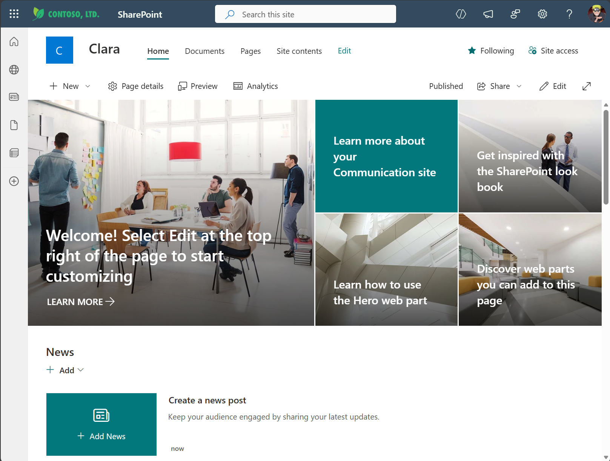

4. Copy the SharePoint site URL to Notepad—you'll need it in Exercise 4

   ```
   SharePoint Configuration
   ========================
   Site URL: _______________________________________
   ```

✅ **Validation:** SharePoint site is open and URL is saved

---

### 🧱 Step 3: Import the List from CSV

#### Understanding CSV Import

SharePoint can create lists from CSV files, automatically detecting column types from the data. This is faster than manual creation and ensures consistency across deployments.

**Steps:**

1. From your SharePoint site, click **+ New** from the top navigation

2. Select **List** from the dropdown menu.

   

3. In the "Create a list" dialog, select **From CSV**

   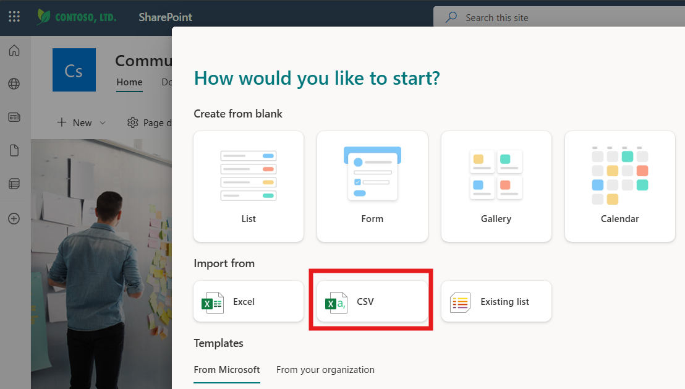

4. Click **Upload file**

   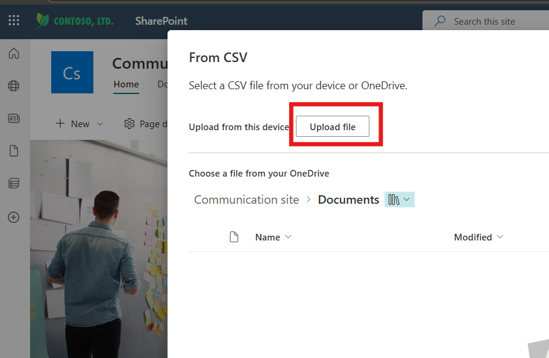

5. Browse to your **Downloads** folder and select **M365-Copilot-Waitlist-Template.csv**

6. Click **Open**

   > ⏱️ **Wait time:** 3-5 seconds while SharePoint analyzes the file

7. SharePoint displays a preview of the columns it detected:

   You should see:
   - Title
   - User Waiting License
   - Request Date
   - Status
   - Priority
   - Business Justification
   - Assigned Date
   - Assigned By
   - Notes

   > 💡 **Review the preview:** SharePoint attempts to detect column types automatically. We'll verify these in the next step.
   

8. Click **Next**

   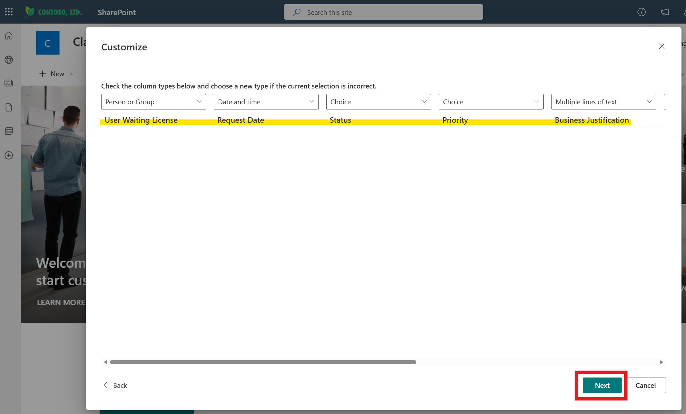

9. Configure the list:
   - **Name:** `M365 Copilot License Waitlist`
   

10. Click **Create**

   > ⏱️ **Wait time:** 5-10 seconds for SharePoint to create the list and import data
   
   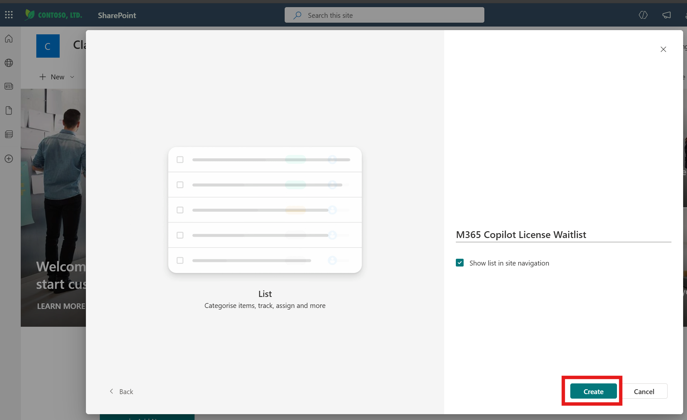

✅ **Validation:** List is created and opens with columns visible

   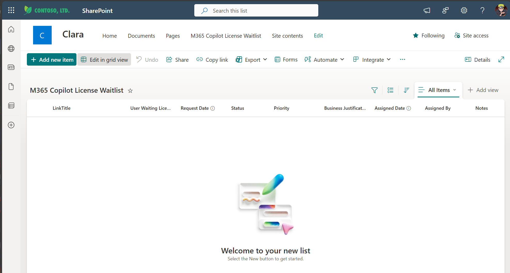

**Troubleshooting:**
- **Upload fails?** Check file isn't open in Excel—close Excel and retry
- **"Unable to detect columns"?** Ensure CSV is properly formatted—download again from GitHub
- **Import hangs?** Refresh the page and try again
- **Character encoding errors?** The CSV should be UTF-8 encoded—if issues persist, use the instructor's backup file

---


### 🧱 Step 4: Create Optimized View for Clara

#### Why Views Matter for Performance

Without a custom view, Clara retrieves **all columns** including system metadata, resulting in large JSON payloads that consume her token budget. In testing:
- **Without view:** 140 lines of JSON for 2 users
- **With optimized view:** 72 lines of JSON for 2 users

This 50% reduction prevents token limit errors and improves response speed.

**What We're Creating:**

An "Active Waitlist" view that:
- Shows only users with Status = "Pending"
- Sorts by Priority (High first) then Request Date (oldest first)
- Includes only essential columns Clara needs

**Steps:**

1. Click the **+ Add view** next to **All Items** (current view name) at the top of the list

   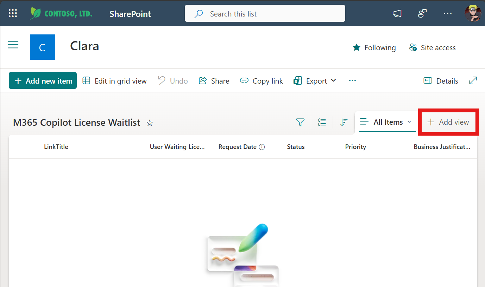

2. In the "Create View" dialog
   - **View name:** `Active Waitlist`
   - **Show as:** List (pre-selected)
   - **Make this the default view:** No (leave unchecked)

3. Click **Create**

   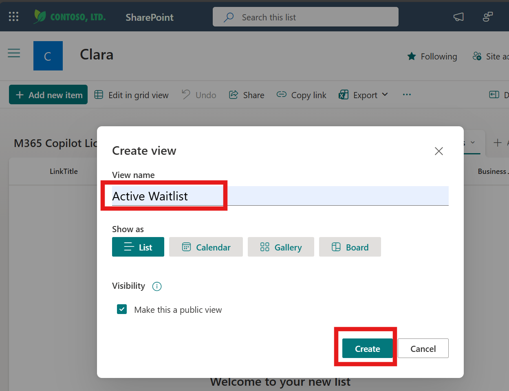
   
   Once created, you'll see "Active Waitlist" appear in the view dropdown

4. Now configure the view by clicking the view dropdown → **Edit current view**

   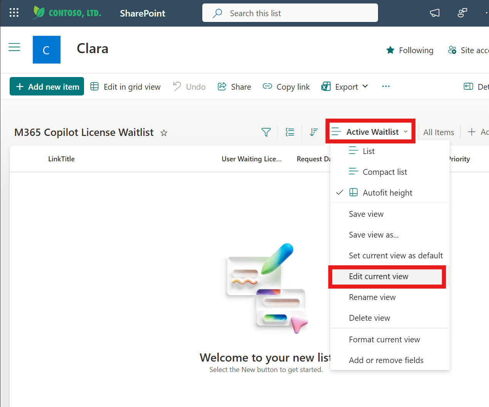
   
5. Under the Columns section, check only these columns: 
   - ✅ User Waiting License
   - ✅ Request Date
   - ✅ Priority
   - ✅ Business Justification (if you need it in responses)
   
   > 💡 **Why only these three?** Clara retrieves full item data in her flows; the view is just for efficient filtering


   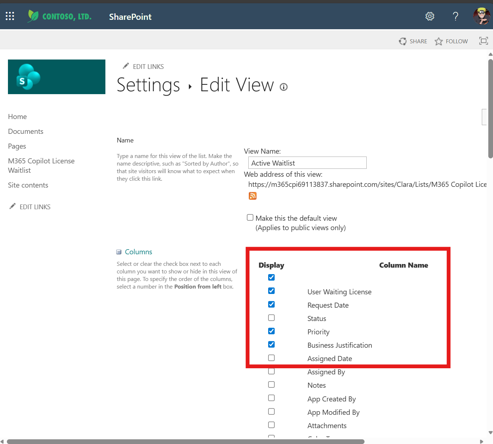

6. Scroll to **Filter** section

7. Configure filter:
   - **Show items only when the following is true:**
   - Select: **Status** → **is equal to** → **Pending**

   > 💡 **Why filter by Pending?** Clara primarily works with active requests, not historical ones


8. Click **OK** to save the view
 
    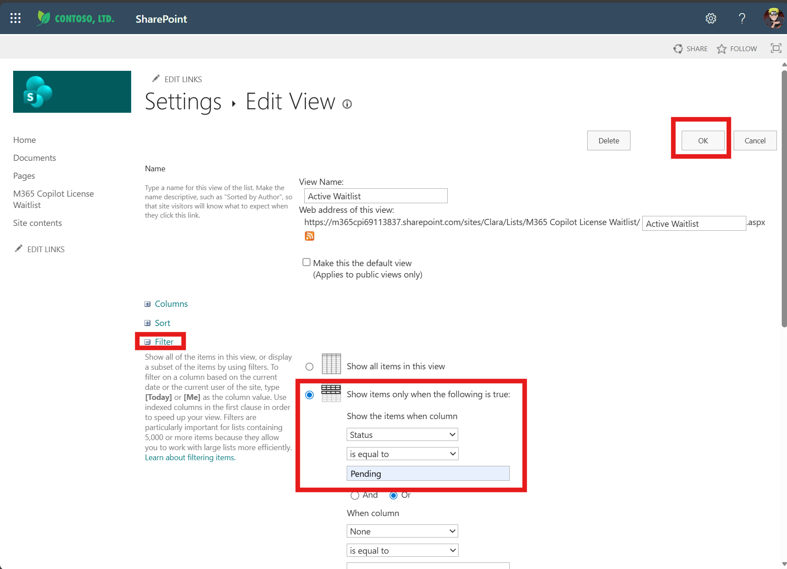


✅ **Validation:** "Active Waitlist" view is created and ready

---

### 🧱 Step 5: Record Configuration Details

Save these details for Exercise 4 configuration:

**Steps:**

1. Update your Notepad with the following information:

   ```
   SharePoint Configuration
   ========================
   Site URL: _______________________________________
   List Name: M365 Copilot License Waitlist
   View Name: Active Waitlist
   ```

2. To get the **List URL** (optional, but helpful):
   - While viewing the list, copy the URL from your browser
   - Example: `https://yourtenant.sharepoint.com/sites/SiteName/Lists/M365CopilotLicenseWaitlist`
   - Add to your notes:
     ```
     List URL: _______________________________________
     ```

3. Keep this information—you'll need it when configuring Clara's SharePoint connector in Exercise 4

✅ **Validation:** All SharePoint configuration details saved in Notepad

---

## Summary

You've successfully created Clara's operational infrastructure in just 8 minutes:

- ✅ Imported SharePoint List template with all required columns
- ✅ Configured validation rules for data integrity
- ✅ Created optimized "Active Waitlist" view for performance
- ✅ Saved configuration details for Exercise 4

---

## What You Built

**The M365 Copilot License Waitlist** is now ready to serve as Clara's real-time memory for:
- Tracking license requests as they come in
- Managing the queue with priority and FIFO fairness
- Recording assignment decisions with full audit trails
- Providing visibility for IT admins to review manually

**The Active Waitlist view** optimizes Clara's performance by:
- Reducing JSON payload size by ~50%
- Filtering to show only actionable items (Status = Pending)
- Sorting intelligently (Priority first, then Request Date)
- Preventing token limit issues as your waitlist scales

---

**Next:** [Exercise 1: Import CLARA](./01-exercise1.md)

