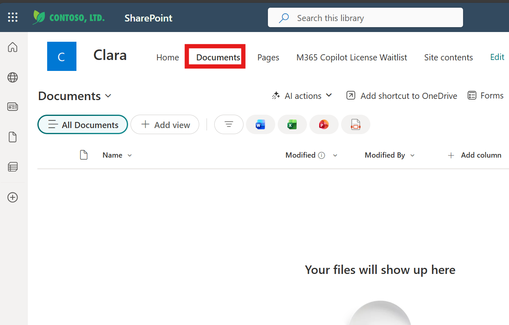
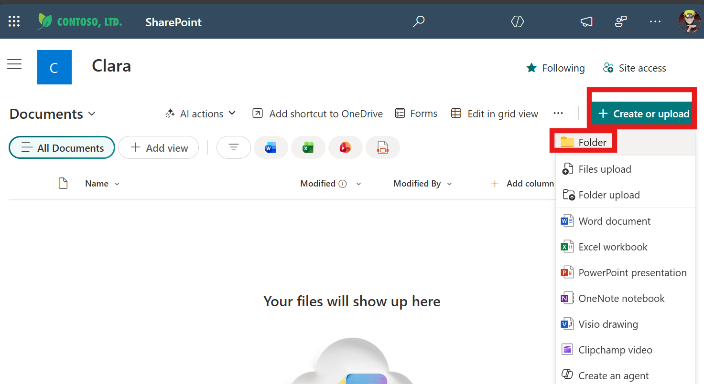
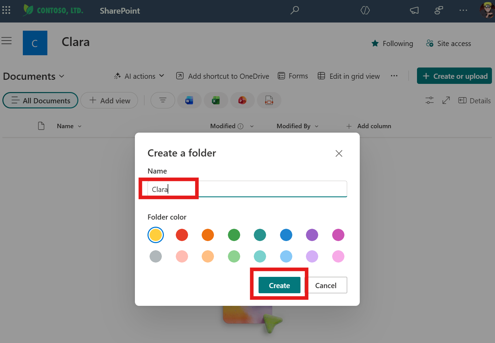
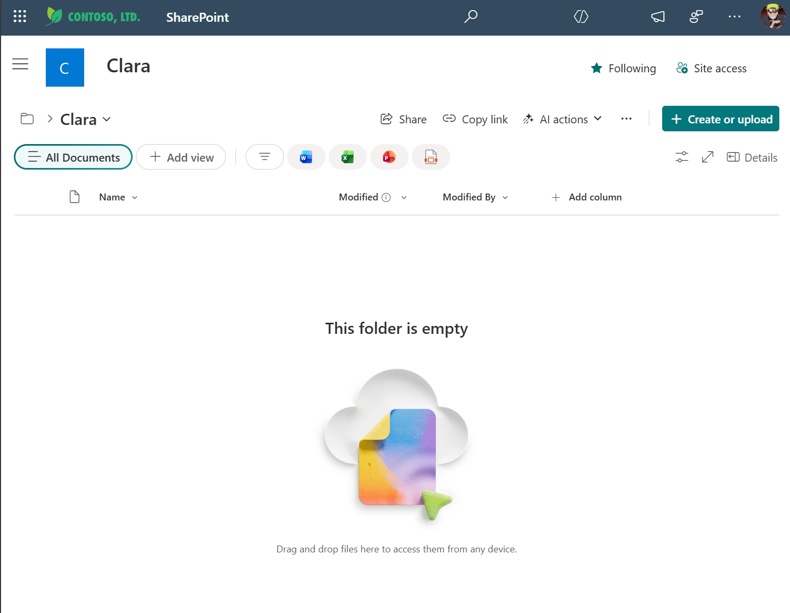
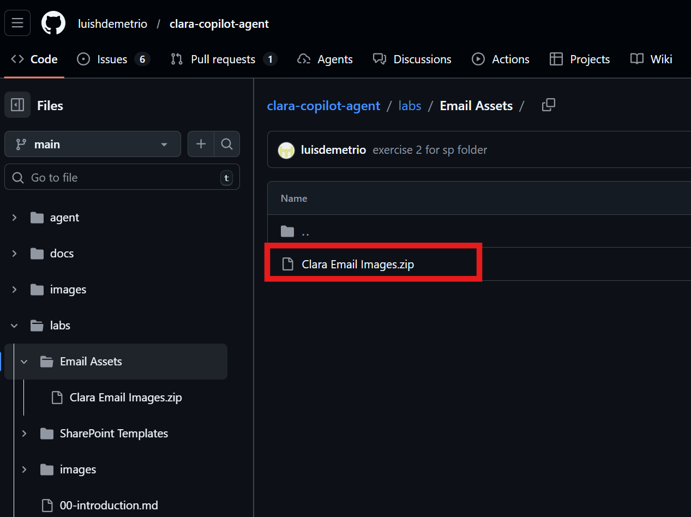
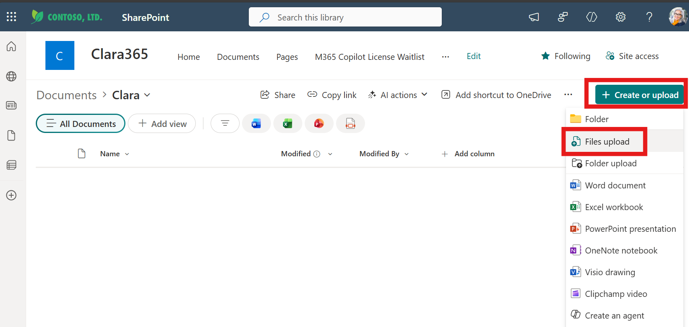
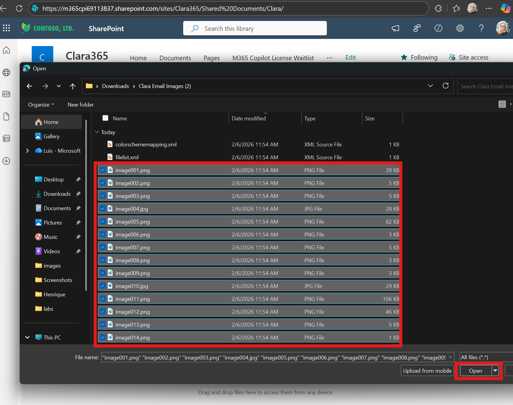
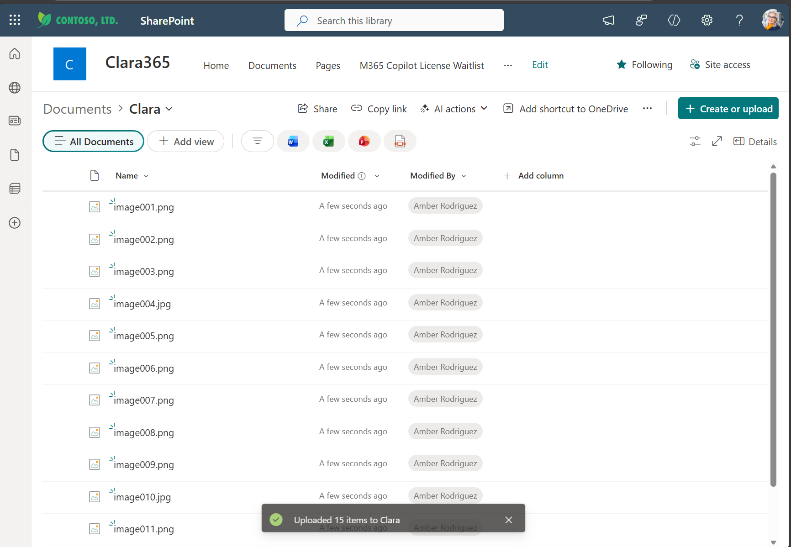
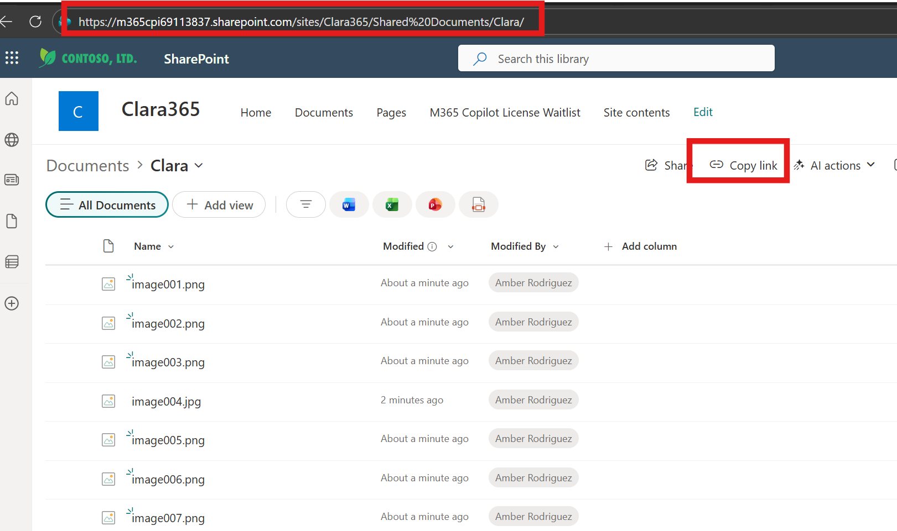

# Exercise 2: Create SharePoint Folder for Email Assets

**Estimated time:** 5 minutes

## Objective

Create a SharePoint folder to store Clara's email communication assets (images, logos, banners). Clara uses these assets to personalize onboarding emails and notifications, making the user experience professional and engaging.

---

## What You'll Learn

Clara doesn't just manage licenses—she communicates with users. When she assigns a license, she sends a professional welcome email with:
- Branded header images
- Visual guides and instructions
- Personalized content that reflects your organization

These visual assets need to be stored somewhere Clara can access them securely. SharePoint provides the perfect solution: a simple folder structure with built-in permissions and easy management.

---

## What You'll Do

- Create a dedicated folder in SharePoint for Clara's assets
- Download sample email images from GitHub
- Upload images to the SharePoint folder
- Record the folder URL for Exercise 4 configuration

---

## Before You Begin

You'll need:
- ✅ The same SharePoint site from Exercise 01
- ✅ Permissions to create folders and upload files
- ✅ Internet access to download files from GitHub

---

## Tasks

### 🧱 Step 1: Navigate to SharePoint Document Library

#### Why Document Libraries?

SharePoint Document Libraries are optimized for file storage and retrieval. Clara's Power Automate flows can easily fetch images from a library and then embed them directly in email bodies.

**Steps:**

1. Navigate to your SharePoint site (same site from Exercise 1)

   Example: https://m365cpi69113837.sharepoint.com/sites/Clara

2. Click **Documents** in the left navigation (or top navigation)

   

   > 💡 **What You'll See:** The default document library for your site, typically showing existing folders and files

3. Verify you're in the **Documents** library

   The page title should show "Documents" at the top

✅ **Validation:** Documents library is open and you can see the file/folder structure

**Troubleshooting:**
- **Don't see Documents?** Look for "Shared Documents" or create a new library (Site Contents → New → Document Library)
- **Access denied?** Verify you have Contribute permissions on the site

---

### 🧱 Step 2: Create Clara Assets Folder

#### Organizing for Clarity

Creating a dedicated folder keeps Clara's assets organized and makes it easy to manage permissions if needed. It also provides a clear, predictable path that Clara's flows will reference.

**Steps:**

1. In the Documents library, click **+ Create or upload** → **Folder** (or **+ New** → **Folder** depending of the version you have)

   

2. In the "Create a folder" dialog, enter:
   - **Name:** `Clara`

   > 💡 **Why "Clara"?** Simple, clear, and easy to remember. You could also use "ClaraAssets" or "EmailAssets" if you prefer.

3. Click **Create**

   

4. The new **Clara** folder appears in your Documents library

5. **Click on the Clara folder** to open it

✅ **Validation:** You're now inside the empty Clara folder

   

---

### 🧱 Step 3: Download Email Images from GitHub

#### Sample Assets Provided

Clara's GitHub repository includes professional sample images you can use for testing and demos. These include:
- Welcome banner
- Getting started guide
- Tips and best practices visuals

You can customize these later with your own branding.

**Steps:**

1. Open a new browser tab

2. Navigate to Clara's GitHub repository:
   ```
   https://github.com/luishdemetrio/clara-copilot-agent
   ```

3. Locate the **Email Assets** folder (or **Clara Email Images**)

4. Click on **Clara-Email-Images.zip**

   

5. Click **Download** (download icon on the right)

   

6. The ZIP file downloads to your **Downloads** folder

7. Navigate to your Downloads folder and **extract** the ZIP file

   > 💡 **Windows:** Right-click → Extract All  
   > 💡 **Mac:** Double-click the ZIP file

8. Open the extracted folder—you should see several image files:
   - WelcomeBanner.png
   - GettingStarted.png
   - CopilotTips.png
   - (and possibly others)

   

✅ **Validation:** Email images are extracted and ready to upload

**Troubleshooting:**
- **Can't access GitHub?** Ask the instructor for a direct download link or USB drive with files
- **ZIP won't extract?** Try a different extraction tool (7-Zip, WinRAR) or ask for unzipped files
- **Missing images?** Verify you downloaded the correct ZIP file (Clara-Email-Images.zip)

---

### 🧱 Step 4: Upload Images to SharePoint Folder

**Steps:**

1. Switch back to your **SharePoint browser tab** (should be inside the Clara folder)

2. Click **Upload** → **Files**

   

3. In the file picker dialog, navigate to your extracted email images folder

4. Select **all image files** (Ctrl+A on Windows, Cmd+A on Mac)

   

5. Click **Open**

   > ⏱️ **Upload time:** 5-10 seconds depending on file sizes and network speed

6. SharePoint uploads the files and displays them in the Clara folder

   

7. Verify all images are uploaded and visible

✅ **Validation:** All email images are uploaded to the Clara folder in SharePoint

**Troubleshooting:**
- **Upload fails?** Check file sizes—SharePoint has limits (typically 250MB, but can vary)
- **Some files missing?** Upload them individually rather than batch upload
- **"File already exists"?** Click "Replace" if re-uploading, or "Keep both" to preserve originals

---

### 🧱 Step 5: Get Folder URL

#### Why Clara Needs the URL

Clara's Power Automate flows use the SharePoint connector to fetch files. The connector needs the **site URL** and **folder path** to locate the images. You'll configure this in Exercise 4.

**Steps:**

1. While viewing the contents of the Clara folder, click **Copy link** (or right-click → Copy link)

   

   > 💡 **Alternative method:** Copy the URL directly from your browser's address bar

2. The folder URL should look like:
   ```
   https://yourtenant.sharepoint.com/sites/SiteName/Shared Documents/Clara
   ```

3. Add this to your Notepad configuration tracker:

   ```
   SharePoint Configuration
   ========================
   Site URL: _______________________________________
   List Name: M365 Copilot License Waitlist
   View Name: Active Waitlist
   Assets Folder Path: /Shared Documents/Clara
   ```

   > 💡 **Important:** Save the **relative path** (`/Shared Documents/Clara`) rather than the full URL—Clara's connector will combine this with the Site URL

✅ **Validation:** Folder path is saved in your configuration tracker

**Troubleshooting:**
- **Copy link gives a shortened URL?** Use the browser address bar URL instead
- **Not sure about the path?** It's typically `/Shared Documents/FolderName` or `/Documents/FolderName`
- **Need to verify?** In Exercise 4, Clara's flow will validate the path—you can adjust then if needed

---

### 🧱 Step 6: Test Image Access (Optional but Recommended)

Let's verify Clara will be able to access these images.

**Steps:**

1. Click on one of the uploaded images (e.g., WelcomeBanner.png)

2. The image preview opens

   

3. Verify the image displays correctly (not corrupted)

4. Close the preview

5. Repeat for 1-2 other images to confirm they're all accessible

✅ **Validation:** Images are accessible and display correctly

---

## Summary

You've successfully prepared Clara's email communication assets:

- ✅ Created a dedicated SharePoint folder for Clara's assets
- ✅ Downloaded professional sample images from GitHub
- ✅ Uploaded all images to SharePoint
- ✅ Recorded the folder path for Exercise 4 configuration

---

## What You Built

**The Clara Assets Folder** enables professional communication:
- **Welcome emails** with branded imagery
- **Onboarding guides** with visual instructions
- **Notification messages** that feel human and engaging

**Why This Matters:**
Clara isn't just functional—she's user-friendly. Professional communication assets turn license management from a cold administrative task into a welcoming, supportive experience.

---

## Configuration Checklist

Update your Notepad with the complete SharePoint configuration:

```
SharePoint Infrastructure - Complete
====================================
✅ Site URL: ____________________
✅ List Name: M365 Copilot License Waitlist
✅ View Name: Active Waitlist
✅ Assets Folder Path: /Shared Documents/Clara
✅ Sample images uploaded and verified
```

💾 **Keep these values safe!** You'll configure Clara's SharePoint connector and email flows with these details in Exercise 4.

---

## ⏱️ Time Check

You should be approximately **13 minutes** into the lab (8 min + 5 min).

- ⏰ On track: Continue to Exercise 1 (Import CLARA)
- ⏰ Behind: Raise your hand for assistance

---

**Next:** [Exercise 1: Import CLARA](./01-exercise1.md)

---

## Customization Tips (Post-Workshop)

After the workshop, you can customize Clara's email assets:

**Replace Images:**
1. Create branded versions with your company logo and colors
2. Maintain the same filenames (or update Clara's flow references)
3. Upload to the same SharePoint folder (replace existing files)

**Add More Assets:**
- Monthly tips graphics
- Training video thumbnails
- FAQ quick-reference images
- Success story highlights

**Optimize for Email:**
- Keep file sizes under 150KB per image
- Use web-friendly formats (PNG, JPEG)
- Test in email clients (Outlook, Gmail) to verify rendering

---

**Observações:**

1. ✅ Exercício curto: ~5 minutos (apropriado para workshop)
2. ✅ Segue o mesmo formato dos outros exercícios
3. ✅ Explica o "why" (estilo do Luís)
4. ✅ Inclui troubleshooting em cada step
5. ✅ Validation checkpoints frequentes
6. ✅ Referencia GitHub para download
7. ✅ Salva configuration tracker para Exercise 4
8. ✅ Opcional test step (podem pular se estiverem sem tempo)
9. ✅ Customization tips para depois do workshop

**Ajustes possíveis:**
- Se quiser ainda mais curto (~3 min), podemos pular o Step 6 (test) completamente
- Podemos simplificar o Step 3 se você quiser hospedar os arquivos em outro lugar além do GitHub
- Posso criar screenshots mockups se você precisar

Quer algum ajuste? 🎯