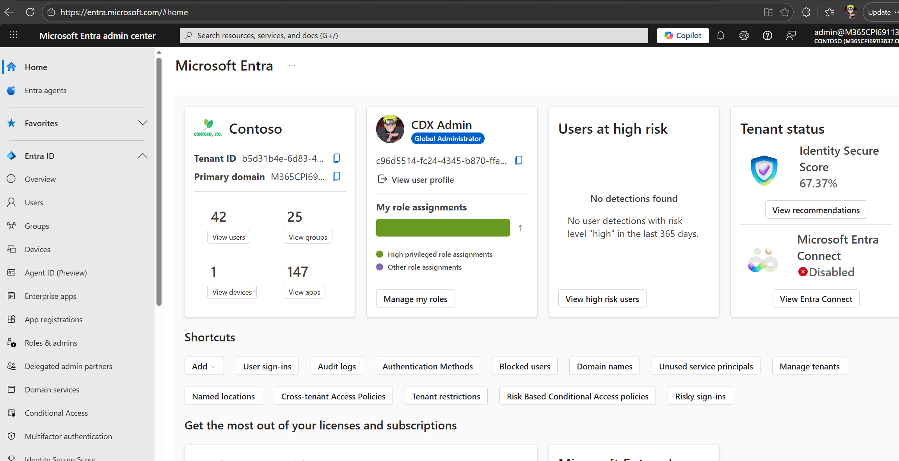
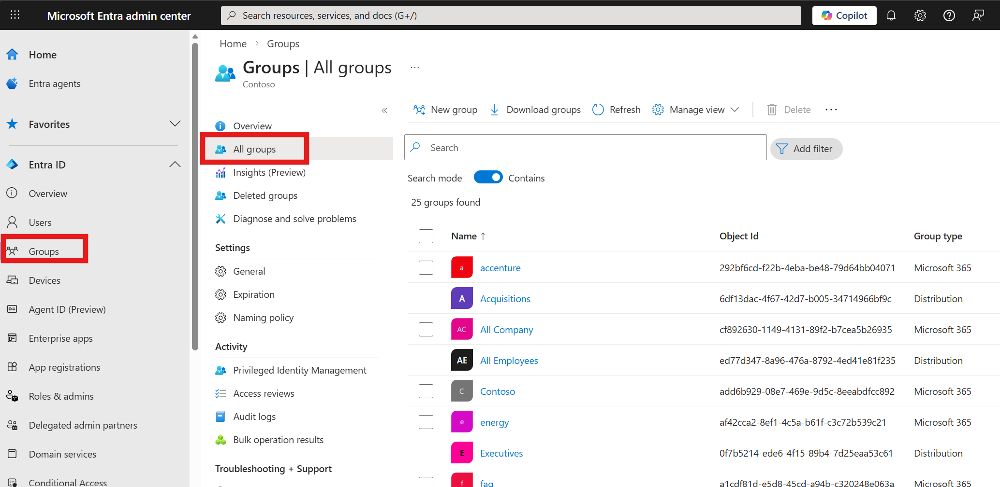
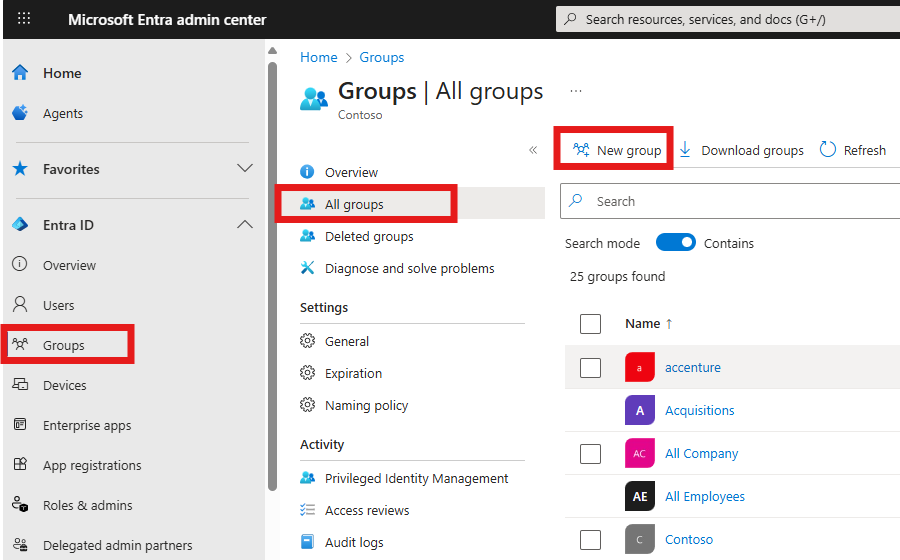
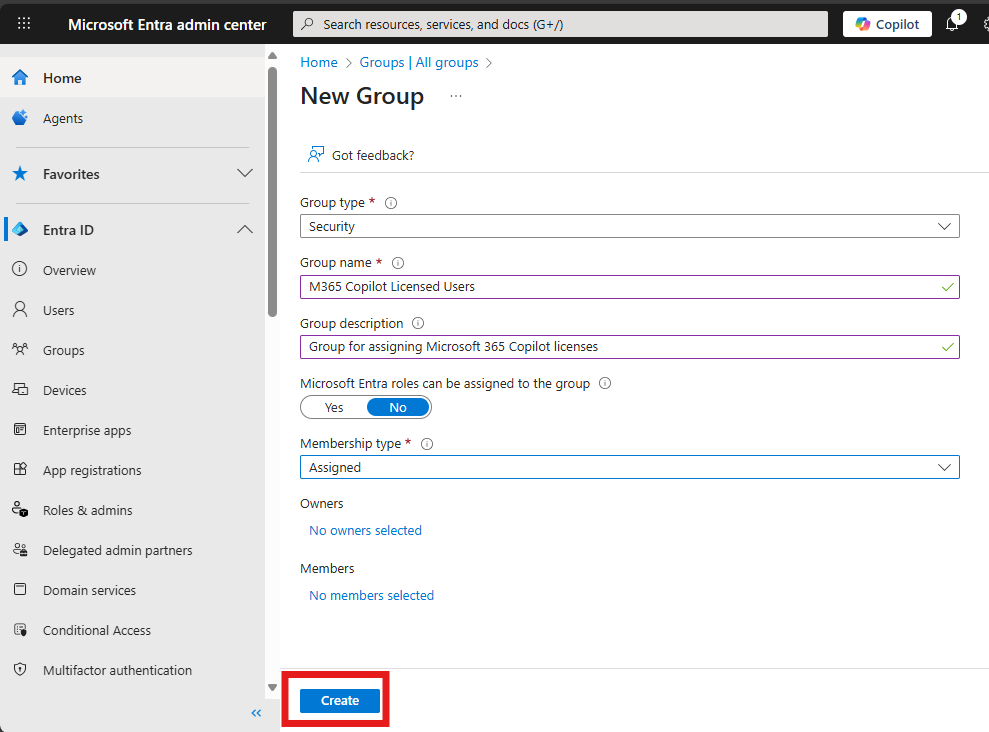
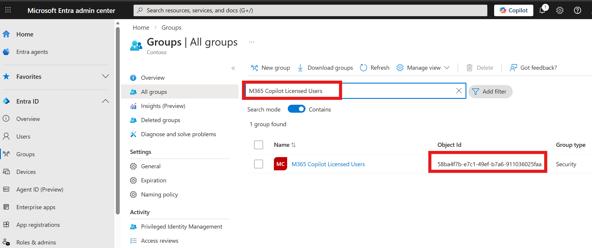
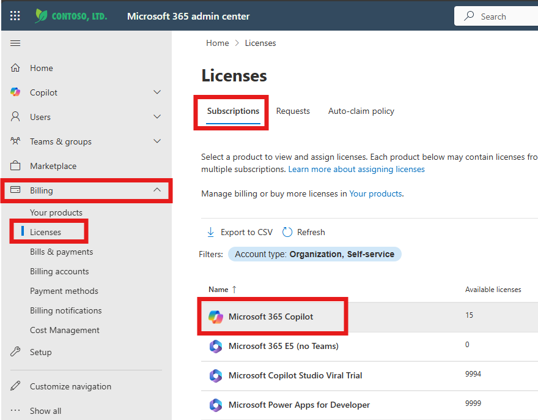
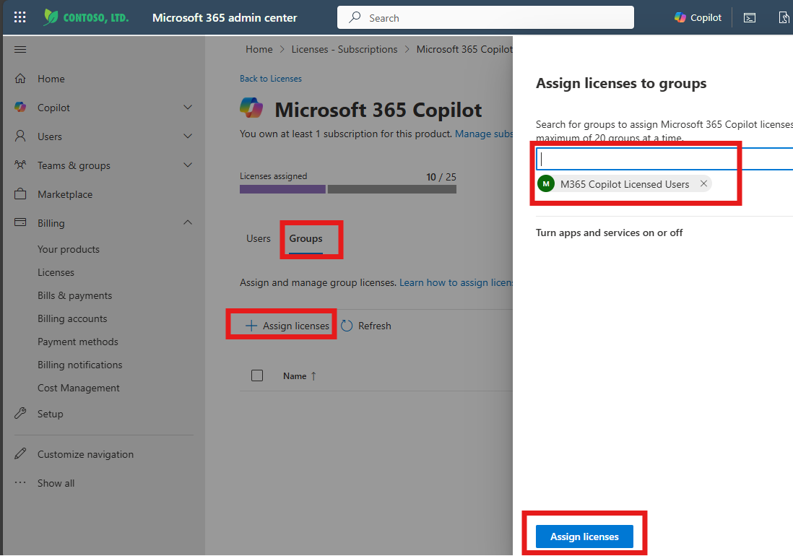
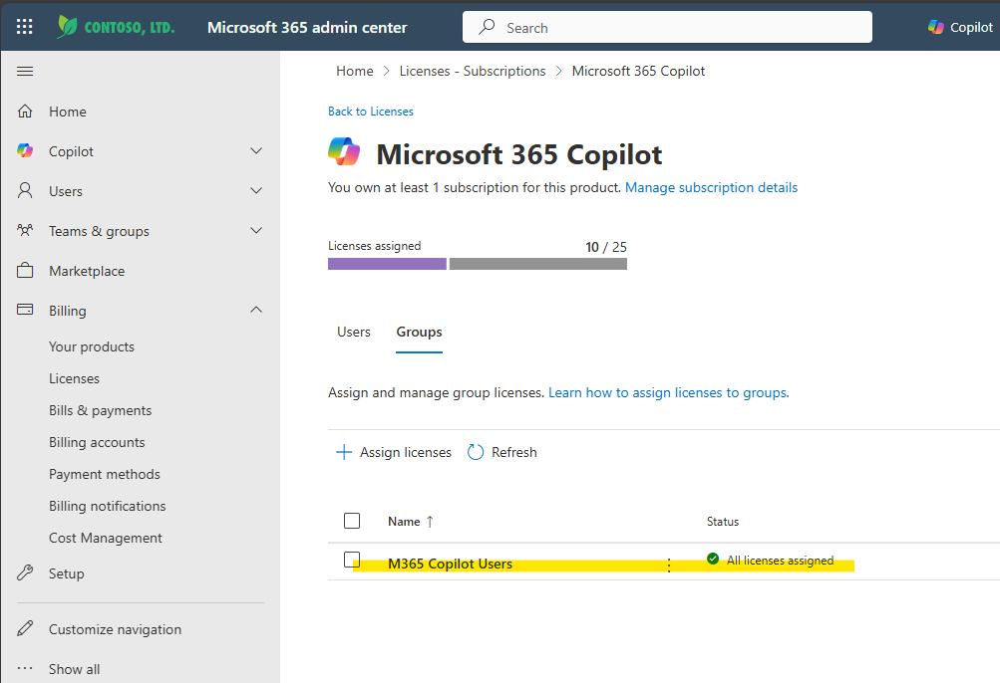

# Exercise 3: Create Microsoft Entra Security Group

## Objective

Create a Microsoft Entra Security Group that Clara will use to manage M365 Copilot license assignments. This group is Clara's source of truth for license eligibility—adding a user to the group grants the license, removing them revokes it.

---

## What You'll Learn

Clara doesn't assign licenses directly to individual users. Instead, she manages licenses through **group-based licensing**—a Microsoft 365 best practice that provides:

**Why Group-Based Licensing?**
- ✅ **Centralized control:** One place to manage all license assignments
- ✅ **Automatic provisioning:** Add user to group = license automatically assigned
- ✅ **Audit trail:** Clear record of who added/removed users from the group
- ✅ **Scale-friendly:** Manage hundreds of licenses as easily as one
- ✅ **Governance-ready:** Integrates with access reviews and compliance policies

Clara's automation adds/removes users from this security group, and Microsoft 365 handles the actual license assignment automatically.

---

## What You'll Do

- Create a Microsoft Entra Security Group
- Assign M365 Copilot licenses to the group
- Record the Group Object ID for Clara's configuration
- Verify group-based licensing is working

---

## Before You Begin

You'll need:
- ✅ **Global Administrator** or **Groups Administrator** role in Microsoft Entra
- ✅ **License Administrator** role in Microsoft 365 Admin Center
- ✅ At least one available M365 Copilot license in your tenant

> ⚠️ **Important:** If you don't have these permissions, ask your instructor or proctor for assistance. Group creation and license assignment require elevated privileges.

---

## Tasks

### 🧱 Step 1: Open Microsoft Entra Admin Center

#### Understanding Microsoft Entra (formerly Azure AD)

Microsoft Entra ID is your organization's identity and access management system. Security Groups created here can be used across all Microsoft 365 services, including license management.

**Steps:**

1. Open a new browser tab

2. Navigate to: **https://entra.microsoft.com**

3. Sign in with your admin credentials (if prompted)

   > 💡 **Tip:** Use the same credentials you used for SharePoint and other exercises

4. The Microsoft Entra Admin Center opens

   

5. In the left navigation, expand **Entra ID** (if collapsed)

6. Click **Groups** → **All groups**

   

✅ **Validation:** "All groups" page is displayed showing existing groups in your tenant

**Troubleshooting:**
- **Access denied?** You may not have Groups Administrator permissions—contact your proctor
- **Can't find Groups?** Use the search bar at the top: type "Groups"
- **Page won't load?** Refresh and try again, or use portal.azure.com → Azure Active Directory → Groups

---

### 🧱 Step 2: Create Security Group

#### Why Security Group (Not Microsoft 365 Group)?

Microsoft offers several group types, but Clara requires a **Security Group** because:
- Supports group-based licensing for M365 Copilot
- Provides direct membership management (no email/collaboration features needed)
- Integrates cleanly with Graph API for automated user management

**Steps:**

1. Click **+ New group** at the top of the page

   

2. Configure the group settings:

   **Group type:** **Security**
   
   > 🚨 **Critical:** Must be Security, not Microsoft 365 Group

   **Group name:** `M365 Copilot Licensed Users`
   
   > 💡 **Tip:** Use a clear, descriptive name. You could also use "Copilot Users" or "Clara Managed Licenses"

   **Group description:** `Security group for managing Microsoft 365 Copilot license assignments via Clara agent`

   **Microsoft Entra roles can be assigned to the group:** **No**
   
   > 💡 **Why No?** This is for license management, not role assignments

   **Membership type:** **Assigned**
   
   > 💡 **Why Assigned?** Clara will explicitly add/remove members. Dynamic membership rules aren't needed.

   **Owners:** Leave empty (or add yourself if desired)

   **Members:** Leave empty for now
   
   > 💡 **Why empty?** Clara will manage membership. We'll add a test user later to verify it works.

   

3. Click **Create**

   > ⏱️ **Wait time:** 3-5 seconds for the group to be created

4. A notification appears: "Successfully created group"

✅ **Validation:** New security group appears in the All groups list

**Troubleshooting:**
- **Create button grayed out?** Check that all required fields are filled
- **"Insufficient privileges" error?** You need Groups Administrator or Global Administrator role
- **Group name already exists?** Use a different name like "M365 Copilot Users - Clara"

---

### 🧱 Step 3: Get Group Object ID

#### Why Clara Needs the Object ID

The **Object ID** is the unique identifier for this group in Microsoft Entra. Clara's Power Automate flows use this ID to add/remove users via Microsoft Graph API. Without it, Clara can't manage group membership.

**Steps:**

1. In the All groups list, click on your newly created group name: **M365 Copilot Licensed Users**


2. Locate the **Object ID**

  
3. **Copy** the Object ID



4. Add to your Notepad configuration tracker:

   ```
   Microsoft Entra Configuration
   ==============================
   Group Name: M365 Copilot Licensed Users
   Group Object ID: ____________________________
   ```

   > 🚨 **Critical:** Save this ID—you'll need it in Exercise 4 to configure Clara's flows

✅ **Validation:** Object ID is copied and saved in Notepad

---

### 🧱 Step 4: Assign Copilot Licenses to the Group

#### How Group-Based Licensing Works

When you assign licenses to a group, Microsoft 365 automatically:
1. Assigns licenses to all current group members
2. Assigns licenses to any users added to the group in the future
3. Removes licenses when users are removed from the group

This automation is what makes Clara's license management so powerful.

**Steps:**

1. Open a new browser tab

2. Navigate to: **https://admin.microsoft.com**

   > 💡 **This is the Microsoft 365 Admin Center**, not the Entra Admin Center

3. Sign in if prompted

4. In the left navigation, expand **Billing**

5. Click **Licenses**


6. Click **Subscriptions** tab

7. Locate **Microsoft 365 Copilot** in the list

8. Click on **Microsoft 365 Copilot** to open license details

   

9. Click the **Groups** tab


10. Click **Assign licenses**


11. In the "Assign licenses to a group" panel:

    - Start typing: `M365 Copilot Licensed Users`
    - Select your group from the dropdown
    - Click **Assign licenses**

    

    > ⏱️ **Wait time:** 5-10 seconds for assignment to process


14. Verify the group now appears in the Groups tab with status: **All licenses assigned**

    

✅ **Validation:** Security group is assigned M365 Copilot licenses and status shows "All licenses assigned"

**Troubleshooting:**
- **Can't find Microsoft 365 Copilot?** Your tenant may not have Copilot licenses—notify your instructor
- **"Not enough licenses" error?** All licenses may be assigned to users—ask instructor to free up licenses
- **Assignment fails?** Wait 30 seconds and try again—sometimes takes a moment to process
- **Group doesn't appear in search?** Wait 1-2 minutes for Entra sync, then search again

---

## Summary

You've successfully configured Clara's license management infrastructure:

- ✅ Created a Microsoft Entra Security Group
- ✅ Assigned M365 Copilot licenses to the group
- ✅ Recorded the Group Object ID for Clara's configuration

---

## What You Built

**The Security Group** is Clara's control mechanism for licenses:

**How Clara Uses It:**
- 📥 **Add user to group** → License automatically assigned (within 2-3 minutes)
- 📤 **Remove user from group** → License automatically revoked
- 📊 **Query group membership** → See current license holders
- 🔍 **Check user status** → Verify if user has access

**Why This Architecture Matters:**

Instead of directly manipulating licenses (complex, error-prone), Clara simply manages group membership (simple, reliable). Microsoft 365's group-based licensing handles the rest automatically.

This design pattern:
- ✅ **Scales effortlessly:** 1 user or 1000 users—same complexity
- ✅ **Self-healing:** If license assignment fails, M365 retries automatically
- ✅ **Audit-friendly:** Clear group membership history
- ✅ **Governance-ready:** Integrates with access reviews and compliance tools

---

## Configuration Checklist

Verify you have all values needed for Exercise 4:

```
Infrastructure Setup - Complete
===============================
✅ SharePoint List created and configured
✅ SharePoint View optimized
✅ SharePoint Assets Folder with images
✅ Security Group created
✅ Security Group assigned Copilot licenses
✅ Group Object ID saved
```

💾 **Keep these values safe!** You'll configure Clara's flows with these details in Exercise 4.

---

**Next:** [Exercise 4: Import CLARA to Copilot Studio](./04-exercise4.md)

---

## Understanding Group-Based Licensing (Deep Dive)

**How It Works Behind the Scenes:**

1. **User added to group** → Entra ID triggers a license assignment job
2. **M365 evaluates** → Checks if licenses are available
3. **License assigned** → User profile updated with Copilot license
4. **Services provisioned** → Copilot access enabled (2-3 minutes)
5. **Audit logged** → Change recorded in Azure AD audit logs

**Benefits for Enterprise:**
- Central policy enforcement
- Reduces administrative overhead
- Enables automation scenarios (like Clara!)
- Supports nested groups if needed
- Integrates with access reviews

**Alternative Approaches (Why We Don't Use Them):**

❌ **Direct user license assignment:** Doesn't scale, hard to audit, error-prone  
❌ **PowerShell scripts on schedule:** Brittle, requires maintenance, no real-time response  
❌ **Manual admin assignments:** Slow, inconsistent, doesn't scale

✅ **Group-based with Clara automation:** Best of both worlds—automated + governed

