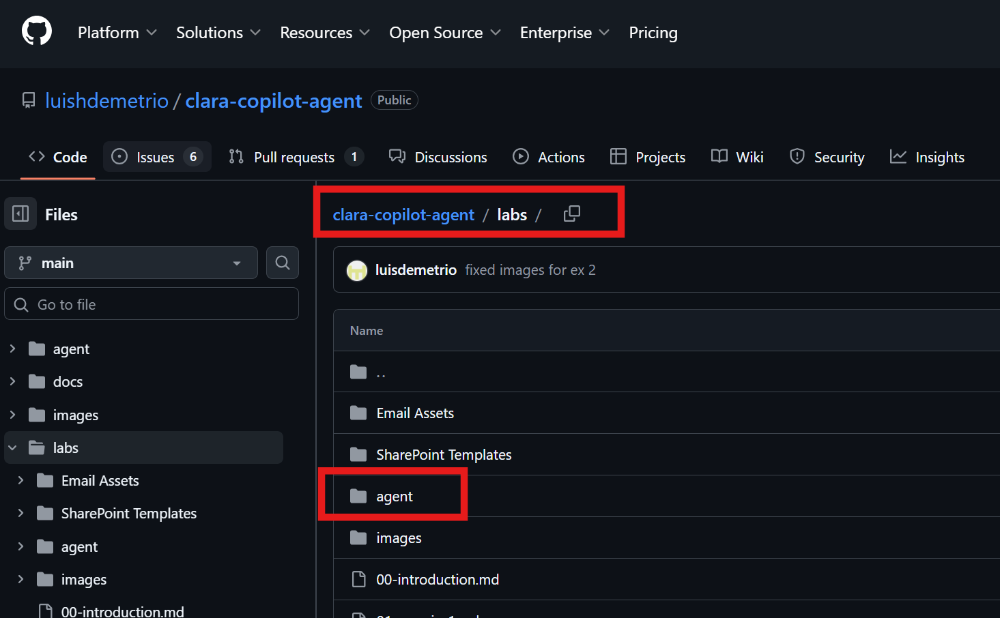
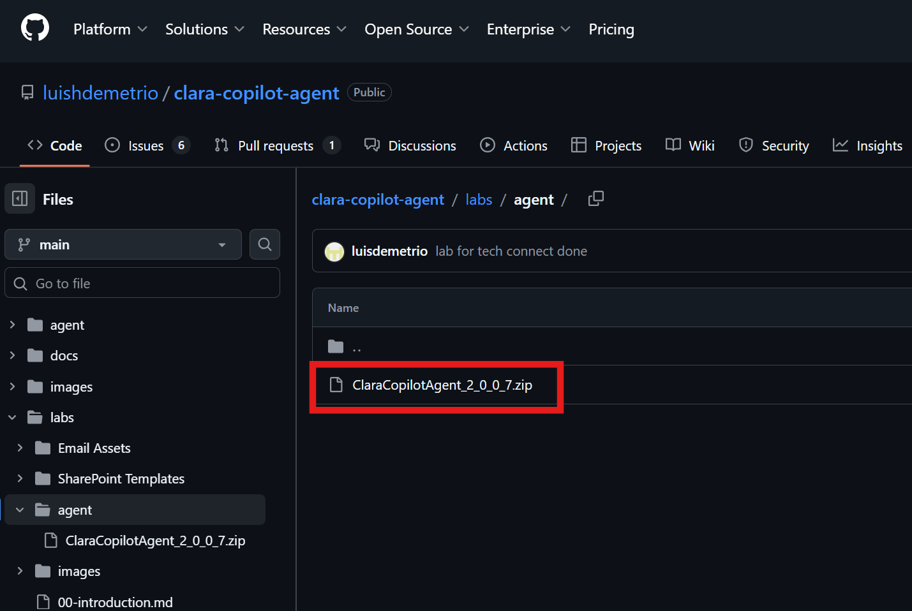
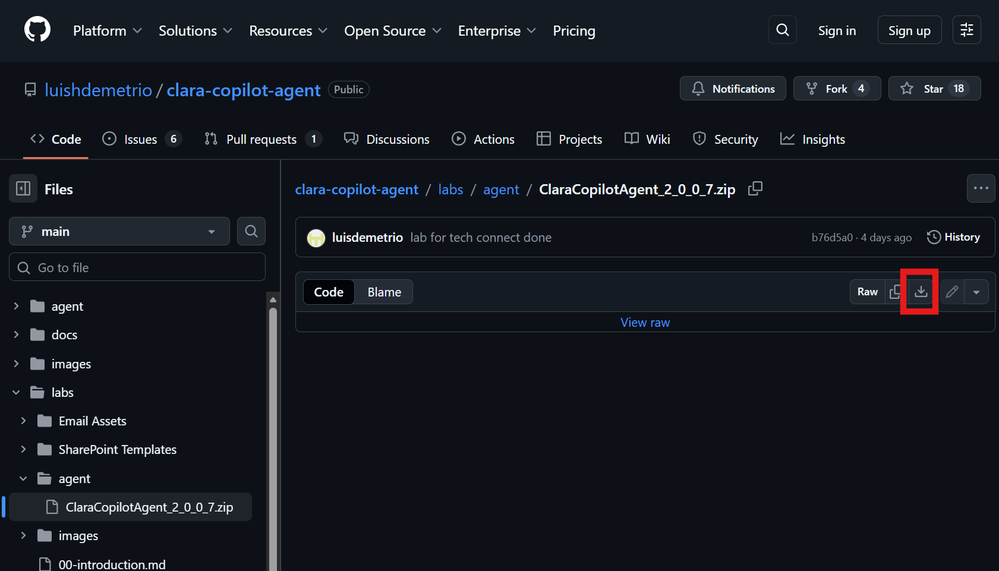
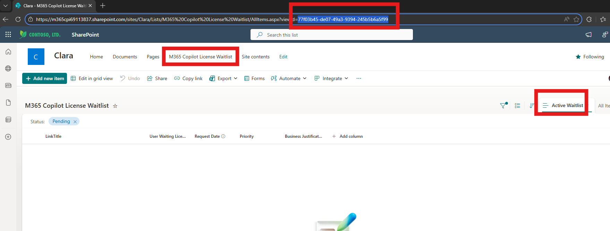
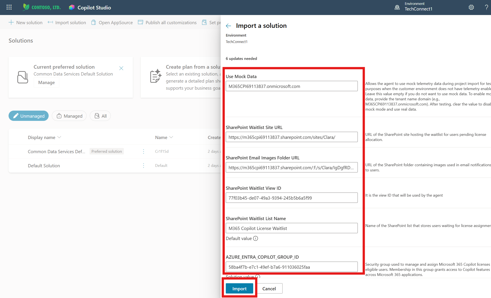

# Exercise 4: Import CLARA to Copilot Studio

## Objective

Import the CLARA solution package into Microsoft Copilot Studio and verify all components are created successfully.

---

## What You'll Do

- Navigate to Copilot Studio
- Import the CLARA solution package
- Verify the agent, custom connector, and Azure app creation
- Prepare configuration values for next exercises

---

## Tasks

### 🧱 Step 1: Download Clara's solution

1. Navigate to Clara's GitHub repository:
   
   https://github.com/luishdemetrio/clara-copilot-agent/blob/main/labs/

3. Locate and click on the **agent** folder

   

4. Click on **ClaraCopilotAgent_2_0_0_7.zip**

   
   
   > ℹ️ The file name or version can be different

5. Click **Download** (download icon on the right)

   

### 🧱 Step 2: Access Copilot Studio

1. In your environment, open **Microsoft Edge**

2. Navigate to: https://copilotstudio.microsoft.com

3. Sign in 

✅ **Validation:** Copilot Studio home page loads with Agents tab visible.

---

### 🧱 Step 3: Import the Solution

1. Access Solutions:

   - On the left-hand side menu, click on the ellipsis (**...**) and then select Solutions.

   
  
2. In the top menu, click **Import solution**.   
   

3. When prompted:
   - Click **Browse** or **Choose file**
   - Navigate to **Desktop**
   - Select `Clara_Copilot_Agent.zip`
   - Click **Open**
   
   
   
   

4. Click **Import** to start the process

   
   
   > ℹ️ Please not that the agent version can be different.
   
   - Review the details, then click **Next** again.
   
   
   
   - Click **Next** to proceed.

   
   
5. Proceed with the Environment Variable Values

   - Fill up the following fields:
   
     - **Use Mock Data:** Allows the agent to use mock telemetry data during project import for testing purposes when the customer environment does not have telemetry enabled. Leave this value empty if you do not want to use mock data. To enable mock data, provide the tenant name domain (e.g., M365CPI69113837.onmicrosoft.com). After testing, you can clear the value to disable mock mode and use real data.
     
     Example: `M365CPI69113837.onmicrosoft.com`
   
     - **SharePoint Waitlist Site URL**: URL of the SharePoint site hosting the waitlist for users pending license allocation.
     
     Example: `https://m365cpi69113837.sharepoint.com/sites/Clara/`
     
     - **SharePoint Email Images Folder URL**: URL of the SharePoint folder containing images used in email notifications sent to users.
     
     Example: `https://m365cpi69113837.sharepoint.com/:f:/s/Clara/IgDgfRDHfmQsQZUDS9Hb0miQAdOUSuZy3TaqDO_2KdCkN4k?e=i4dnvj`
     
     - **SharePoint Wailist View ID**: It is the view ID that will be used by the agent.
     
     Example: `77f03b45-de07-49a3-9394-245b5b6a5f99`
     
     - **SharePoint Waitlist List Name**: Name of the SharePoint list that stores users waiting for license assignment.
     
     Example: `77f03b45-de07-49a3-9394-245b5b6a5f99`
     
     You can get the view id in the SharePoint URL:  
  
     
    
     
     - **AZURE_ENTRA_COPILOT_GROUP_ID**: Security group used to manage and assign Microsoft 365 Copilot licenses to eligible users. Membership in this group grants access to Copilot features across Microsoft 365 applications.
     
     Example: `58ba4f7b-e7c1-49ef-b7a6-911036025faa`
     
     > ℹ️
     >
     >Clara relies on three key resources to operate effectively:
     > - **SharePoint List** – Stores and manages users waiting for Copilot licenses.
     > - **SharePoint Folder** – Contains the images used in email communications.
     > - **Microsoft Entra Security Group** – Controls license assignments and access.
     >
     > Your Skillable environment already includes these resources configured.

  - Click **Import** to begin.
  
    

6. Wait for import to complete

   ⏱️ **Expected time:** 2-4 minutes

   
   
✅ **Validation:** 
   - You may see a warning after importing the solution. You can ignore it for now.
   - The agent will appear in your solutions list.

     
   

---

### 🧱 Step 3: Verify CLARA Agent in Copilot Studio

#### Why This Verification Matters:

After importing the agent package, the next critical step is confirming that Clara appeared correctly in your Copilot Studio environment. This verification ensures the import completed successfully and that all agent components—topics, configurations, and the basic structure—are intact. Think of this as a "health check" before we move forward with configuration. **You're not testing functionality yet** (Clara won't work at this stage), but you are confirming that the foundation is in place and ready for the setup steps ahead.

1. Switch back to: https://copilotstudio.microsoft.com

2. After import completes, **CLARA** should appear in your Agents list

   

3. Click on **CLARA** to open the agent

4. Verify you can see:
   - Agent name: CLARA
   - Description visible
   - Triggers (Clara Copilot Dashboard Daily Sync)
   - Test chat panel available

   

5. Click on the **Knowledge** tab to verify that **Clara M365 Copilot Dashboard** table for Dataverse is listed..

   
   
6. Click on the **Tools** tab and check if the following tools (Flows and Connectors) are available:

   - Clara - Flow to Assign Copilot License via Group
   - Clara - Flow to get real-time M365 Copilot Dashboard Report
   - Clara - Flow to Remove Copilot License via Group
   - M365 Copilot License Overview
   - Get Copilot Waitlist Users
   
   
   

7. Finally, check if you have the following topics:

   - Send a welcome email to Copilot licensed user
   - Send Notification Email to Inactive Copilot Users
   - Update the Waitlist Status to Approved

   
   
✅ **Validation:** CLARA agent opens in Copilot Studio 

>💡 **Note:**
>
>Clara is not expected to work at this stage. This is by design —we will complete Clara’s configuration first.

> ⚠️ **Troubleshooting**:
>
>If any components are missing, verify that the import completed without errors. You may need to re-import the solution package or check that your environment has the necessary licenses and permissions.
---

## Summary

You've successfully:

- ✅ Imported CLARA solution to Copilot Studio
- ✅ Verified CLARA agent is visible and accessible
---

---

## Troubleshooting

**Issue:** Import fails with error

**Solutions:**
- Verify you have admin permissions
- Check solution file is not corrupted
- Ensure correct environment selected
- Try import again (transient errors can occur)

---

**Next:** [Exercise 5: Configure Azure App Registration](./05-exercise5.md)
