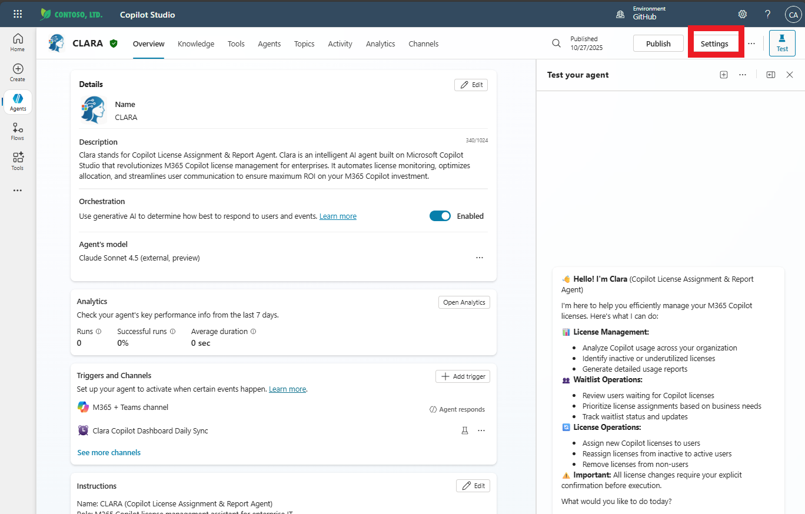
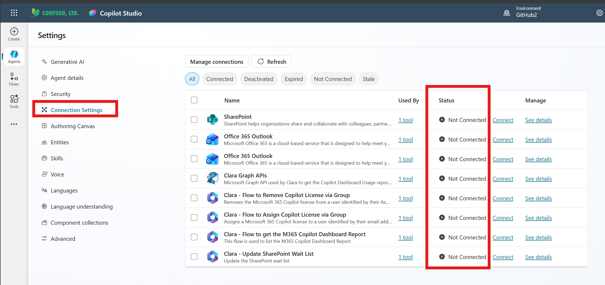
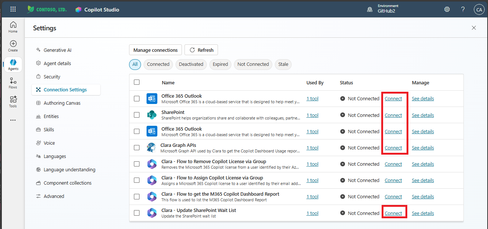

# Exercise 4: Configure Clara in Copilot Studio

**Estimated time:** 12 minutes

## Objective

Complete CLARA's configuration in Copilot Studio by connecting all tools, setting up Power Automate flows, and testing the agent with live scenarios.

---

## What You'll Learn
In the previous exercises, you built Clara's infrastructure layer by layer:

- Exercise 1: Imported Clara's solution package with all components
- Exercise 2: Configured Azure App Registration with permissions and OAuth credentials
- Exercise 3: Connected Clara's custom connector to Microsoft Graph API

Now comes the final integration step: connecting all of Clara's tools and flows within Copilot Studio itself. Think of this as wiring the electrical system in a house—the foundation is built, the walls are up, and now we're connecting everything to the power source so Clara can actually function.


## What Makes an Agent Functional:
Clara isn't just a chatbot—she's an orchestration engine that coordinates multiple systems:

- **Custom Connectors** (Clara Graph APIs) - Her bridge to Microsoft Graph
- **SharePoint Connectors** - Her access to waitlist data and communication assets
- **Outlook Connectors** - Her ability to send notifications and onboarding emails
- **Power Automate Flows** - Her automation workflows that perform complex operations
- **Dataverse Tables** - Her knowledge base for historical license usage

Each of these components was imported in Exercise 1, but they're not yet connected to your specific tenant resources. This exercise completes that connection.

---

## What You'll Do

- Connect Clara Graph APIs custom connector with your authenticated connection
- Connect SharePoint connector to your waitlist and assets
- Connect Outlook connector for email notifications
- Configure all Power Automate flows with proper connections
- Test CLARA with conversational prompts to verify functionality

By the end of this exercise, Clara will be fully operational and ready to manage Microsoft 365 Copilot licenses in your environment.

---

## Before You Begin

Verify you have completed:

- ✅ Exercise 1: CLARA imported into Copilot Studio
- ✅ Exercise 2: Azure App Registration configured with permissions
- ✅ Exercise 3: Clara Graph APIs connector authenticated and tested


> ⚠️ Important: If any previous exercise is incomplete, Clara's configuration will fail. Return and complete any missing steps before proceeding.


## Tasks

#### Why We're Here
Now that Clara's custom connector can authenticate and call Microsoft Graph API (verified in Exercise 3), we need to configure Clara's agent definition in Copilot Studio to actually use that connector. Additionally, we'll connect all the other tools Clara depends on—SharePoint for waitlist management, Outlook for notifications, and Power Automate flows for complex orchestrations.

#### What the Agent Canvas Shows:

When you open Clara in Copilot Studio, you're viewing her configuration interface:

- Topics: Conversational flows that handle specific user requests
- Knowledge: Data sources Clara can reference (Dataverse tables, SharePoint sites)
- Tools: External services Clara can call (connectors and flows)
- Settings: Agent-wide configuration including connections

Steps:

### 🧱 Step 1: Open Clara Agent in Copilot Studio

1. Navigate to: https://copilotstudio.microsoft.com

2. Click **Agents** in the left navigation panel

3. Locate and click on **CLARA** to open the agent

   

4. The agent canvas opens, showing Clara's overview with tabs:

   - Overview: High-level status and configuration summary
   - Topics: Conversational logic and dialogue flows
   - Knowledge: Connected data sources and knowledge bases
   - Actions: Legacy action configurations (may be empty)
   - Tools: Connected flows and connectors (this is where we're heading)
   - Channels: Publishing destinations (Microsoft Teams, web, etc.)

   

**✅ Validation:** 
CLARA agent canvas is open in Copilot Studio with tabs visible across the top.

**Troubleshooting:**

- Can't find CLARA in agents list? Use the search box at the top to search for "CLARA"
- Agent shows error icon? This is expected—connections aren't configured yet
- "Access denied" when opening agent? Verify you have maker permissions in this environment—notify your proctor

---

### 🧱 Step 2: Access Connection Settings

#### Understanding Connection Settings
The Connection Settings page is your dashboard for managing all of Clara's integrations with external services. This is where you'll see every tool, connector, and flow that Clara uses—and most importantly, their connection status.

#### What the Connection Settings Show:
When you open Connection Settings, you'll see a table with these columns:

- Name: The connector or flow name
- Used By: Which tools in Clara use this connection (shows "1 tool" or multiple)
- Status: Connection state with visual indicators:

  - ⚫ Not Connected (black dot) - Needs configuration
  - 🟢 Connected (green checkmark) - Ready to use
  - ⚠️ Other states: Deactivated, Expired, Stale

- Manage: Links to Connect, Manage, or See details

#### Why Multiple Items Need Connection:

Clara uses a distributed architecture with multiple services working together:

- Clara Graph APIs (1 item) - Your custom connector from Exercise 3
- SharePoint (1 item) - Access to waitlist and communication assets
- Office 365 Outlook (2 items) - Email capabilities (may show twice for different flows)
- Power Automate Flows (4 items) - Automation workflows for complex operations

Each of these requires a connection to your specific tenant resources.

Steps:

1. Click the **Settings** button in the top-right corner

   

2. In the **Settings** panel that opens, click **Connection Settings** in the left menu

   
   
3. The main panel displays a table of all connections. At the top, you'll see filter tabs:

   - All: Shows every connection (this should be selected)
   - Connected: Shows only working connections
   - Deactivated: Shows disabled connections
   - Expired: Shows connections with expired credentials
   - Not Connected: Shows connections needing configuration
   - Stale: Shows connections that haven't been used recently   

4. Review the items with "Not Connected" status
   
   
   
   You should see several items requiring connection:

   - Connectors: SharePoint, Office 365 Outlook (2 instances), Clara Graph APIs
   - Flows: Clara - Flow to Remove Copilot License via Group, Clara - Flow to Assign Copilot License via Group, Clara - Flow to get the M365 Copilot Dashboard Report, Clara - Update SharePoint Wait List


    > 🚨 Important Connection Strategy:
    >
    >In the next steps, you'll connect only the connectors (SharePoint, Outlook, Clara Graph APIs), not the Power Automate flows.
    >
    >Why? Power Automate flows have their own connection management interface that requires configuring connections from within the flow editor itself. Attempting to connect flows from this screen won't properly configure the internal flow connections.
    > What we'll do:
    >
     - Step 3: Connect Clara Graph APIs connector
     - Step 4: Connect SharePoint connector
     - Step 5: Connect Office 365 Outlook connectors
    - Later steps: Configure each Power Automate flow individually from the flow editor


#### Connect Clara Graph APIs:

1. In Settings, find **Clara Graph APIs** tool

2. Click **Connect** (or "+" to add connection)

3. Select the connection you created in Exercise 3

4. Click **Submit**

5. Verify status changes to **Connected** (green checkmark)

#### Connect SharePoint:

1. Find **SharePoint** in tools list

2. Click **Connect**

3. Sign in if prompted

4. Click **Allow** for permissions

5. Select the connection

6. Click **Submit**

7. Verify **Connected** status

#### Connect Office 365 Outlook:

1. Find **Office 365 Outlook**

2. Click **Connect**

3. Sign in if prompted

4. Allow permissions

5. Select connection

6. Click **Submit**

7. Verify **Connected**

✅ **Validation:** Clara Graph APIs, SharePoint, and Outlook all show "Connected" (green checkmarks).

💡 **Note:** Power Automate flows will be configured in Step 5.

---

### 🧱 Step 4: Set AI Model (Optional)

CLARA is pre-configured with an AI model. You can verify or change it if needed.

1. In Settings, click **Generative AI**

2. Click **Model** subsection

3. Current model is displayed

   **Default:** Claude 3.5 Sonnet (external, preview)

4. **To keep Claude:** Verify it's selected and click **Save**

5. **To use GPT-4:** Select **GPT-4** from dropdown and click **Save**

✅ **Validation:** Model is selected and saved.

💡 **For this lab:** Use whichever model is available. CLARA works with both!

---

### 🧱 Step 5: Configure Power Automate Flows

CLARA uses Power Automate flows to automate license operations. You need to configure their connections.

#### Configure License Assignment Flow:

1. In Copilot Studio, go to **Tools** tab (or Actions in Settings)

2. Find: **Clara - Flow to Assign Copilot License via Group**

3. Click the flow name

4. Click **Open flow** (opens Power Automate in new tab)

5. In Power Automate, click **Edit**

6. Find the **Add User to Azure Group** action

7. Click on the action to expand it

8. Click **Details pane** icon (i) or look for connection warning

9. Click **Change connection reference**

10. Select the **first connection** in the list

11. Repeat for **Get User Entra Information** action:
    - Find the action
    - Click Details pane
    - Change connection reference
    - Select first connection

12. Click **Save** at top

13. Click **Publish**

14. Close Power Automate tab, return to Copilot Studio

✅ **Validation:** Flow saved and published successfully.

#### Configure License Removal Flow (if time permits):

Repeat same steps for: **Clara - Flow to Remove Copilot License via Group**

1. Open flow in Power Automate
2. Update **Remove User from Azure Group** connection
3. Update **Get User Entra Information** connection
4. Save and Publish

---

### 🧱 Step 6: Manage Connections

Connect the flows in Copilot Studio's connection manager.

1. In Copilot Studio with CLARA open, click **Test your agent** panel

2. Click **...** (ellipsis) menu in test panel

3. Select **Manage connections**

4. For each "Not connected" item, click **Connect**:

   - Clara - Flow to Assign Copilot License via Group
   - Office 365 Outlook (if not already connected)
   - SharePoint (if needed)

5. Sign in and allow permissions when prompted

6. Verify all show **Connected** status

✅ **Validation:** All tools in Connection Manager show green checkmarks.

---

### 🧱 Step 7: Test License Overview

Time to test CLARA!

1. In **Test your agent** panel, type:
   ```
   Hi Clara, show me an overview of my Copilot licenses
   ```

2. Press **Enter**

3. **If prompted to connect:**
   - Click **Connect** or **Sign in**
   - Complete authentication
   - Retry prompt

4. **Expected response:**
   - Total licenses count
   - Assigned licenses count
   - Available licenses count
   - Usage statistics

✅ **Validation:** CLARA responds with license overview data.

**Troubleshooting:**
- **"I don't have access":** Go to Manage connections, verify Clara Graph APIs connected
- **Timeout:** Wait 30 seconds and retry
- **No data:** Verify M365 Copilot licenses exist in tenant

---

### 🧱 Step 8: Test Waitlist Query

1. In test panel, type:
   ```
   What users are waiting for licenses?
   ```

2. **If prompted for SharePoint:** Click **Allow** and sign in

3. **Expected responses:**

   **If waitlist has users:**
   - Lists users from SharePoint
   - Shows request dates and priorities
   - May suggest next steps

   **If waitlist is empty:**
   - "The waitlist is currently empty"
   - This is OK—query worked!

✅ **Validation:** CLARA queries SharePoint and reports waitlist status.

---

### 🧱 Step 9: Test Inactive Users

1. Type:
   ```
   Show me the top 5 inactive users in the last 15 days
   ```

2. **Expected scenarios:**

   **Scenario A - Data available:**
   - Shows list of inactive users
   - Includes last activity dates
   - May suggest reassigning licenses

   **Scenario B - No data:**
   - "Usage data not available yet"
   - This is expected in new environments

✅ **Validation:** CLARA responds to query (with data or explanation).

💡 **Note:** The daily sync flow must run first for usage data. This is optional for the lab.

---

### 🧱 Step 10: Test License Assignment (Grand Finale!)

This demonstrates CLARA's full capabilities.

**If your waitlist is empty, add a test user:**

1. Open SharePoint in new tab
2. Navigate to M365 Copilot License Waitlist
3. Click **+ New**
4. Fill in:
   - User Waiting License: [Select a user]
   - Status: Pending
   - Priority: High
5. Click **Save**
6. Return to Copilot Studio

**Test license assignment:**

1. In CLARA test panel, type:
   ```
   What users are waiting for licenses?
   ```

2. Verify CLARA shows test user(s)

3. Type:
   ```
   Assign a license to the first one
   ```

4. **CLARA's response should:**
   - Identify who is first
   - Explain WHY (priority + date)
   - **ASK FOR CONFIRMATION** (does NOT auto-execute!)

5. CLARA asks something like:
   ```
   "I found [User Name] at top of queue.
   They requested on [Date] with High priority.
   Should I proceed with assigning their license?"
   ```

6. **This is the confirmation-before-action pattern!**

7. Respond:
   ```
   Yes, please proceed
   ```

8. **CLARA executes:**
   - Calls Power Automate flow
   - Adds user to M365 Copilot Licensed Users group
   - Updates SharePoint waitlist
   - (May send welcome email)

9. **Completion response:**
   ```
   "License assigned successfully to [User].
   The waitlist has been updated.
   [User] will receive access within a few minutes."
   ```

✅ **Validation:** CLARA assigns license with confirmation, updates waitlist, confirms completion.

💡 **This is THE pattern:** Notice how CLARA:
1. ✅ Identified correct user
2. ✅ Explained WHY (priority + date)
3. ✅ Asked for confirmation
4. ✅ Executed only after approval
5. ✅ Confirmed what happened

**This confirmation-before-action is what makes CLARA production-ready!**

---

## Summary

Congratulations! You've successfully:

- ✅ Connected all CLARA tools (Graph API, SharePoint, Outlook)
- ✅ Configured Power Automate flow connections
- ✅ Tested license overview queries
- ✅ Tested waitlist management
- ✅ Tested usage analytics
- ✅ Successfully assigned a license through conversation!

---

## CLARA's Capabilities Demonstrated

| Capability | Test | Result |
|------------|------|---------|
| **License Inventory** | "Show overview" | Real-time Graph API data |
| **Waitlist Management** | "Who's waiting?" | SharePoint integration |
| **Usage Analytics** | "Inactive users" | Data-driven insights |
| **Confirmation Pattern** | License assignment | Asks before acting |
| **Explainability** | All responses | Clear reasoning |

---

## Production-Ready Patterns

You experienced patterns that separate demos from production:

**1. Confirmation-Before-Action** ⭐
- Never auto-executes changes
- Always asks for approval
- Can be cancelled

**2. Explainability** ⭐
- Every action explains: What, Why, Who, When, Next
- Builds trust and confidence

**3. Multi-System Orchestration** ⭐
- Integrates 4+ Microsoft services
- Seamless user experience

**4. Error Handling** ⭐
- Graceful with missing data
- Never leaves users stuck

---

## Troubleshooting

**Issue:** "I don't have access"

**Solutions:**
- Check Manage connections—ensure Clara Graph APIs connected
- Verify OAuth connection from Exercise 3
- Reconnect in Connection Manager

---

**Issue:** SharePoint connection fails

**Solutions:**
- Reconnect SharePoint in Manage connections
- Verify access to SharePoint site
- Check waitlist exists
- Sign out and back in

---

**Issue:** License assignment doesn't work

**Solutions:**
- Verify flow is published (Step 5)
- Check flow connections configured
- Ensure user exists in Azure AD
- Verify M365 Copilot Licensed Users group exists

---

**Issue:** No usage data

**Solutions:**
- Daily sync hasn't run yet—expected in new environments
- Manually trigger sync (advanced)
- Wait 24 hours for first sync
- For lab, this is OK

---

## Lab Complete! 🎉

### What You Accomplished

✅ Deployed production-ready AI agent  
✅ Configured Azure AD OAuth 2.0  
✅ Set up custom connectors  
✅ Connected multiple enterprise systems  
✅ Tested live license management  
✅ Experienced enterprise governance patterns

---

## Real-World Value

**For CSAs:**
- Demo-ready agent for customers
- Reference architecture
- Conversation starter

**For Engineers:**
- Production patterns
- Source code on GitHub
- Deployment templates

**For IT Admins:**
- Deploy for your own licenses
- Optimize allocation
- Save time

---

## Resources

**GitHub:** https://github.com/luishdemetrio/clara-copilot-agent

**Includes:**
- Complete source code
- Flow templates
- Documentation
- Troubleshooting

---

## Next Steps

**Deploy for customers (2-3 hours):**
1. Prerequisites (30 min)
2. Import solution (10 min)
3. Azure config (15 min)
4. Connector setup (15 min)
5. Flow config (20 min)
6. Testing (30 min)

**Use CLARA in demos:**
1. "Show license overview"
2. "Who's waiting?"
3. "Show inactive users"
4. "Assign to first person"

---

**Thank you for completing the CLARA deployment lab!** 🚀

**Previous:** [Exercise 3: Configure Clara Custom Connector](./exercise3.md)
