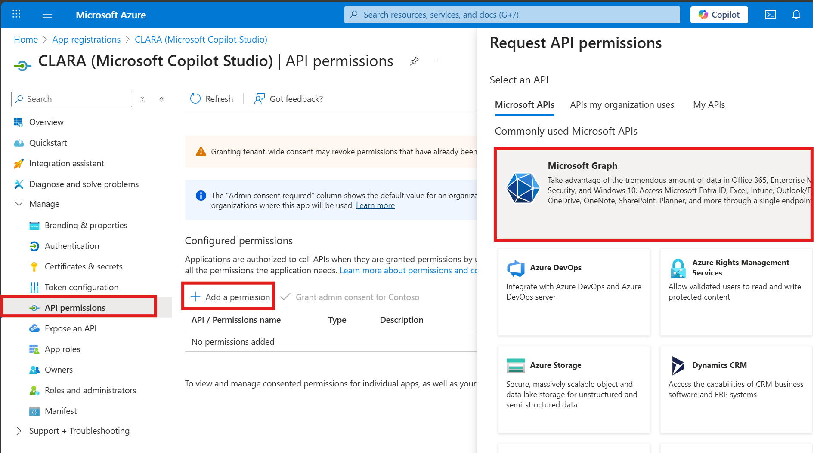
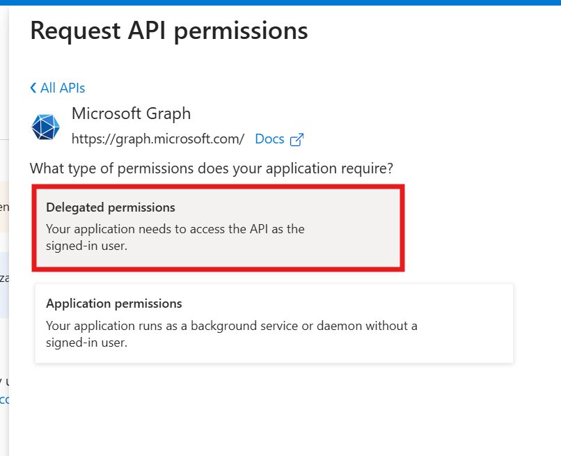
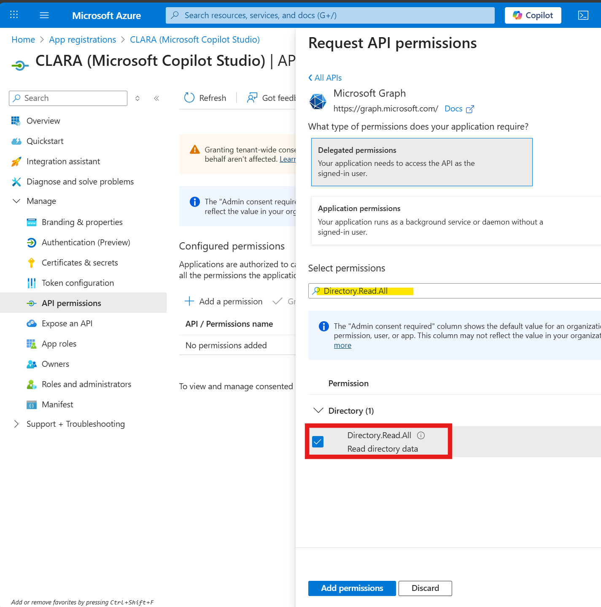
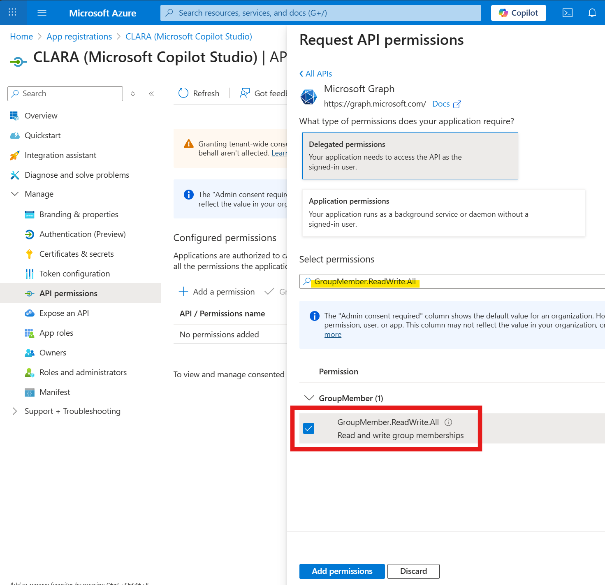
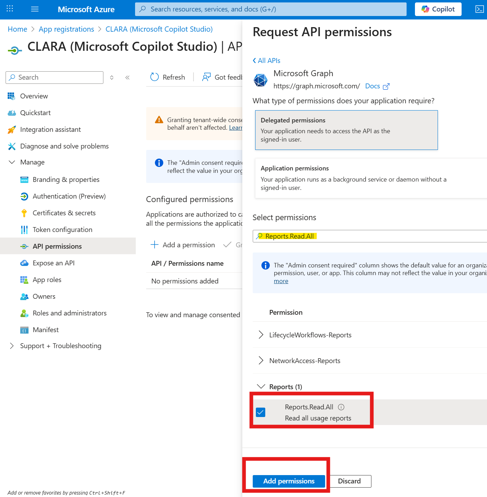
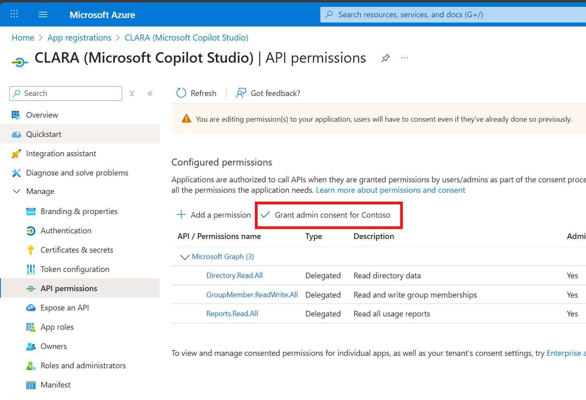
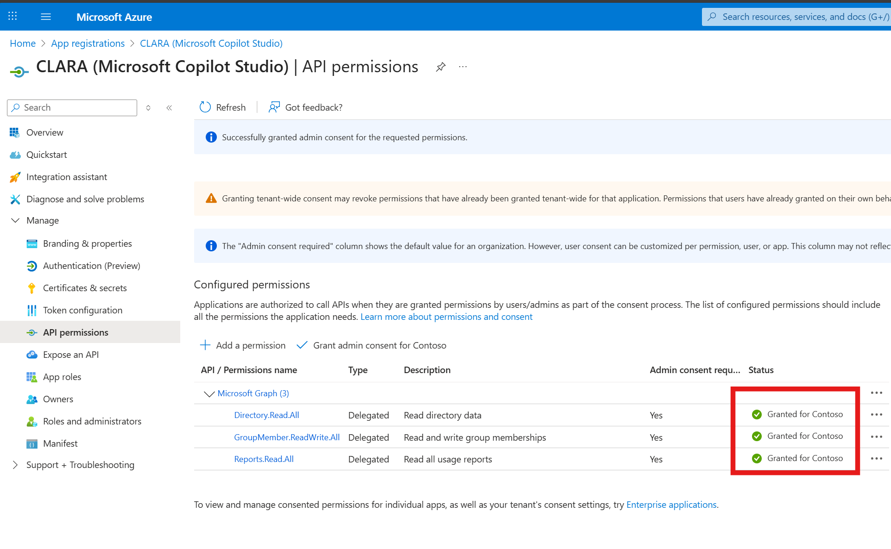
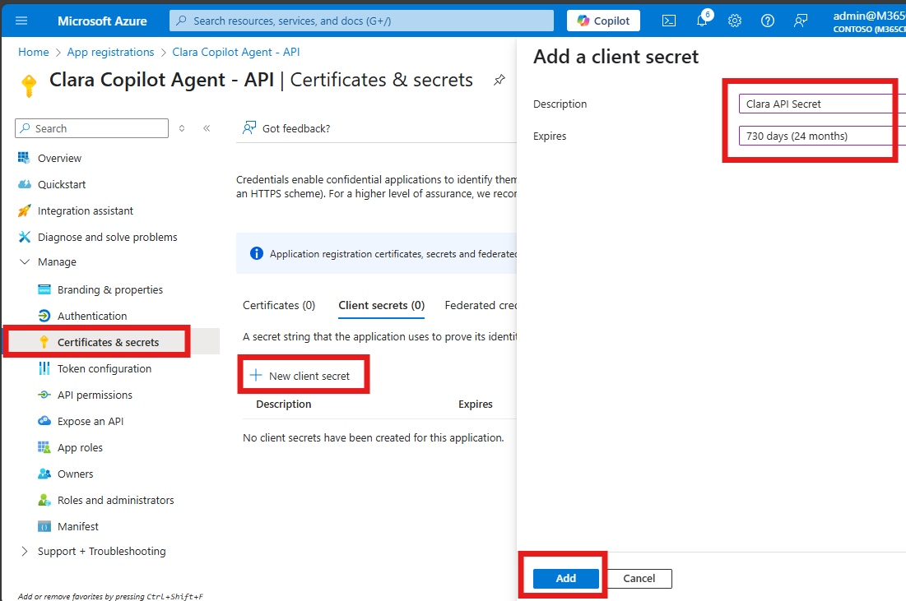
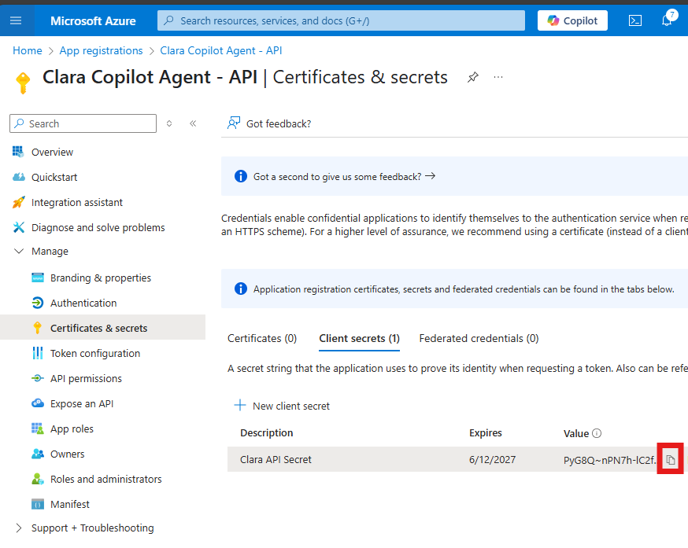

# Exercise 5: Configure Azure App Registration


## Objective

Configure the Azure AD application with proper API permissions, admin consent, client secret, and custom scope to enable secure access to Microsoft Graph.

---

## What You'll Do

- Add Microsoft Graph API permissions
- Grant admin consent for permissions
- Generate and securely save client secret
- Expose API with custom OAuth scope

---

## Background

CLARA needs specific Microsoft Graph permissions to manage Copilot licenses:

- **Directory.Read.All:** Read user and group information
- **GroupMember.ReadWrite.All:** Add/remove users from license group
- **Reports.Read.All:** Access M365 Copilot usage reports

---

#### Why Azure App Registration Matters:
When you imported Clara's solution package, **Copilot Studio automatically created an Azure App Registration** behind the scenes. This app registration is Clara's identity in your Microsoft 365 tenant—think of it as Clara's security badge that allows her to authenticate and interact with protected services like Microsoft Graph API, SharePoint, and Outlook.

Custom Agents like Clara need this identity because they perform actions on behalf of users: assigning licenses, reading usage data, sending emails, and managing waitlists. Each of these operations requires secure authentication using OAuth 2.0. The Azure App Registration provides the credentials (Client ID and Tenant ID) that Clara uses to prove her identity when making these API calls.

While the app registration is created automatically during import, you'll still need to configure its permissions and client secret manually in the next steps. This separation is intentional—it ensures that sensitive credentials aren't embedded in the solution package and that you maintain full control over what Clara can access in your environment.

---

## Tasks

### 🧱 Step 1: Locate CLARA App Registration

1. Open a **new browser tab**

2. Navigate to: https://portal.azure.com

3. Sign in with your credentials (if prompted)

4. Search for and click: **App Registrations**

  


5. Click **All applications** tab

6. Search for: **CLARA**

7. Click on the CLARA application

   
   
   
✅ **Validation:** CLARA app registration Overview page is visible.

---

### 🧱 Step 2: Configure API Permissions

#### Understanding Permission Types
Before we add permissions, let's understand the critical difference between the two types:

##### Delegated Permissions:

- Actions are performed on behalf of a signed-in user
- The app can only do what the user themselves could do
- User must be logged in and consent to the permissions
- More secure—combines app permissions + user permissions (least privilege)
- **This is what Clara uses**

##### Application Permissions:

- Actions are performed as the app itself, without a signed-in user
- The app has full access regardless of which user is logged in
- Typically used for background services and daemons
- More powerful but requires tighter security controls

##### Why Clara Uses Delegated Permissions:
Clara operates in a conversational context where an IT admin is actively logged in and interacting with her. When Clara assigns a license, she does it on behalf of that admin, using their identity and permissions. This ensures:

- **Accountability**: Every action is traced to a real person
- **Security**: Clara can't do more than the logged-in admin could do manually
- **Auditability**: Logs show which admin made each decision
- **Least privilege**: Clara inherits the admin's permissions, nothing more

If we used Application permissions instead, Clara would have unrestricted access to perform actions even when no one is logged in—creating unnecessary security risk and losing the audit trail of who approved each action.

Steps:

1. In the app registration, click **API permissions** (left menu)

2. Click **+ Add a permission**

3. Select **Microsoft Graph**

   

4. Click **Delegated permissions**

   

   > ⚠️ Important: Choose Delegated permissions, NOT Application permissions. Clara needs to act on behalf of signed-in admins, not as an autonomous service.

5. Search for and select these **3 permissions**:

   **Permission 1:**
   - Search: `Directory.Read.All`
   - Expand **Directory**
   - Check ☑️ **Directory.Read.All**

   
   
   **Permission 2:**
   - Search: `GroupMember.ReadWrite.All`
   - Expand **GroupMember**
   - Check ☑️ **GroupMember.ReadWrite.All**
   
   

   **Permission 3:**
   - Search: `Reports.Read.All`
   - Expand **Reports**
   - Check ☑️ **Reports.Read.All**

6. Click **Add permissions**

   


✅ **Validation:** All 3 permissions appear in the API permissions list.

---

### 🧱 Step 3: Grant Admin Consent

1. On the API permissions page, click **Grant admin consent for [Your Organization]**

   

2. Click **Yes** in the confirmation dialog

3. Wait for consent to be granted (2-5 seconds)

4. Verify **Status** column shows **Granted** with green checkmarks

   

✅ **Validation:** All 3 permissions show green checkmarks with "Granted" status.

**Troubleshooting:**
- **Button grayed out:** You may need Global Admin role—notify your proctor
- **Consent fails:** Wait 30 seconds and try again

---

### 🧱 Step 4: Generate a Client Secret

#### Why Clara Needs a Client Secret
A client secret is like a password for the Azure App Registration. When Clara's custom connector authenticates with Microsoft Graph API, it needs to prove two things:

1. Who it is (using the Client ID from Step 1)
2. That it's authorized (using the Client Secret we're about to create)

Together, the Client ID and Client Secret form Clara's authentication credentials. Think of it as a username and password combination—except this "password" is a cryptographically secure string that enables OAuth 2.0 authentication flows between Clara, your tenant, and Microsoft Graph API.

The client secret is sensitive information. Anyone with both the Client ID and Client Secret could potentially authenticate as Clara and perform actions on behalf of users. That's why Azure shows it only once—to minimize exposure risk.

Steps:

1. Click **Certificates & secrets** (left menu)

2. Under **Client secrets** tab, click **+ New client secret**

3. Enter details:
   - **Description:** `Clara API Secret`
   - **Expires:** **6 months** (or an option of your choice)

4. Click **Add**

   

5. 🚨 **IMMEDIATELY copy the VALUE** (long string under "Value" column)

   

   > ⚠️ Do NOT copy the "Secret ID"—copy the Value column. The Secret ID is just a reference identifier; the Value is the actual credential.

6. **Paste into Notepad** immediately:
   ```
   Client Secret Value: ________________________
   ```

> 🚨 CRITICAL: The secret value is shown only ONCE. After you navigate away from this page, it cannot be retrieved. If you lose it, you'll need to delete this secret and create a new one.


7. While you're here, verify you have the Client ID and Tenant ID from the previous exercise. If you missed copying them, go to the Overview page and copy:
   - **Application (client) ID**
   - **Directory (tenant) ID**

8. Update your complete configuration tracker:
   ```
   Application (client) ID: ____________________
   Directory (tenant) ID: ______________________
   Client Secret Value: ________________________
   ```

✅ **Validation:** All 3 values safely saved in Notepad.

**Troubleshooting:**

- **Lost the secret?** You cannot retrieve it. Delete the old secret (⋯ → Delete) and create a new one following steps 2-6 above.
- **Can't create secret?** Verify you have the necessary permissions on the app registration—notify your proctor if the issue persists.
- **Copied the wrong value?** If you accidentally copied the Secret ID instead of the Value, delete the secret and create a new one.

---


## Summary

You've configured:

- ✅ 3 Microsoft Graph delegated permissions
- ✅ Admin consent granted for all permissions
- ✅ Client secret created and saved

---

## Troubleshooting

**Issue:** Lost client secret

**Solutions:**
- You CANNOT retrieve it
- Go to Certificates & secrets
- Delete old secret (⋯ → Delete)
- Create new secret
- Update your notes

---

**Next:** [Exercise 6: Configure Clara Custom Connector](./06-exercise6.md)

