# Exercise 6: Configure Clara Custom Connector

## Objective

Configure the Clara Graph APIs custom connector with OAuth 2.0 authentication, establish connection to Microsoft Graph, and test the integration.

---

## What You'll Learn

In Exercise 5, you configured Clara's Azure App Registration with permissions, secrets, and an exposed API scope. Now you'll complete the authentication chain by configuring Clara's Custom Connector to use those credentials when calling Microsoft Graph API.

Think of this exercise as connecting the dots:

- **Exercise 5**: Created Clara's identity and credentials (the "who")
- **Exercise 6** (this): Configure how Clara uses those credentials to authenticate (the "how")

---

## What You'll Do

- Edit Clara Graph APIs connector security settings
- Configure OAuth 2.0 with Azure AD credentials from Exercise 5
- Add redirect URI to Azure app authentication
- Create and test connector connection
- Verify successful integration with Microsoft Graph

---

#### Why the Custom Connector Matters:
Along with the agent and Azure App Registration, the solution package also imported a Custom Connector called Clara Graph APIs. This connector is Clara's bridge to Microsoft Graph API—the unified API endpoint that provides programmatic access to Microsoft 365 services and data.

While Copilot Studio has built-in connectors for many common operations, Clara needs specialized access to Graph API endpoints that aren't covered by standard connectors—specifically, license assignment operations, usage analytics from the M365 Copilot Dashboard API, and security group membership management. The custom connector packages these specific Graph API calls into reusable actions that Clara's Power Automate flows can invoke.

Think of it this way: the Azure App Registration (from Step 4) is Clara's identity badge, and the Custom Connector is the specialized toolkit she uses to perform her job. Together, they enable Clara to read license inventory, assign and remove licenses, and retrieve usage data—all through secure, authenticated API calls.

The connector was imported automatically, but you'll need configure the connection details in Exercise 3 by linking it to the Azure App Registration credentials you just verified.
---
## Before You Begin

Retrieve these values from Exercise 2 (should be in your Notepad):

```
Required Values from Exercise 2
================================
Application (client) ID: ____________________
Client Secret Value: ________________________
Directory (tenant) ID: ______________________

```
> ⚠️ Don't have these values? Return to Exercise 4 and complete Steps 1 and 4 before continuing.
---

## Tasks

### 🧱 Step 1: Access Custom Connectors

#### Why We're Here
The **Clara Graph APIs** custom connector was imported in Exercise 1, but it's currently "Not connected." This step will locate the connector so we can configure it with the OAuth 2.0 credentials from Exercise 2.

#### What Custom Connectors Do:
Custom connectors act as bridges between Power Automate flows and external APIs. Clara's custom connector specifically:

- Packages specialized Microsoft Graph API calls (license operations, usage reports, group management)
- Handles OAuth 2.0 authentication automatically once configured
- Provides reusable actions that Clara's Power Automate flows can invoke
- Manages token refresh and secure credential storage

Without this connector, Clara would have no way to interact with Microsoft Graph API.

Steps:


1. Open a **new browser tab**

2. Navigate to: https://make.powerautomate.com

3. Sign in if prompted

4. In the left-hand menu, select **Custom Connectors**.

   - If not pinned, click **More → Discover all → Custom Connectors**.
   
   - Pin the connector by clicking the 📌 icon—you'll need quick access to it in future exercises
   
   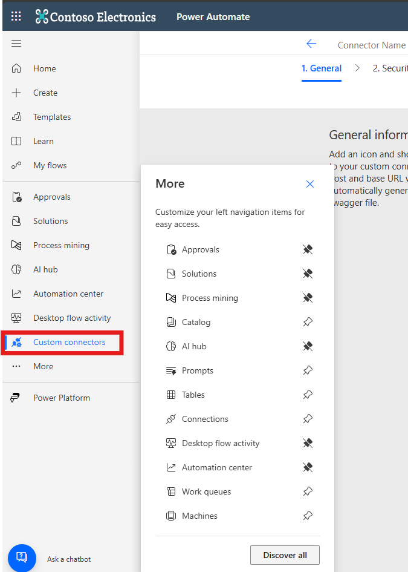 

5. Locate **Clara Graph APIs** in the list.

   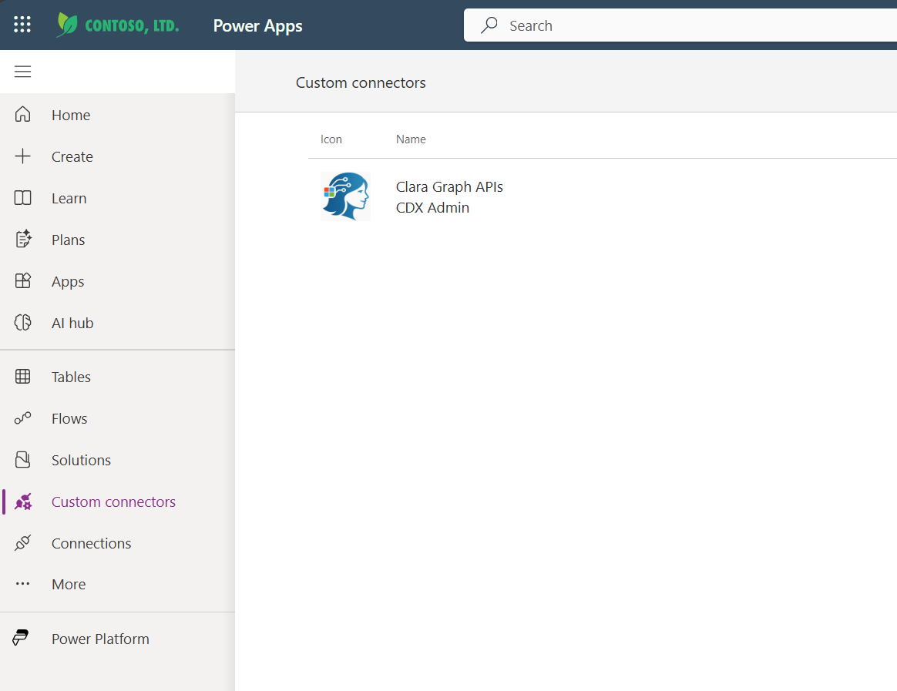 


✅ **Validation:** Custom Connectors page displays with "Clara Graph APIs" visible in the list.

Troubleshooting:

- **Don't see Custom Connectors?** Click More → Discover all and search for it in the full menu
- **Connector not in list?** Verify Exercise 1 import completed successfully—return to Exercise 1 if needed
- **Multiple Clara connectors?** Choose the one named exactly "Clara Graph APIs"

---

### 🧱 Step 2: Edit Clara Connector

#### Why We're Editing the Connector
The Clara Graph APIs connector was imported with a template configuration, but it doesn't yet have the specific OAuth 2.0 credentials from your Azure tenant. In this step, you'll open the connector editor and navigate to the Security tab where authentication is configured.

#### What's on the Security Tab:
The Security tab is where you define how the connector authenticates when making API calls. For Clara, this means configuring:

- **Authentication type**: OAuth 2.0 (the industry-standard protocol for secure API access)
- **Identity Provider**: Azure Active Directory (your Microsoft 365 tenant)
- **Client credentials**: The Client ID and Client Secret from Exercise 2
- **Resource endpoints**: Where to authenticate and what permissions to request

Think of this as filling out Clara's "authentication form" so she can prove her identity when calling Microsoft Graph API.

Steps:

1.  Locate **Clara Graph APIs** in the list.

2.  Click the **Edit** (pencil ✏️) icon.  

    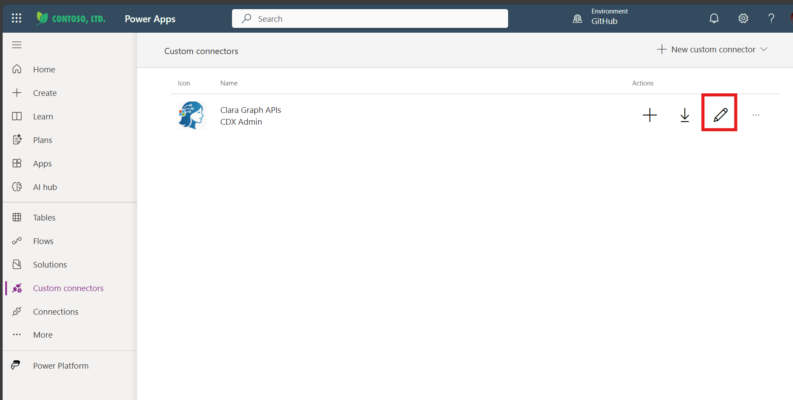 

3. The connector editor opens with five tabs across the top:

- **General**: Connector name, description, and host settings
- **Security**: Authentication configuration (this is where we're headed)
- **Definition**: API operations and actions available
- **Code**: Custom code for specialized transformations (not needed for Clara)
- **Test**: Connection testing and validation

4. Click the **Security** tab

   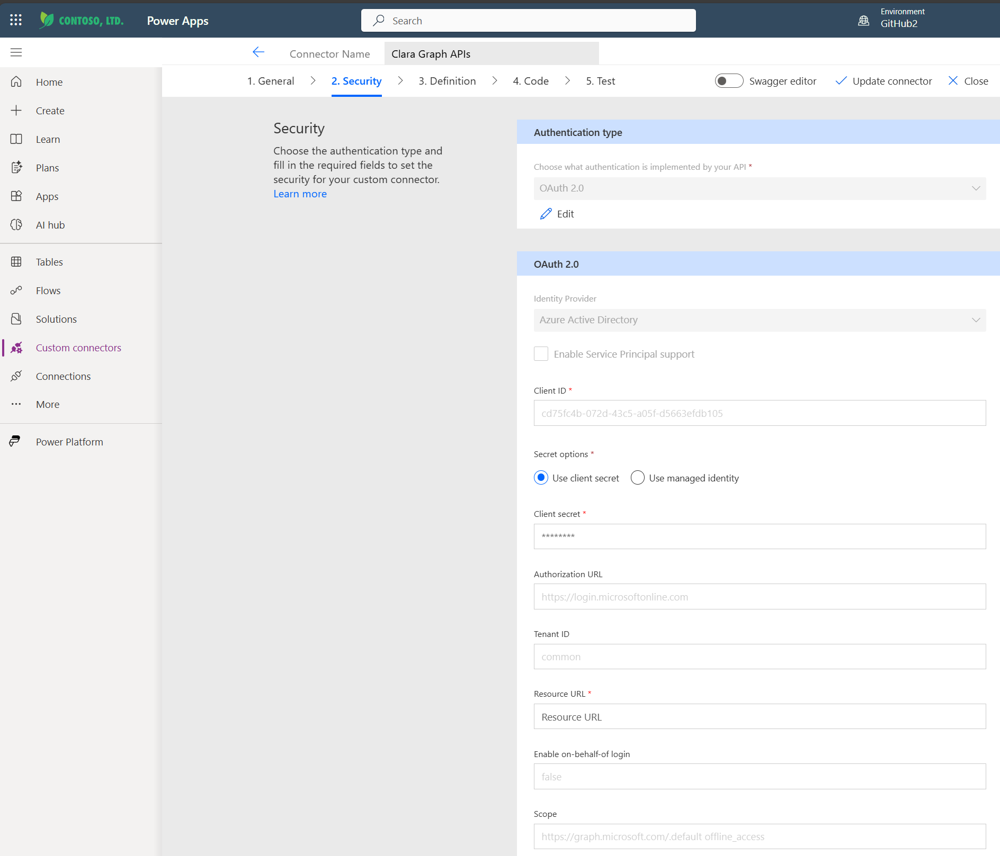 

> 💡 What You'll See: The Security tab displays authentication type, OAuth 2.0 settings, and token configuration fields—all currently empty or using placeholder values.

✅ *Validation: Security tab opens showing authentication settings with OAuth 2.0 configuration fields.

---

### 🧱 Step 3: Configure OAuth Authentication

#### Understanding OAuth 2.0 Configuration
This is where we connect everything from Exercise 5. You're about to configure the OAuth 2.0 authentication flow that enables Clara to securely access Microsoft Graph API on behalf of signed-in users.

#### What Each Field Does:
- **Identity Provider**: Tells the connector which OAuth service to use (Azure AD in our case)
- **Client ID & Secret**: Clara's credentials (like username and password) from Exercise 5
- **Authorization URL**: Where users are redirected to sign in and grant consent
- **Token URL**: Where the connector exchanges authorization codes for access tokens
- **Refresh URL**: Where the connector gets new tokens when old ones expire
- **Scope**: What permissions Clara is requesting `https://graph.microsoft.com/.default` plus offline_access for token refresh

#### The OAuth 2.0 Flow in Action:

When an admin uses Clara:

1. They're redirected to the Authorization URL to sign in
2. Azure AD validates credentials and shows consent screen
3. User grants consent, Azure returns an authorization code
4. Connector exchanges code at the Token URL for an access token
5. Access token is used to call Microsoft Graph API
6. When token expires, connector uses Refresh URL to get a new one

Steps:

1. On the Security tab, under **Authentication type**, click **Edit**

    

2. Set **Identity Provider** to **Generic OAuth 2**.

>💡 **Why Generic OAuth 2?** 
>
>While Azure AD has a dedicated option in some contexts, "Generic OAuth 2" gives us full control over the endpoint URLs and works reliably across all Microsoft 365 tenants.

3. Fill in the OAuth 2.0 configuration fields:

   - **Client ID:** `[Paste your Application (client) ID]`
   
     💡 This is the public identifier for Clara's app registration
 
   - **Client Secret:** `[Paste your Client Secret Value]`
   
     🚨 This is the sensitive credential—treat it like a password

   - **Authorization URL:** `https://login.microsoftonline.com/[YOUR-TENANT-ID]/oauth2/v2.0/authorize`
   
     ⚠️ Replace `[YOUR-TENANT-ID]` with your Directory (tenant) ID
   
     💡 Example: https://login.microsoftonline.com/12345678-abcd-ef01-2345-6789abcdef01/oauth2/v2.0/authorize

   - **Token URL:** `https://login.microsoftonline.com/[YOUR-TENANT-ID]/oauth2/v2.0/token`
   
     ⚠️ Replace `[YOUR-TENANT-ID]` with your Directory (tenant) ID

   - **Refresh URL:** `https://login.microsoftonline.com/[YOUR-TENANT-ID]/oauth2/v2.0/token`
   
     ⚠️ Replace `[YOUR-TENANT-ID]` with your Directory (tenant) ID
   
     💡 Note: Token URL and Refresh URL are the same endpoint in Azure AD v2.0

   - **Scope:** `https://graph.microsoft.com/.default offline_access`
   
     💡 Understanding this scope:

        - **https://graph.microsoft.com/.default** - Requests all delegated permissions you configured in Exercise 5 (Directory.Read.All, GroupMember.ReadWrite.All, Reports.Read.All)
   
        - **offline_access** - Allows the connector to refresh access tokens automatically without re-authentication

        🚨 Important: This is Microsoft Graph's scope, NOT a custom scope. You're authenticating TO Graph API, not creating your own API. Clara calls Microsoft Graph endpoints directly, so we use Microsoft's scope format.

4. Critical validation checkpoint:

   Before proceeding, verify:

   - ✅ All three URLs contain your actual Tenant ID (no [YOUR-TENANT-ID] placeholders)
   - ✅ The Scope contains your actual Client ID (no [YOUR-CLIENT-ID] placeholder)
   - ✅ Client ID and Client Secret are pasted without extra spaces
   - ✅ All URLs start with https:// (not http://)

5. Click **Update connector** at the top right

   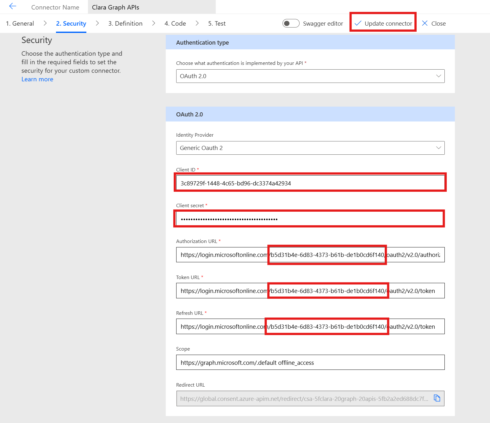 

6. Wait for the confirmation message: "Custom connector updated"

   ⏱️ This usually takes 3-15 seconds. The page may briefly show a loading indicator.

✅ **Validation:** Confirmation message appears and settings are saved.

**Troubleshooting:**

- "Invalid URL" error: Check that all URLs use HTTPS and contain your actual Tenant ID with no brackets
- "Invalid scope" error: Verify the scope format exactly matches: api://[client-id]/access_as_user offline_access with your actual Client ID
- Update button grayed out: One or more required fields may be empty—scroll through all fields to verify
- Changes not saving: Try clicking a different tab first, then back to Security, then Update connector
- Timeout error: Network issue—wait 30 seconds and click Update connector again

---

### 🧱 Step 4: Copy Redirect URI

#### Understanding the Redirect URI
The Redirect URI (also called Redirect URL or Callback URL) is a critical component of OAuth 2.0 authentication. It's the address where Azure AD sends users after they sign in and grant consent.

#### How It Fits Into the Authentication Flow:

1. User clicks "Sign in" in Clara
2. They're redirected to Azure AD's login page (the Authorization URL from Step 3)
3. User enters credentials and grants consent
4. Azure AD redirects them back to the Redirect URI with an authorization code
5. The connector exchanges this code for an access token at the Token URL
6. Clara can now call Microsoft Graph API on behalf of the user

#### Why We Need to Copy It:
Power Platform generates this Redirect URI automatically when you configure OAuth 2.0 in a custom connector. However, Azure AD doesn't know about it yet. In the next step, you'll add this URI to Clara's Azure App Registration so that Azure AD trusts it and allows the redirect to complete.

Without this URI registered in Azure AD, the authentication flow would fail at step 4 above—Azure wouldn't know where to send users after they log in, resulting in an error like *"redirect_uri_mismatch"*.

Steps:

1. Still on the **Security** tab, scroll down to find the **Redirect URL** section

2. Locate the **Redirect URL** field (read-only, with a lock icon)

3. You'll see a URL in this format:
   ```
   https://global.consent.azure-apim.net/redirect
   ```
   
   >💡 Note: This URL is generated by Power Platform and is the same for all custom connectors in your environment. The "azure-apim" refers to Azure API Management, which Power Platform uses behind the scenes.
   

4. Click the **Copy** icon (or select and Ctrl+C)

   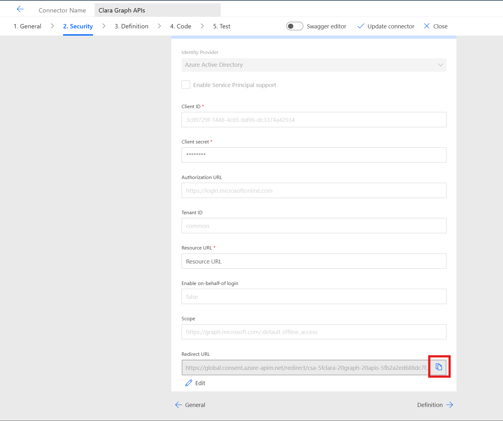 

5. Save the copied URL to Notepad with your other configuration values:
   ```
   Redirect URI: ___________________________
   ```

   >🚨 Important: Copy the URL exactly as shown, including https:// and no trailing spaces. An incorrect Redirect URI will cause authentication failures.

✅ **Validation:** Redirect URI copied exactly and saved to Notepad.

**Troubleshooting:**

- Don't see the Redirect URL field? Scroll down further on the Security tab—it's usually below the OAuth configuration fields
- Copy icon not working? Manually select the entire URL and copy with Ctrl+C (Windows) or Cmd+C (Mac)
- URL looks different? Different Power Platform environments may have slightly different redirect URLs—copy exactly what you see

---

### 🧱 Step 5: Add Redirect URI to Azure

#### Completing the OAuth Trust Chain
In Step 4, you copied the Redirect URI that Power Platform generated for Clara's custom connector. Now you need to register that URI in Azure AD so that it's recognized as a **trusted destination** for authentication redirects.

#### Why This Step Is Critical:
Azure AD has strict security controls around OAuth 2.0 redirects. When a user signs in and grants consent, Azure AD will only redirect them to URIs that are explicitly registered in the app registration. This prevents malicious actors from stealing authorization codes by redirecting users to unauthorized websites.

#### What We're Doing:
We're telling Azure AD: "When someone authenticates through Clara's app registration, it's safe to redirect them back to *`https://global.consent.azure-apim.net/redirect`*—this is Power Platform's trusted endpoint."

####The Complete Authentication Circle:

With this step, you're closing the authentication loop:

1. ✅ Exercise 2, Step 2: Defined what Clara can access (Microsoft Graph permissions)
2. ✅ Exercise 2, Step 4: Created credentials for Clara (Client Secret)
3. ✅ Exercise 2, Step 5: Exposed Clara's API with a custom scope
4. ✅ Exercise 3, Step 3: Configured the connector with OAuth endpoints
5. ✅ Exercise 3, Step 5 (now): Register where users return after authentication

After this step, the entire OAuth 2.0 flow will be functional.

Steps:

1. Switch to your **Azure Portal** browser tab (or open a new tab if closed)

2. Navigate back to Clara's App Registration:

   - Portal: https://portal.azure.com
   - Search: App Registrations
   - Find and click: CLARA

3. In the left menu, click **Authentication**

   >💡 What You'll See: This page shows all configured platforms (Web, Mobile, Desktop, SPA) and their associated redirect URIs

4. Under **Platform configurations**, click **+ Add a platform**

5. Select **Web**

   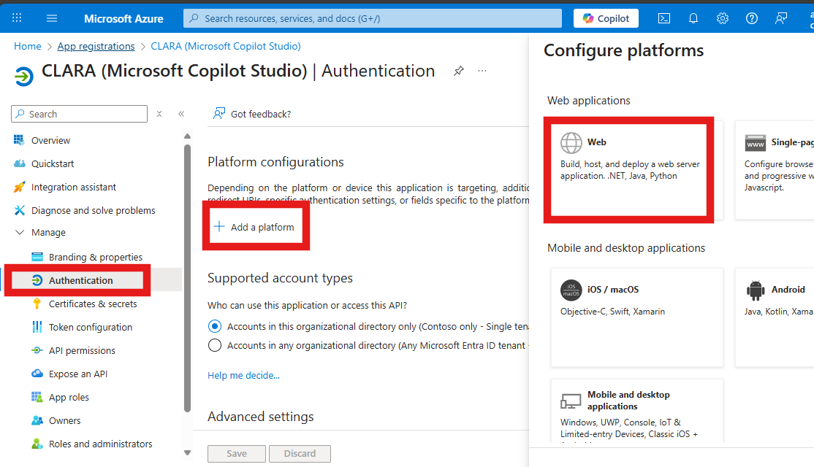 
   
   >⚠️ Critical: Choose Web, NOT "Single-page application" (SPA). Power Platform's connector infrastructure requires the Web platform for proper token handling and security.

6. In the "Configure Web" panel that appears, fill in:


   **Redirect URIs:** `[Paste the Redirect URL from Step 4]`

   Example: `https://global.consent.azure-apim.net/redirect`
   
   >💡 Double-check: Ensure there are no extra spaces before or after the URL, and it starts with https://

   Other fields:

   - Leave Front-channel logout URL blank
   - Leave Implicit grant and hybrid flows checkboxes unchecked

   >💡 Why unchecked? Clara uses the more secure "Authorization Code" flow, not implicit grant flows

7. Click **Configure** at the bottom of the panel

   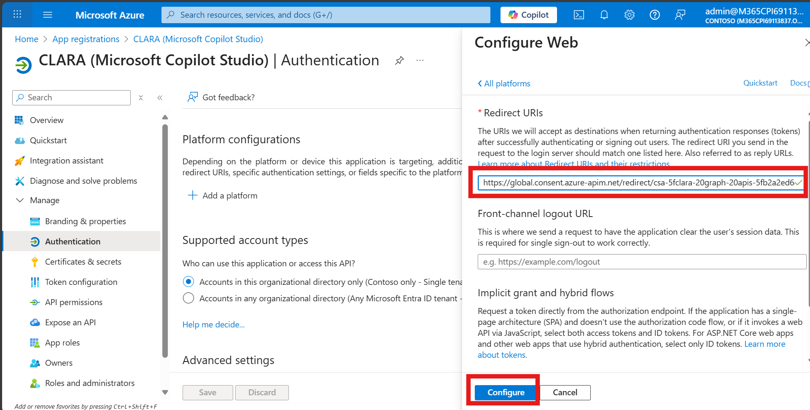 

8. Verify the **redirect URI** now appears under the **Web** platform section

   You should see:

   - Platform: Web
   - Redirect URIs: https://global.consent.azure-apim.net/redirect

   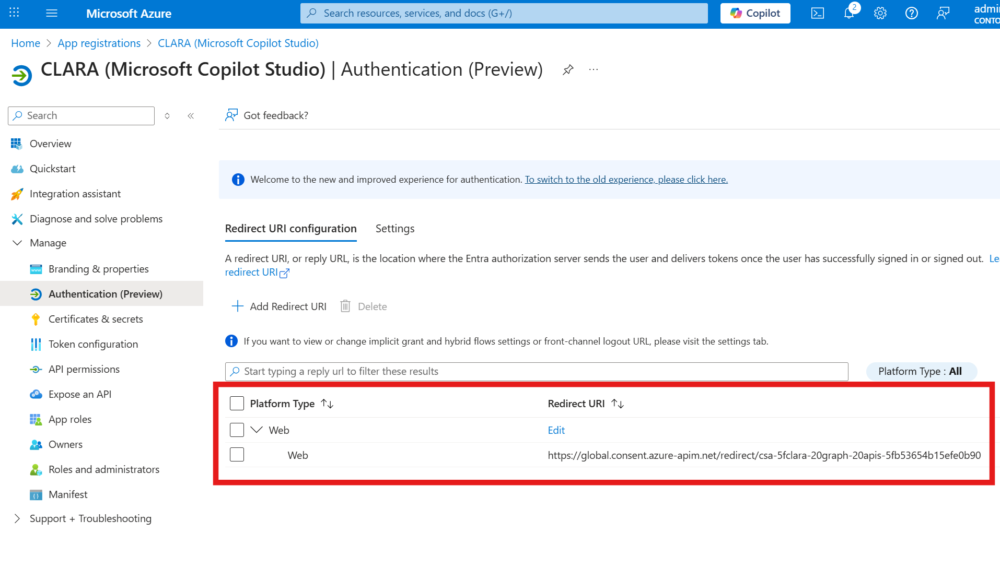 

✅ **Validation:** Redirect URI appears under "Web" platform configurations with your exact URL displayed.

**Troubleshooting:**

- Added to wrong platform? Delete it (⋯ → Remove) and repeat steps 4-7, carefully selecting "Web"
- "Redirect URI already exists" error? It was configured previously—verify it's under - "Web" platform and proceed
- Can't add platform? You may not have sufficient permissions—notify your proctor
- URI looks wrong after saving? Edit the Web platform, verify the URI is exactly as copied, and save again


>⚠️ Common Mistake: Adding the redirect URI to "Single-page application" instead of "Web"
Why it matters: SPAs use a different OAuth flow (PKCE without client secret), while Clara's connector uses the traditional Web flow with client secret. Using the wrong platform will cause authentication failures.


>ℹ️ Security Note:
This Redirect URI is essential for OAuth security. Without it registered, Azure AD will reject authentication attempts with a "redirect_uri_mismatch" error. Even if all other OAuth settings are correct, the flow cannot complete without this trusted redirect destination.

---

### 🧱 Step 6: Test the Connection

#### Why This Test Matters
This is the moment of truth. You've configured OAuth 2.0 across two systems (Azure AD and Power Platform), and now you'll verify that the entire authentication flow works end-to-end. This test simulates what happens when Clara's Power Automate flows attempt to call Microsoft Graph API.

#### What Happens During This Test:

When you create a new connection, you're triggering the complete OAuth 2.0 flow:

1. Redirect to Azure AD: You'll be sent to the Authorization URL from Step 3
2. Sign in: Azure verifies your credentials
3. Consent screen: Azure shows what permissions Clara is requesting
4. Grant consent: You approve the permissions
5. Redirect back: Azure sends you to the Redirect URI with an authorization code
6. Token exchange: The connector exchanges the code for an access token
7. Connection established: The access token is stored securely for Clara's flows to use

If any step in your configuration was incorrect (wrong Client ID, missing Redirect URI, incorrect scope), this test will reveal it.

Steps:

1. Switch back to **Power Automate** tab with Clara's connector open

2. Click the **Test** tab at the top of the connector editor

3. Under the **Connections** section, click **+ New connection**

   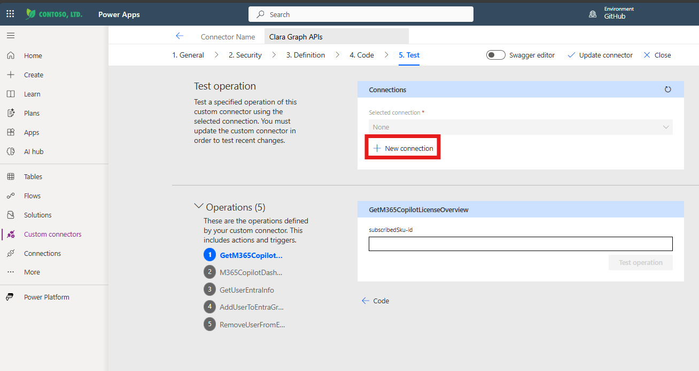 

4. A pop-up window opens redirecting you to Microsoft sign-in

5. Sign in with your Skillable lab credentials:
   - Use the username and password from your lab environment
   
6. You may see a consent screen requesting permissions:

   App name: Clara Graph APIs
   Permissions requested:
   - Access Clara as user
   - Maintain access to data you have given it access to (offline_access)

   This app would like to:
   - Read directory data
   - Read and write group memberships
   - Read usage reports

   > 💡 What This Means: Azure is showing you the delegated permissions you configured in Exercise 2, Step 2. You're granting Clara permission to perform these actions on your behalf.
   
7. Review the permissions and click **Accept**

   > 🔒 Security Note: You're consenting to Clara acting on your behalf with the permissions shown. In a production environment, ensure users understand what they're consenting to.


8. The consent window closes automatically and returns you to the Connections page.

9. In the left-hand menu, select **Custom Connectors**.

10.  Locate **Clara Graph APIs** in the list.

11.  Click the **Edit** (pencil) icon to reopen the connector editor  

     

12. Click the **Test** tab to return to the testing interface
    
13. Under **Connections**, verify your new connection appears and is selected

    You should see:

    Connection name: [Your Name]'s connection or Connection 1
   
    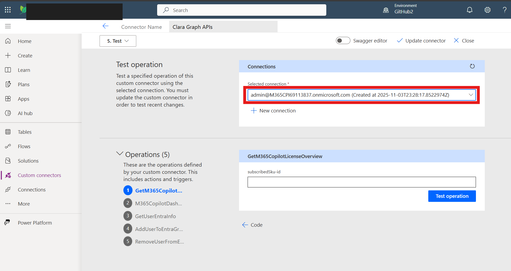 

✅ **Validation:** New connection listed with your name (or "Connection 1") and selected by default.

What Success Means:

If the connection appears, congratulations! You've successfully:

- ✅ Configured OAuth 2.0 authentication between Power Platform and Azure AD
- ✅ Established trust with the Redirect URI
- ✅ Obtained a valid access token for Clara to use
- ✅ Verified that all credentials (Client ID, Secret, Tenant ID, Scope) are correct

Clara's Power Automate flows can now use this connection to call Microsoft Graph API securely.

**Troubleshooting:**

Issue: "Redirect URI mismatch" error

Solutions:

- Verify the exact URI from Step 4 was added to Azure
- Confirm it's under "Web" platform, NOT "Single-page application"
- Check for extra spaces or typos in the URI
- Ensure URI starts with `https://` (not `http://`)

---

### 🧱 Step 7: Test an API Operation

#### Validating the Complete Integration
Creating a connection (Step 6) proved that OAuth authentication works. Now you'll verify that Clara can actually call Microsoft Graph API and retrieve real data from your tenant. This is the final validation that everything—Azure permissions, OAuth configuration, and API access—is working correctly.

#### What This Operation Does:

The **GetM365CopilotLicenseOverview** operation is one of Clara's core functions. It calls Microsoft Graph API to retrieve:

- Total licenses: How many M365 Copilot licenses your organization has purchased
- Assigned licenses: How many are currently allocated to users
- Available licenses: How many remain in the pool for assignment

This is real-time data from your tenant's licensing system, accessed through the permissions you configured in Exercise 2.

#### Why This Test Matters:

A successful test proves:

- ✅ OAuth authentication flow is complete and functional
- ✅ Access token has the correct permissions (Reports.Read.All, Directory.Read.All)
- ✅ Clara's custom connector can successfully call Microsoft Graph API
- ✅ Data can flow from Microsoft 365 → Graph API → Custom Connector → Power Platform

If this test succeeds, Clara's Power Automate flows will be able to retrieve license data for all her operations.

Steps:

1. Still on **Test** tab, scroll drown to the  **Operations** section

   💡 What You'll See: A list of available API operations that this connector provides—these are the actions Clara's flows can perform

2. Locate the operation named: **GetM365CopilotLicenseOverview**

   💡 Note: Operations are typically listed alphabetically. You may need to scroll through the list to find it.

3. Click **Test operation** button next to the operation name

   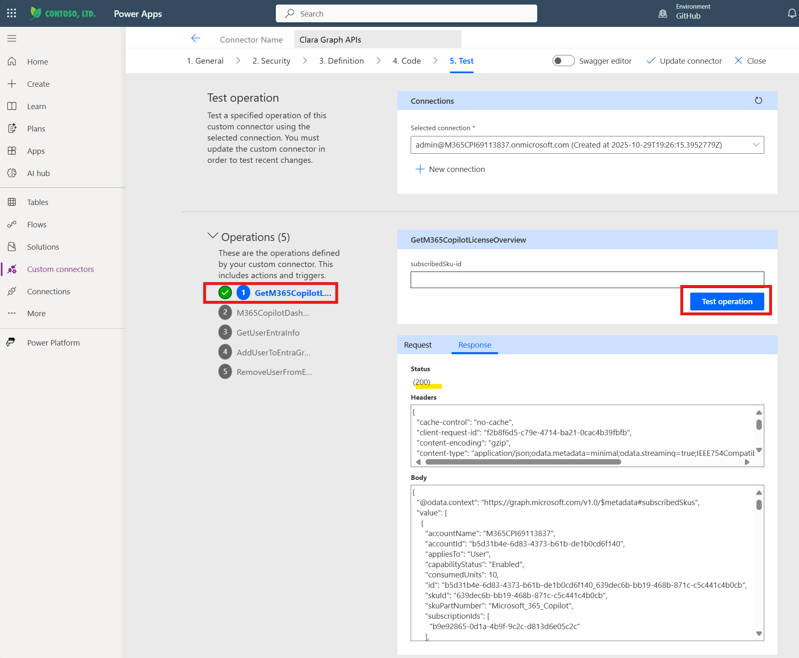 
   
   ⏱️ What Happens: The connector sends a request to Microsoft Graph API using your authenticated connection

4. Wait for the response (typically 5-10 seconds)

   💡 Behind the scenes:

      - Connector uses the access token from your connection
      - Calls Microsoft Graph API: `GET https://graph.microsoft.com/v1.0/subscribedSkus`

5. Scroll down to check the **Response** section **Success Indicators**:

   - Status: `200 OK`
   - Body: JSON with license data
   
   Example response:
   
   ```json
   {
     "totalLicenses": 25,
     "assignedLicenses": 18,
     "availableLicenses": 7
   }
   ```

   >💡 What the numbers mean:
   >
   > - totalLicenses: Your organization's total M365 Copilot license capacity
   > - assignedLicenses: Licenses currently allocated to specific users
   > - availableLicenses: Licenses remaining in the pool (totalLicenses - assignedLicenses)
   >
   >Your actual numbers will vary based on your tenant's license configuration.

   **Failure Indicators:**

   - Status: `401 Unauthorized` or `403 Forbidden`
   - Body: Error message with details

   **Common error responses:**
   
   ```json
   {
       "error": {
         "code": "InvalidAuthenticationToken",
         "message": "Access token is empty."
       }
     }
   ```   
   or
   ```json
   {
     "error": {
       "code": "Forbidden",
       "message": "Insufficient privileges to complete the operation."
     }
   }
   ```
   
✅ **Validation:** S Response shows status "200 OK" with JSON data containing totalLicenses, assignedLicenses, and availableLicenses values.

**What Success Means:**

Congratulations! If you received a 200 OK response with license data, you've successfully:

- ✅ Completed the entire OAuth 2.0 authentication configuration
- ✅ Established a working connection between Power Platform and Microsoft Graph
- ✅ Verified that delegated permissions are functioning correctly
- ✅ Confirmed Clara can retrieve real-time license data from your tenant

Clara is now ready to be configured with her Power Automate flows in the next exercise!

**Troubleshooting:**

Issue: Status 401 Unauthorized - "Access token is empty" or "Invalid authentication token"

What it means: The connection's access token is invalid or expired

Solutions:

- Delete the existing connection:
  - Go back to the Test tab
  - Find your connection under "Connections"
  - Click ⋯ (three dots) → Delete
- Create a new connection following Step 6 again
- Verify the token was stored correctly by testing immediately after creation
---

Issue: Status 403 Forbidden - "Insufficient privileges"

What it means: The connection works, but doesn't have the required permissions

Solutions:
- Return to Azure Portal → App Registrations → CLARA
- Click API permissions
- Verify all three permissions show "Granted" status with green checkmarks:
  - Directory.Read.All ✅
  - GroupMember.ReadWrite.All ✅
  - Reports.Read.All ✅
- If any are missing the green checkmark:
  - Click "Grant admin consent for [Your Organization]"
  - Wait 2-3 minutes for propagation
  - Delete and recreate the connection in Step 6

---


Issue: Status 404 Not Found - Operation not found

What it means: The connector definition may not have loaded properly

Solutions:
- This is actually OK for the purposes of this lab—the connection test in Step 6 was successful
- The operation may not be available in your specific lab environment
- If other operations appear in the list, try testing one of those instead
- Proceed to the next exercise—Clara's flows will work even if this specific test operation isn't available


---

## Summary

You've successfully:

- ✅ Configured OAuth 2.0 for Clara Graph APIs
- ✅ Added Azure credentials to connector
- ✅ Registered redirect URI in Azure app
- ✅ Created and tested connector connection
- ✅ Verified access to Microsoft Graph API

---

## Configuration Summary

**Custom Connector Settings:**
- Identity Provider: Generic OAuth 2
- Client ID: Your Application ID
- Client Secret: Your secret value
- OAuth URLs: Azure AD endpoints
- Scope: `https://graph.microsoft.com/.default offline_access`

**Azure App Authentication:**
- Platform: Web
- Redirect URI: `https://global.consent.azure-apim.net/redirect`

---


**Next:** [Exercise 7: Configure Clara in Copilot Studio](./07-exercise7.md)
