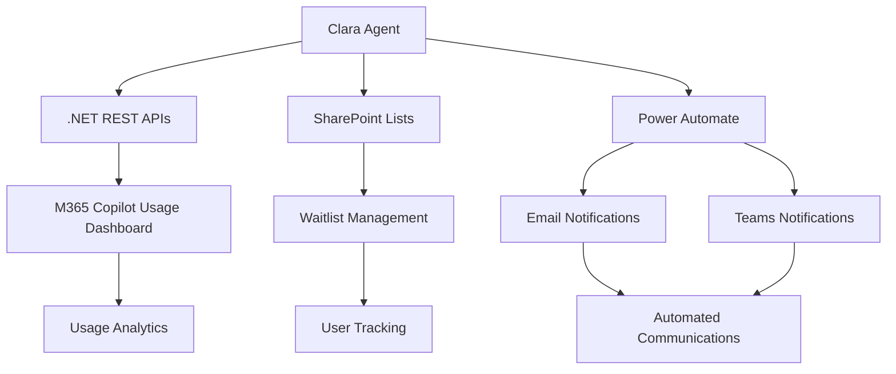

# 👧 CLARA -Copilot License Assignment & Report Agent

[](https://opensource.org/licenses/MIT)
[](https://copilotstudio.microsoft.com/)
[](https://dotnet.microsoft.com/)

**Clara** is an intelligent AI agent built on Microsoft Copilot Studio that revolutionizes M365 Copilot license management for enterprises. It automates license monitoring, optimizes allocation, and streamlines user communication to ensure maximum ROI on your M365 Copilot investment.


| [Documentation](https://github.com/luishdemetrio/clara-copilot-agent) | [Local Deployment guide](https://github.com/luishdemetrio/clara-copilot-agent/blob/main/docs/local_deployment.md) | [Azure Deployment guide ](https://github.com/cristianoag/microsoft-teams-apps-company-communicator/wiki/Deployment-guide-powershell)  |
| ---- | ---- | ---- | 

## 🎯 Overview

Managing M365 Copilot licenses across large organizations can be complex and time-consuming. Clara solves this by providing:

- **Automated License Monitoring**: Real-time tracking of license usage and identification of inactive users
- **Intelligent Waitlist Management**: Streamlined process for managing license requests and approvals
- **Smart Reassignment Workflows**: Automated redistribution of unused licenses to waiting users
- **Proactive Communication**: Automated notifications to users about license status and usage optimization


## ✨ Key Features

### 🔍 **Usage Analytics & Reporting**
- Comprehensive M365 Copilot usage analysis across all applications (Teams, Outlook, Word, Copilot Chat)
- Identification of inactive and low-usage license holders
- Customizable usage thresholds and reporting periods

### 📋 **Waitlist Management**
- Integration with SharePoint Lists for centralized waitlist tracking
- Automated status updates and user notifications
- Priority-based license assignment based on request dates
- Comprehensive audit trails for compliance

### 🔄 **License Optimization**
- **Individual Reassignment**: Move licenses between specific users
- **Bulk Operations**: Reassign multiple unused licenses to waitlist users
- **New Assignments**: Streamlined process for assigning licenses to new users
- **Safety Controls**: Mandatory confirmation before any license changes

### 📧 **Automated Communications**
- Proactive notifications to low-usage license holders
- Welcome messages for new license recipients with usage guidance
- Status updates for waitlist users
- Integration with Outlook Power Automate connector

## 🏗 Architecture



### Components

1. **LANCE Agent (Copilot Studio)**
   - Natural language interface for IT administrators
   - Intelligent conversation flows with safety confirmations
   - Integration orchestration and workflow management

2. **.NET REST APIs**
   - M365 Copilot license management endpoints
   - Usage data retrieval and processing
   - License assignment/removal operations

3. **SharePoint Integration**
   - Centralized waitlist storage and management
   - User request tracking and status updates
   - Audit trail maintenance

4. **Power Automate Connectors**
   - Automated email notifications
   - Workflow triggers and data synchronization


## 💡 Usage Examples

### Basic Commands

```
🔍 Monitor License Usage
"Show me all users who haven't used Copilot in the last 30 days"

🔄 Reassign Licenses
"Reassign license from john.doe@company.com to jane.smith@company.com"

📋 Manage Waitlist
"Assign a Copilot license to the next person on the waitlist"

📊 Bulk Operations
"Reassign unused licenses to waitlist users"
```


## 📁 Repository Structure

```
clara-copilot-agent/
├── src/
│   ├── LanceAPI/                 # .NET REST API source code
│   │   ├── Controllers/
│   │   ├── Models/
│   │   ├── Services/
│   │   └── appsettings.json
│   └── CopilotStudio/           # Copilot Studio assets
│       ├── Solution/
│       └── Topics/
├── templates/
│   ├── SharePoint/              # SharePoint list templates
│   └── PowerAutomate/           # Power Automate flow templates
├── docs/
│   ├── LAB.md                   # Step-by-step lab guide
│   ├── API-Documentation.md     # API reference
│   └── screenshots/
└── README.md
```


### Required Permissions

- Microsoft Graph API permissions for license management
- SharePoint site collection access
- Power Automate connector permissions

## 🧪 Lab Guide

Want to build LANCE from scratch? Check out our comprehensive [Lab Guide](docs/LAB.md) that walks you through:

- Setting up the development environment
- Creating the .NET REST APIs
- Building the Copilot Studio agent
- Configuring SharePoint integration
- Testing and deployment

## 📚 Documentation

- [API Reference](docs/API-Documentation.md)
- [Lab Guide - Build Your Own LANCE](docs/LAB.md)
- [Troubleshooting Guide](docs/Troubleshooting.md)
- [Best Practices](docs/Best-Practices.md)

## 🤝 Contributing

We welcome contributions! Please see our [Contributing Guidelines](CONTRIBUTING.md) for details on:

- Code standards and conventions
- Pull request process
- Issue reporting
- Feature requests

## 📄 License

This project is licensed under the MIT License - see the [LICENSE](LICENSE) file for details.

## 🙋‍♀️ Support

- **Issues**: [GitHub Issues](https://github.com/yourusername/lance-copilot-agent/issues)
- **Discussions**: [GitHub Discussions](https://github.com/yourusername/lance-copilot-agent/discussions)
- **Documentation**: [Wiki](https://github.com/yourusername/lance-copilot-agent/wiki)

## 🌟 Acknowledgments

- Microsoft Copilot Studio team for the amazing platform
- Microsoft Graph API for comprehensive M365 integration
- The enterprise IT community for valuable feedback and requirements

---

**⭐ If Clarahelps optimize your M365 Copilot license management, please star this repository!**

Made with ❤️ for enterprise IT teams worldwide.