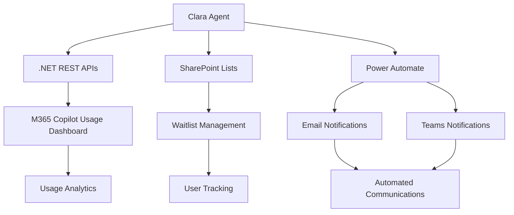

# 👧 CLARA -Copilot License Assignment & Report Agent

**Clara** is an intelligent AI agent built on Microsoft Copilot Studio that revolutionizes M365 Copilot license management for enterprises. It automates license monitoring, optimizes allocation, and streamlines user communication to ensure maximum ROI on your M365 Copilot investment.

---

## 🚀 What is Clara?

Clara helps IT teams:
- Monitor and analyze Copilot license usage
- Manage waitlists and automate license assignments
- Communicate with users about license status

---
## 🎯 Overview

Managing M365 Copilot licenses across large organizations can be complex and time-consuming. Clara solves this by providing:

- **Automated License Monitoring**: Real-time tracking of license usage and identification of inactive users
- **Intelligent Waitlist Management**: Streamlined process for managing license requests and approvals
- **Smart Reassignment Workflows**: Automated redistribution of unused licenses to waiting users
- **Proactive Communication**: Automated notifications to users about license status and usage optimization

---
## 📚 Documentation & Support

All setup guides, usage instructions, and troubleshooting are now in our Wiki and Discussions.

- **Getting Started:** See the [Wiki](https://github.com/luishdemetrio/clara-copilot-agent/wiki)
- **Ask Questions:** Use [Discussions](https://github.com/luishdemetrio/clara-copilot-agent/discussions)
- **Report Issues:** GitHub [Issues](https://github.com/luishdemetrio/clara-copilot-agent/issues)

---

## 🏗 Architecture

## 🤝 Contributing

We welcome contributions!

## 📄 License

This project is licensed under the MIT License - see the [LICENSE](https://opensource.org/license/MIT) file for details.

## 🌟 Acknowledgments

- Microsoft Copilot Studio team for the amazing platform
- Microsoft Graph API for comprehensive M365 integration
- The enterprise IT community for valuable feedback and requirements

---

**⭐ If Clara helps optimize your M365 Copilot license management, please star this repository!**

Made with ❤️ for enterprise IT teams worldwide.

